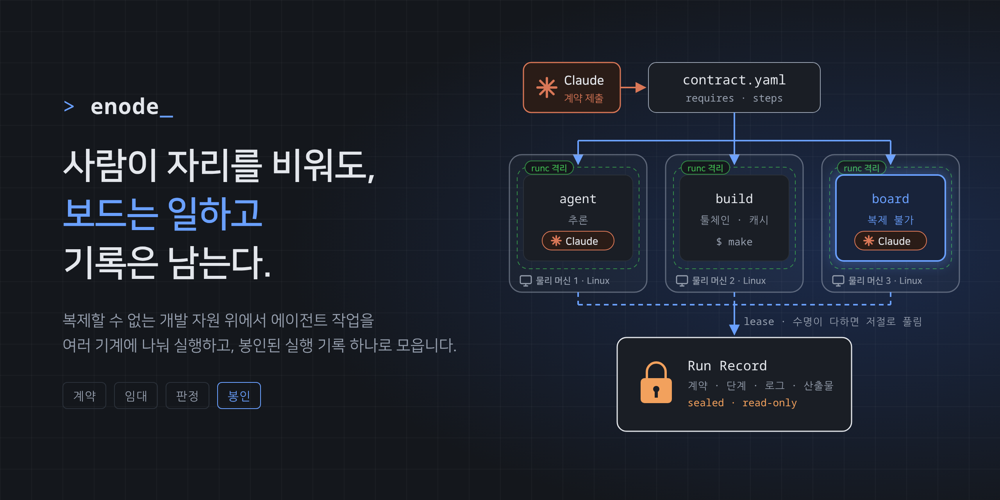
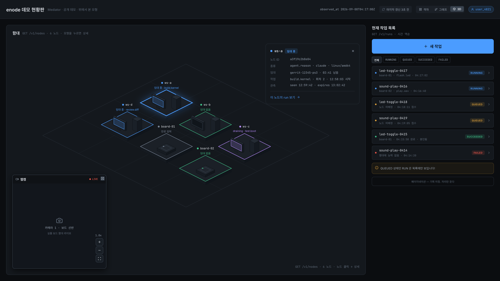

# 사람이 자리를 비워도, 보드는 일하고 기록은 남는다.

enode 는 개발보드와 빌드 서버처럼 각 기계에 자리 잡은 개발 자원을 연결해,
에이전트 작업과 명령을 여러 기계에 나눠 실행하는 시스템이다.
흩어진 실행 흔적은 **봉인된 실행 기록 하나**로 모여서, 사람이 자리에 없어도
작업이 이어지고 나중에 그 기록을 보고 결과를 판단할 수 있다.

예를 들어 [greet-play](recipes/greet-play/README.md) 는 한 기계에서 음성을
만들고 다른 기계의 스피커로 재생한다.

[실행 흐름](#한-번의-요청이-기록이-되기까지) · [구성 요소](#구성-요소) ·
[개발 환경 시작](#개발-환경-시작) · [화면](#화면) · [더 읽을 것](#더-읽을-것)

## 자원은 그 자리에, 작업은 그 너머로

실물 보드는 복제할 수 없고, 빌드 서버에는 이미 갖춰진 툴체인과 캐시가 있다.
추론을 맡은 에이전트가 있는 기계와 실제 작업을 돌려야 할 기계가 다르면,
프롬프트만으로 그 거리를 메울 수 없다.

enode 에서는 자원 소유자가 자기 기계를 **함대(enode 에 연결된 기계 전체)** 에
내놓고, 호출자가 작업에 필요한 능력과 실행 순서를 선언한다. 시스템은 요구에
맞는 노드를 찾아 **임대(작업 동안 다른 Run 이 쓰지 못하게 점유)** 하고,
노드는 일을 당겨 실행한다. 한 번의 요청은 **Run** 이라는 단위로 관리된다.
자원이 부족하면 Run 은 대기열에서 기다리고, 소유자는
**`drain`(새 작업을 받지 않고 자원을 되찾는 제어)** 을 걸 수 있다.

## 한 번의 요청이 기록이 되기까지

계약을 제출해서 실행 기록이 봉인될 때까지의 한 덩어리를 **Run** 이라고 부른다.
계약에서 봉인까지를 네 가지 큰 흐름으로 보면 다음과 같다.

1. **계약** — 무엇을 어떤 순서로 실행하고 무엇을 완주로 볼지 선언한다.
2. **임대와 실행** — 필요한 노드를 배타적으로 임대한다. 노드는 에이전트 하네스나
   명령을 실행하고, 단계 사이의 산출물은 **Mediator(실행을 조정하는 중앙 서비스)** 를
   거쳐 전달한다.
3. **판정** — 계약에 적힌 완주 조건을 기계가 대조한다. 결과의 좋고 나쁨과
   작업을 완주했는가는 구분한다.
4. **봉인** — 계약, 단계 기록, 로그, 산출물, 판정을 Run Record 하나로 묶고
   파일 권한으로 쓰기를 막는다.

## 구성 요소

| 실행파일 | 역할 | 쓰는 사람 |
|---|---|---|
| [`mediator`](cmd/mediator) | 노드 매칭, 임대, 단계 순서, 판정과 기록 봉인 | 함대 운영자 |
| [`enode`](cmd/enode) | 능력을 광고하고 작업을 당겨 실행하는 노드 데몬 | 자원 소유자 |
| [`runctl`](cmd/runctl) | 계약 제출, 실행 조회, 기록 수거, MCP 연결 | 작업을 맡기는 사람이나 프로그램 |
| [`enodectl`](cmd/enodectl) | 자기 기계의 노드 운영과 호스트 제어판 | 자원 소유자 |
| [`iapadapter`](cmd/iapadapter) | 바깥 트래커와 함대를 연결하는 어댑터 | 연동 운영자 |

Mediator 는 실행을 조정하고, 실제 실행은 노드가 맡는다.
노드가 중앙으로 연결하므로 작업 수신용 인바운드 포트를 열지 않는다.
Claude 같은 MCP 클라이언트에서도 계약을 제출할 수 있다.
히어로의 Claude 는 이 호출 경로의 예시다.

## 개발 환경 시작

**실행 환경:** `runc-overlay` 격리는 Linux 에서 지원한다. Windows 노드는
`native` 방식으로 실행하며, Windows 격리 실행은 아직 구현되지 않았다.

**저장소를 받은 뒤 코드와 테스트를 확인하는 경로다.** Go 버전은
[go.mod](go.mod) 를 따르고, 시험용 PostgreSQL 은 Docker 로 준비한다.

```bash
git submodule update --init
eval "$(scripts/testdb.sh)"
go test ./...
```

Docker 를 쓸 수 없다면 직접 준비한 PostgreSQL 의 DSN 을
`ENODE_TEST_DATABASE_URL` 에 지정한다. DB 없이 실행하면 일부 테스트가
실패하거나 건너뛰므로, 그것을 테스트 통과로 보면 안 된다.
환경별 준비는 [테스트 DB 안내](docs/testdb-setup.md), 실행파일 설치는
[packaging](packaging) 을 참고한다.

계약을 작성할 때는 `runctl` 의 예제와 도움말부터 확인한다.
명령 사용법의 기준은 각 실행파일의 usage 다.

```bash
go run ./cmd/runctl example
go run ./cmd/enodectl -h
```

## 화면

중앙 현황판에서 함대와 Run 을 보고, 호스트 제어판에서 자기 노드를 관리한다.
실행 중인 하네스의 출력은 트랜스크립트로 읽을 수 있다.



**데모 현황판의 화면 설계 시안이다.** 실제 실행 화면의 캡처는 아니다.
[화면 설계와 원본](design/README.md) 에서 각 표면의 역할을 볼 수 있다.

## 더 읽을 것

| 알고 싶은 것 | 문서 |
|---|---|
| 시스템 전체의 경계와 데이터 흐름 | [시스템 설계](enode-design/docs/system.md) |
| 계약의 형태와 실행 규칙 | [Run 계약](enode-design/protocol/run-contract.md) |
| 항상 지켜야 하는 상태와 불변식 | [INVARIANTS](enode-design/protocol/INVARIANTS.md) |
| 설계 선택의 이유 | [설계 결정 문서](enode-design/adr) |
| 요구사항과 확인하는 장면 | [요구 팩](requirements/README.md) |
| 표기, 언어와 커밋 규약 | [CONVENTIONS](CONVENTIONS.md) |

설계 정본은 이 저장소가 고정한 `enode-design/` 서브모듈이다.
코드와 설계가 어긋나면 `enode-design/protocol/INVARIANTS.md` 가 기준이다.

## 기여자 안내

<details>
<summary>설계 정본, 저장소 구조와 검증 근거</summary>

### 1. 설계 정본과 구현 원격

설계 정본은 `enode-design/` 서브모듈의 `adr/` 와 `protocol/` 이다.
이 저장소는 정본의 커밋 하나를 고정하며, 코드와 설계가 어긋나면
`enode-design/protocol/INVARIANTS.md` 를 기준으로 본다.

```bash
git submodule status
git ls-tree HEAD enode-design
```

설계 변경은 별도로 클론한 `enode-design` 저장소에서 PR 로 반영하고,
그 뒤 이 저장소의 서브모듈 핀을 옮긴다.
[설계 정본과 요구 팩의 연결](requirements/canon.md) 도 함께 확인한다.

이 구현 저장소는 `upstream` 원격에서 갈라져 나왔다.
원격 주소와 현재 코드의 차이는 Git 으로 확인한다.

```bash
git remote -v
git log --oneline HEAD..upstream/main
```

### 2. 저장소 구조

| 경로 | 내용 |
|---|---|
| `cmd/` | 실행파일 진입점 |
| `internal/` | 구현 패키지 |
| `scripts/` | 개발과 검증 도구 |
| `packaging/` | 플랫폼별 설치 묶음 |
| `.github/workflows/` | CI, 패키징과 릴리스 |
| `requirements/` | 요구사항과 기능 검증 장면 |
| `design/` | 화면 설계 원본과 내보낸 이미지 |
| `enode-design/` | 고정된 설계 정본 |

### 3. 규약과 검증

표기, 언어와 커밋 규약은 [CONVENTIONS](CONVENTIONS.md) 를 따른다.
자동 검증 항목은 [CI 워크플로](.github/workflows/ci.yml),
기능을 확인하는 실행 장면은 [장면별 검증](requirements/scene-gates.md) 에 있다.

DB 테스트에는 실제 PostgreSQL 이 필요하다. 준비 방법은 본문의
[개발 환경 시작](#개발-환경-시작) 과 [테스트 DB 안내](docs/testdb-setup.md) 를 따른다.

### 4. 설계가 코드에 어떻게 박혀 있나

**노드 하나에 임대 하나.** [저장소 스키마](internal/store/schema.sql) 의 기본키가
같은 노드에 임대 둘이 걸리는 것을 막는다. 할당을 트랜잭션으로 묶어 필요한
자원을 전부 잡거나 전부 되돌린다.

**봉인된 기록의 쓰기 차단.** [기록 봉인 코드](internal/record/record.go) 가
파일과 디렉터리의 쓰기 비트를 내려 파일 권한으로 쓰기를 막는다.

**계약 스키마의 허용 목록.** [스키마 검증 코드](internal/schema/schema.go) 가
지원하는 키워드만 허용한다. 계약의 완주 조건은 기계가 대조할 수 있는 형태로
검증한다.

</details>
