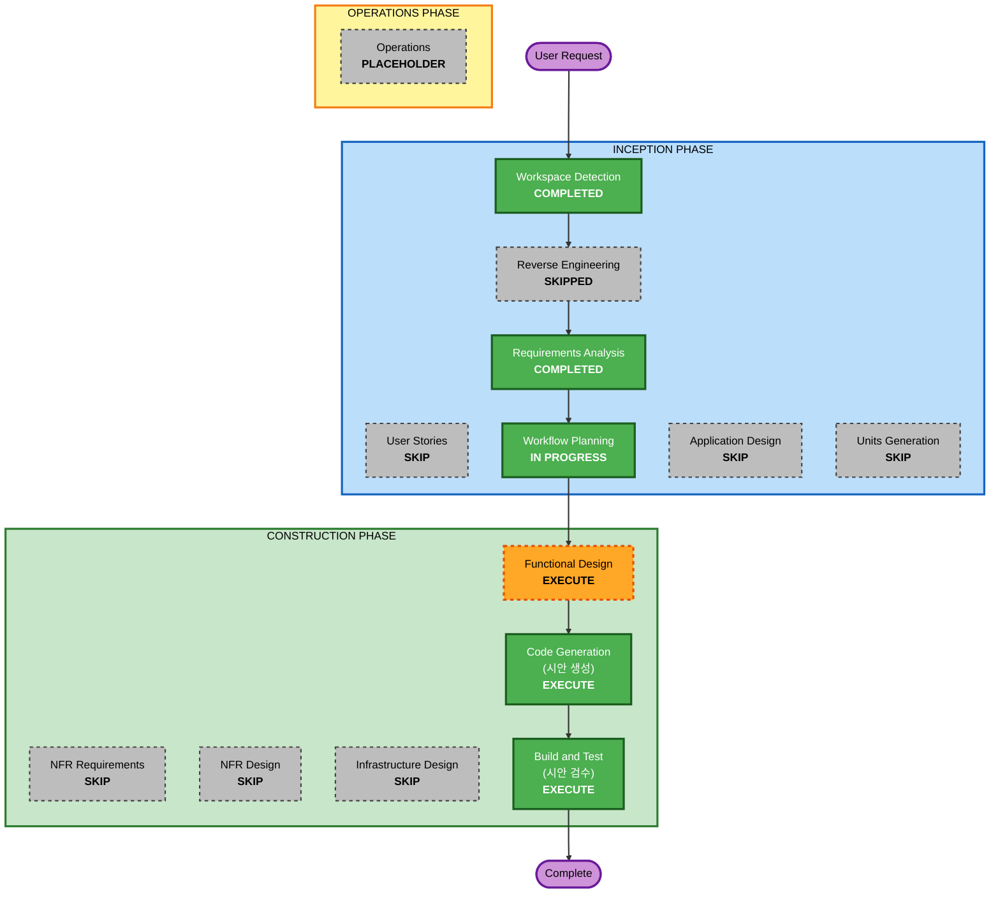

# 실행 계획 — v2 시안 회차

## 상세 분석 요약

### 전환 범위 (브라운필드)
- **전환 유형**: 산출물 하나 추가. 아키텍처 전환이 아니다
- **주 변경**: 새 파일 `design/enode-demo.pen` — 아트보드 D1~D5
- **관련 컴포넌트**: 없다. `cmd/*` 와 `internal/*` 열다섯 패키지 어디도 안 건드린다

### 변경 영향 평가
- **사용자 대면 변경**: Yes — 데모 페이지의 화면을 정의한다. 단, 이 회차는
  시안까지다. 실제 화면은 뒤 회차가 만든다
- **구조 변경**: No — 코드 구조를 안 건드린다
- **자료 모형 변경**: No
- **API 변경**: No — 시안은 오늘의 `POST /v1/runs` 계약이 받는 필드만 그린다
- **NFR 영향**: No — 확장 셋이 다 꺼졌거나 N/A 다

### 컴포넌트 관계
- **주 컴포넌트**: `design/` (시안). 진행자만 고친다 (CONVENTIONS.md 3.2)
- **참조만 하는 것**: `design/enode-ux.pen` (컴포넌트 · 3D 뷰의 출처) ·
  `design/README.md` (그리는 규칙) · `requirements/*.md` (값의 정본) ·
  `enode-design/` (설계 정본)
- **의존 컴포넌트**: 없다. 이 회차 산출물에 기대는 코드가 없다

### 위험 평가
- **위험도**: Low — 새 파일 하나이고 기존 파일을 안 건드린다
- **되돌리기**: Easy — 파일 하나를 지우면 끝난다
- **검사 복잡도**: Simple — 눈으로 본다. 빌드가 걸리지 않는다

## 워크플로 시각화



텍스트 대안:

```text
   INCEPTION      Workspace Detection    완료
                  Reverse Engineering    스킵 (v1 산출물 재사용)
                  Requirements Analysis  완료
                  User Stories           스킵
                  Workflow Planning      진행 중
                  Application Design     스킵
                  Units Generation       스킵

   CONSTRUCTION   Functional Design      실행 — 화면 사양
                  NFR Requirements       스킵
                  NFR Design             스킵
                  Infrastructure Design  스킵
                  Code Generation        실행 — .pen 시안을 그린다
                  Build and Test         실행 — 시안 검수로 대체한다

   OPERATIONS     Operations             자리만
```

## 실행할 단계

### INCEPTION PHASE
- [x] Workspace Detection (COMPLETED)
- [x] Reverse Engineering (SKIPPED)
  - **근거**: v1 산출물 8장이 HEAD(1fe2145)와 같은 시점이라 최신이다
- [x] Requirements Analysis (COMPLETED)
- [ ] User Stories — SKIP
  - **근거**: 요구가 이미 화면 단위로 잘려 있고 페르소나가 하나다 (데모를
    처음 보는 관람자). 스토리를 세워도 requirements.md 의 D1~D5 를 다시 쓰는
    일이 된다
- [x] Workflow Planning (IN PROGRESS)
- [ ] Application Design — SKIP
  - **근거**: 새 컴포넌트도 서비스 계층도 안 만든다. 산출물이 시안이다
- [ ] Units Generation — SKIP
  - **근거**: 산출물이 파일 하나다. 유닛으로 가를 것이 없고 병렬로 돌릴
    브랜치도 없다. Inception 직렬 구간에서 끝난다

### CONSTRUCTION PHASE
- [ ] Functional Design — EXECUTE
  - **근거**: 이 회차의 진짜 설계가 여기다. 아트보드 다섯 장의 화면 사양 —
    무엇을 어디에 놓고 어느 버튼이 어디로 가는지 — 을 먼저 글로 닫는다.
    닫지 않고 그리면 시안이 값을 지어낸다
  - **산출물**: `aidlc-docs/construction/demo-pen/functional-design/screens.md`
- [ ] NFR Requirements — SKIP
  - **근거**: 성능 · 확장성의 대상이 없다. 기술 선택도 이미 pen.dev 로 닫혔다
- [ ] NFR Design — SKIP
  - **근거**: NFR Requirements 를 건너뛴다
- [ ] Infrastructure Design — SKIP
  - **근거**: 배포도 자원도 이 회차에 없다
- [ ] Code Generation — EXECUTE (ALWAYS)
  - **근거**: 이 회차의 코드가 곧 `.pen` 시안이다. pencil MCP 로 만든다.
    Part 1 에서 아트보드별 생성 계획을, Part 2 에서 실제 파일을 낸다
  - **산출물**: `design/enode-demo.pen` + 계획 문서
- [ ] Build and Test — EXECUTE (ALWAYS)
  - **근거**: 빌드가 없으므로 **시안 검수**로 대체한다. pencil 검증(get_style ·
    스키마 검사) · 화면별 버튼 목록 대조 · CONVENTIONS 1절 표기 확인

### OPERATIONS PHASE
- [ ] Operations — PLACEHOLDER

## 패키지 변경 순서
해당 없음. Go 패키지를 하나도 안 건드린다.

## exports 결정
requirements.md 가 이 단계로 미룬 것. **기존 `design/exports/*.png` 는 안
건드린다.** 새 아트보드 D1~D5 의 PNG 는 Build and Test 의 검수 산출물로
`design/exports/D1-*.png` 꼴로 낸다 — pencil 도구가 내보내기를 주면 그것으로,
못 주면 브라우저 스크린샷으로. 필수 산출물은 `.pen` 이고 PNG 는 검수 증빙이다.

## 브랜치
유닛 브랜치 없음. 전부 `v2-run-shin_pen_drawing` 위에서 직렬로 돌고 단계
승인마다 커밋한다 (CONVENTIONS.md 3.3). `design/` 은 진행자(이 세션)가 고친다.

## 예상 규모
- **실행 단계**: 3 (Functional Design · Code Generation · Build and Test)
- **스킵 단계**: 6
- **산출 파일**: `design/enode-demo.pen` 1개 + 문서 3~4개

## 성공 기준

- **주 목표**: 데모 공개용 현황판 흐름 D1~D5 가 한 `.pen` 파일에 그려진다
- **핵심 산출물**
  - `design/enode-demo.pen` — 아트보드 다섯
  - 화면 사양 문서 (버튼을 전부 센 것)
- **품질 게이트**
  1. 아트보드 다섯이 다 있고 각 장의 버튼이 사양의 목록과 일치한다
  2. D5 에서 run 목록이 3D 뷰에 가리지 않는다 (눈으로 본다)
  3. `design/enode-ux.pen` 과 `design/exports/` 가 이 회차에서 안 바뀐다
     (`git status` 로 센다)
  4. 시안의 텍스트에 장식 문자가 없다 (CONVENTIONS.md 1.2)
  5. 시안이 새 필드 · 새 상태 값을 발명하지 않는다 — 정본에 있는 것만 쓴다
