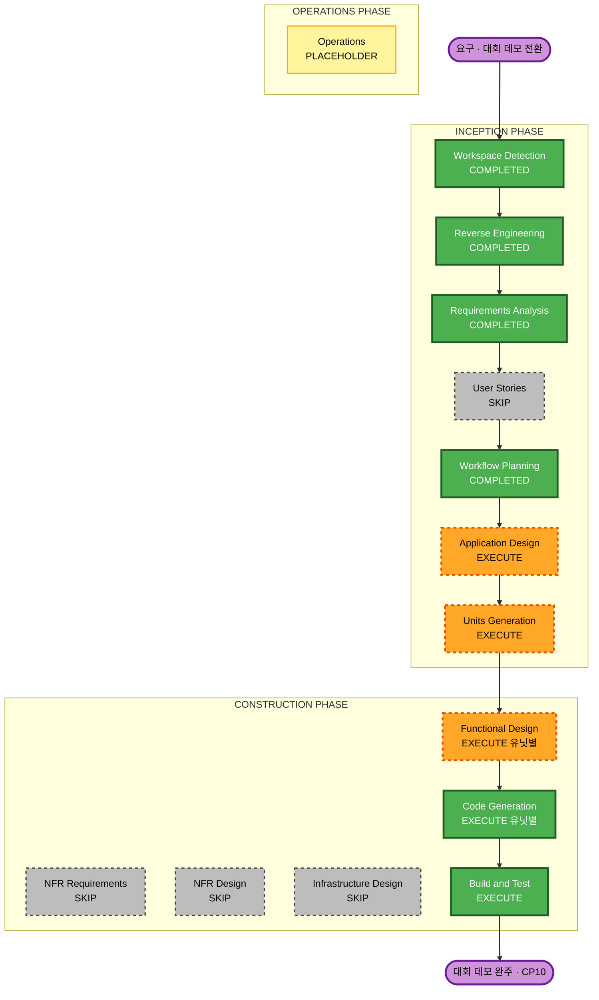

# 실행 계획 — Workflow Planning

AI-DLC Workflow Planning 산출물이다. **정본은 `requirements/` 팩**이고 이
문서는 어느 단계를 돌리고 어느 단계를 건너뛰는지, 그 근거와 순서의 제약을
적는다. 값을 다시 적지 않고 팩과 RE 산출물을 가리킨다.

선행 맥락 — `aidlc-docs/inception/requirements/requirements.md` ·
`requirements/` 팩 다섯 · `aidlc-docs/inception/reverse-engineering/` 아홉.

---

## 상세 분석 요약

### 전환 범위 (브라운필드)

- **전환 유형**: 아키텍처 전환이 아니다. 기존 Go 모노레포(`github.com/taeels/enode`,
  바이너리 다섯 · `internal/*` 열)에 **관측·제어·접수 기능 일곱과 대회 데모 표면
  다섯을 더하는 기능 확장**이다. 배포 모델은 안 바뀐다 (`packaging/` 무변경 —
  `decisions.md` 5.2).
- **주 변경**: 새 패키지 셋(`internal/panel` · `internal/api/ui` · `internal/mcp`)과
  데모 표면, 그리고 기존 패키지 여섯(`internal/api` · `internal/store` ·
  `internal/match` · `internal/enode` · `cmd/enodectl` · `cmd/mediator`)의 확장.
- **관련 컴포넌트**: 아래 컴포넌트 관계 그래프.

### 변경 영향 평가

- **사용자 대면 변경**: 예 — 중앙 현황판(S0~S2) · 호스트 제어판(S3·S3b·S5) ·
  트랜스크립트 카드 · 온보딩 · 게스트 데모 대시보드 · 3D 뷰(S6·S7) · 웹캠 플로팅.
- **구조 변경**: 부분 — 새 패키지 셋은 기존 아키텍처 안에서 생기고, `constraints.md`
  의 임포트 금지 넷(panel↛store · panel↛api · api/ui↛store · enode↛panel)이
  새 불변식으로 붙는다. 경계 검사 테스트를 새로 낸다.
- **데이터 모델 변경**: 최소 — `runs.state` 어휘에 `QUEUED` 하나가 늘고, run 에
  표시 필드 `submitter` 하나가 는다. **새 테이블 0 · 스키마 파괴 변경 0.**
  트랜스크립트(3.1.3)와 MCP(3.3.1)는 DB 를 안 만진다.
- **API 변경**: 예 — 신규 `GET /v1/nodes` · `GET /v1/runs`, `GET /v1/runs/{id}` 에
  `requires` 추가(`ADR-069`), `StepView.chosen` 추가(`ADR-060`), 데모 allow-list
  제출 라우트, `202`/`QUEUED` 응답. **기존 라우트 15개는 그대로 보존**
  (`internal/api/api.go:61-75`).
- **NFR 영향**: 예 — 그러나 팩이 값으로 닫았다. `security-baseline`(새 표면) ·
  차단 CI 게이트 다섯 · 패키지 커버리지 하한 80% · 폴링 간격. 아래 NFR 단계
  판정을 본다.

### 컴포넌트 관계 그래프 (브라운필드)

```text
   주 컴포넌트 (이번 회차가 만지는 것)

     internal/api            GET /v1/nodes · GET /v1/runs · requires · chosen ·
                             202/QUEUED 응답 · 데모 allow-list 라우트
     internal/api/ui (신규)   /ui/ 아래 정적 화면.  store 를 직접 안 부른다
     internal/store          QUEUED 어휘 · WakeQueued · submitter · draining 제외 재료
     internal/match          busy 에 DrainingNodes 합침 (if !dry 안)
     internal/enode          drain 정책 파일 읽기 · 광고 경로 · 링 파일 tee
     cmd/enodectl            serve 하위명령 (위임으로 net/http 심볼 상한 회피)
     internal/panel (신규)    제어판 HTTP 서버.  Mediator 를 HTTP 로 본다
     internal/mcp (신규)      runctl mcp — 기존 REST 를 stdio JSON-RPC 로 감싼다
     cmd/mediator            /ui/ embed 마운트
     데모 표면                온보딩 · 게스트 로그인 · 고정 시나리오 · 웹캠 임베드

   공유 컴포넌트 (재사용 · 안 만지거나 얇게)

     internal/runctl/client.go   panel · mcp 가 재사용하는 HTTP 클라이언트
     internal/record             welcome-wav blob (시나리오 ②) · 봉인 트랜스크립트
     internal/contract           고정 시나리오 픽스처 (runctl example)

   접점 (유닛 둘 이상이 만진다 — 직렬 병합)

     internal/api/api.go   등록 줄만.  새 핸들러는 새 파일에 (constraints 새 표면 모양)
     aidlc-docs/audit.md · aidlc-state.md · design/   진행자가 병합 뒤 (CONVENTIONS 3.2)
```

각 관련 컴포넌트의 변경 유형과 우선순위는 **Units Generation 이 파일 행렬로
확정한다** — 이 계획이 미리 정하지 않는다 (`constraints.md` 구조 불변식).

### 위험 평가

- **위험 수준**: **High**. 근거 — 핵심 시퀀서에 상태 어휘(`QUEUED`)가 늘고,
  공개·무인증 쓰기 표면(SECURITY-08 수락 위험)이 생기며, 차단 CI 게이트가
  다섯이고, 정본 불변식(`INVARIANTS` 우선)을 지켜야 하고, 완결 게이트(CP10)가
  하드웨어(rpi·mac·웹캠)에 걸리며, 브랜치에 다른 손(shonsin 3D · 진행자 design)이 붙는다.
- **롤백 복잡도**: Moderate. 토픽 브랜치 `unit/<유닛>` 위에서 돌고, 장면 게이트가
  초록이 된 뒤에만 `v1-run-dhseo` 로 병합한다 (CONVENTIONS 3.3). 유닛 단위로 되돌린다.
- **테스트 복잡도**: Complex. DB 의존 테스트는 Postgres 가 필요하고
  (`scripts/testdb.sh`), 장면 게이트는 함대와 하드웨어가 필요하며(CP10),
  플랫폼 분기(`console_*`·`disk_*`·`lock_*` 빌드 태그 쌍)를 넘겨야 한다.

---

## 워크플로 시각화



---

## 실행할 단계

### 🔵 INCEPTION PHASE

- [x] Workspace Detection (COMPLETED — 2026-09-08T05:36:09Z)
- [x] Reverse Engineering (COMPLETED — 2026-09-08T07:17:58Z · 커밋 1fe2145)
- [x] Requirements Analysis (COMPLETED — 2026-09-08T07:50:41Z · 대회 데모 전환)
- [x] Workflow Planning (IN PROGRESS — 이 문서)
- [ ] User Stories — **SKIP**
  - **근거**: 사용자 여정과 수용 기준을 팩이 이미 진다. `scene-gates.md` §1 의
    `dhseo` 장면과 §5 의 대회 데모 장면(5.1 ①~⑦)이 여정이고, 조각 게이트
    CP0~CP11 이 수용 기준이다. 페르소나는 소유자·제출자·게스트·사용자 Claude 로
    팩과 화면(`design/README.md`)에 이미 갈려 있다. 스토리를 새로 내면 팩을
    옮겨 적기만 한다 — `constraints.md` 가 경계하는 그 일이다.
- [ ] Application Design — **EXECUTE**
  - **근거**: 새 패키지 셋(`internal/panel` · `internal/api/ui` · `internal/mcp`)의
    겉면(Config · Server · New)과 메서드, 제어판의 HTTP 클라이언트 사용, MCP 도구
    열의 디스패치, `internal/store` 의 `WakeQueued` 시그니처와 여섯 호출 지점,
    `QUEUED` 전이를 정의해야 한다. 팩은 이것을 **일부러 주지 않는다** — 새 표면의
    모양과 임포트 금지만 제약으로 주고 메서드 설계는 이 단계 몫이다.
- [ ] Units Generation — **EXECUTE**
  - **근거**: `constraints.md` 가 이 단계에 **파일 행렬을 반드시 요구**한다 —
    유닛마다 만지는 파일을 표로 세고, 한 파일을 둘 이상이 만지면 접점으로 적어
    처리를 정한다. 유닛 의존 그래프도 이 단계가 낸다. 병합 순서(CONVENTIONS 3.1)와
    병렬 착수가 그 그래프에 걸린다. 다중 패키지·복잡 분해라 필수다.

### 🟢 CONSTRUCTION PHASE (유닛별 루프)

- [ ] Functional Design — **EXECUTE (유닛별, 조건부)**
  - **근거**: 팩이 명시적으로 이 단계에 넘긴 결정이 있다 — drain 정책 파일의
    위치·형식(`decisions.md` 1절) · `at-boundary` 취소 경로 · 링 파일의 구체
    설계(`decisions.md` 6.3) · 데모 allow-list 라우트 · `sandbox` 표시 출처
    (`decisions.md` 8.5) · **제어판이 데몬 `Capabilities{Caps,At}` 를 읽는 계약**
    (`enode-features.md` §5 · `ADR-068` — 아래 열린 미정). 새 데이터·새 로직이
    없는 얇은 유닛은 이 단계를 건너뛸 수 있다.
- [ ] NFR Requirements — **SKIP**
  - **근거**: NFR 요구가 이미 **값으로 닫혀 있다.** `decisions.md` 2절(권장값) ·
    3절(보안 확장 취급 SECURITY-01·03·07·08·12) · `constraints.md` 의 차단 게이트
    다섯 · 커버리지 하한 80% · 임포트 금지 넷이 그것이다. 기술 스택도 고정이다 —
    Go 1.26, **새 Go 의존 0**. 이 단계를 돌리면 팩을 옮겨 적기만 한다. 다만
    `security-baseline` 확장은 **단계마다 계속 집행**된다(아래 확장 준수) —
    그 집행은 이 단계와 별개다.
- [ ] NFR Design — **SKIP**
  - **근거**: NFR 패턴이 이미 팩에 규정돼 있다 — `enodectl serve` 위임으로 심볼
    상한 회피(`decisions.md` 1절) · 윈도우 안전 링 파일(`decisions.md` 6.3) ·
    새 패키지 커버리지(`decisions.md` 2절). 이 패턴을 코드로 푸는 **how 는
    Functional Design 몫**으로 팩이 이미 정했다. NFR Requirements 를 건너뛰므로
    (핵심 워크플로) 이 단계도 건너뛴다.
- [ ] Infrastructure Design — **SKIP**
  - **근거**: RE 가 확인했다 — 클라우드·CDK·Terraform·K8s 가 스캔 자료에 없고,
    인프라는 OS 설치본 · GitHub Actions CI · 로컬 docker Postgres 뿐이다.
    `constraints.md` §6 이 배포·TLS·리버스 프록시·다중 Mediator·HA·자동 확장을
    뺐다. 데모 Mediator 는 일회용 인스턴스다. 새 인프라 0 · `packaging/` 무변경.
- [ ] Code Generation — **EXECUTE (유닛별, 항상)**
  - **근거**: 구현과 테스트 생성. 각 유닛의 Code Generation 계획에 **그 조각의
    게이트 명령을 실제로 돌린다**를 박는다 (`scene-gates.md` §3 · 차단 게이트 다섯 ·
    커버리지 · 임포트 경계 검사).
- [ ] Build and Test — **EXECUTE (항상)**
  - **근거**: 전 유닛 통합 빌드·테스트. 장면 게이트 CP0~CP11 이 수용 기준이고
    **완결 정본은 CP10(데모 완주)**이다. 게이트는 맨 끝에만 있지 않고 유닛마다
    돈다 — 중간 정합 측정이 빠지면 마지막에 데모가 깨진다(`scene-gates.md` 머리).

### 🟡 OPERATIONS PHASE

- [ ] Operations — PLACEHOLDER (향후 배포·모니터링. 이 회차 범위 밖)

---

## 다중 모듈 조율

### 업데이트 전략

- **접근**: Hybrid — 의존 없는 유닛은 병렬, 접점 파일은 직렬.
- **임계 경로**: 관측 API — `GET /v1/nodes` · `GET /v1/runs`(3.1.1). 대부분의
  게이트가 이것을 딛는다. MCP 의 `fleet.list`·`runs.list` 가 이 둘을 감싸고
  (CP5), 트랜스크립트의 지난 작업이 `GET /v1/runs` 를 읽으며(CP6), 제어판의
  현재 작업이 `GET /v1/nodes` 를 읽는다(CP4). CP1 이 이것을 잰다.
- **조율 지점**: `internal/api/api.go` 의 등록 줄(진행자가 직렬 병합) ·
  상태 파일 둘 · `design/`(진행자·shonsin).
- **테스트 체크포인트**: 장면 게이트가 유닛마다 돈다 — 맨 끝 한 번이 아니다.
- **롤백**: 유닛 브랜치. 게이트가 유닛 밖 이유로 빨가면 `scene-gates.md` §4 의
  보류로 audit 에 적고 넘어간다. 보류는 병합 지점이 아니다.

### 순서를 여기서 못 박지 않는 이유

**유닛 분해와 병합 순서는 Units Generation 이 낸 의존 그래프가 정한다**
(CONVENTIONS 3.1 · `constraints.md` 구조 불변식). 이 계획은 임계 경로(관측 API)와
접점(위)만 짚고, 유닛의 수·경계·순서는 미리 정하지 않는다 — 미리 정하면 다음
단계가 옮겨 적기만 한다.

---

## 열린 미정 — 관련 유닛의 Functional Design 전에 닫는다

팩이 남긴 미정 둘이다. 계획 승인의 차단 요인은 아니고, 해당 유닛의 Functional
Design 착수 전에 진행자가 `decisions.md` 에 행을 더해 닫는다.

1. **제어판이 데몬 `Capabilities{Caps, At}` 를 어떻게 읽는가** (`enode-features.md`
   §5 · `ADR-068` · `canon.md` §1). 계약(어느 파일·어느 라우트·어느 모양)에
   걸리는 물음이라 진행자가 값을 정한다. 호스트 제어판(3.1.2)의 탐지 능력 표시
   유닛이 이것을 딛는다. **아직 안 닫힘.**
2. **`sandbox` 표시 출처** (`decisions.md` 8.5). 노드가 광고에 싣는지, 계약의
   `sandbox:` 를 읽는지 — 있는 값을 읽는다(새 저장·새 의미 0). 게스트 데모
   대시보드(3.4.2)의 노드 표현 유닛이 딛는다. Functional Design 이 정한다.

---

## 확장 준수 (Workflow Planning 단계)

`aidlc-docs/aidlc-state.md` 의 Extension Configuration 을 확인했다.

| 확장 | 상태 | 이 단계 판정 |
|---|---|---|
| security-baseline | Enabled | 준수. 이 단계는 계획 문서만 내고 코드·표면을 안 만든다. 계획이 결정된 보안 태세를 안 무른다 — SECURITY-08 수락 위험의 가둠 셋(일회용 데모 Mediator · 서버측 allow-list · 브라우저에 실 토큰 없음)을 보존하고, 새 표면 집행을 유지하며, 기존 코드 사실(SECURITY-01·03·07)은 기록만으로 둔다. 객체 수준 권한 등 SECURITY 세부 규칙은 이 단계에 산출 코드가 없어 N/A. **차단 소견 없음** |
| resiliency-baseline | Disabled | 건너뜀 (`decisions.md` §1). audit 에 스킵 기록 |
| property-based-testing | Disabled | 건너뜀 (`decisions.md` §1). audit 에 스킵 기록 |

---

## 성공 기준

- **주 목표**: 대회 데모 장면(`scene-gates.md` §5 의 CP10)이 끝까지 돈다 —
  아무나 게스트로 들어와 고정 시나리오를 내고, 두 시나리오가 rpi·mac 에서 돌며,
  웹캠으로 보드가 보이고, 산출이 봉인에 남는다. 기계 일곱(CP0~CP7)이 그 아래 선다.
- **핵심 산출물**: `enode-features.md` §4 의 기능 일곱 + 시연 다섯.
- **품질 게이트**:
  - 장면 조각 게이트 CP0~CP11 (완결 정본은 **CP10**)
  - 차단 CI 게이트 다섯 — `crypto/tls` 심볼 ≤10 · `net/http` 심볼 ≤50(`enodectl.exe`) ·
    패키지 커버리지 ≥80% · 허용목록 밖 스킵 0 · U+2605 담은 파일 0
  - 임포트 경계 검사 테스트 (`internal/panel` 을 만드는 유닛이 함께 낸다)
- **통합 테스트**: 현황판·제어판·MCP 가 **같은 자료**를 보인다 (글자까지 일치 —
  CP5 의 `fleet.list` = `GET /v1/nodes`).
- **운영 준비**: 이 회차 범위 밖 (Operations 는 placeholder).

## 일정 (팩의 장면 게이트 기준)

값은 `scene-gates.md` 의 일정 열에서 온다 — 인위적 기간을 만들지 않는다.

```text
   1일차 오전   CP0 기동이 안 깨졌다 (기계)
   1일차 정오   CP1 보인다 (관측 API · 화면)
   1일차 오후   CP2 기다린다 (대기열)
   2일차 오전   CP3 돌려받는다 (drain)
   2일차 정오   완결 지점 — 전환 전엔 CP4, 지금은 CP10(데모 완주).  이후는 광내기
   장면 밖      CP5 MCP · CP6 트랜스크립트 · CP7 되묻기 (자리 지정된 뒤 아무 때나)
   데모 장면    CP8 들어온다 · CP9 낸다 · CP10 한 장면 · CP11 떠 있다
```

**CP10 을 장면 완주 지점에 두는 것이 이 팩의 핵심이다** — 맨 끝에 두면 실패가
맨 끝에 온다.
