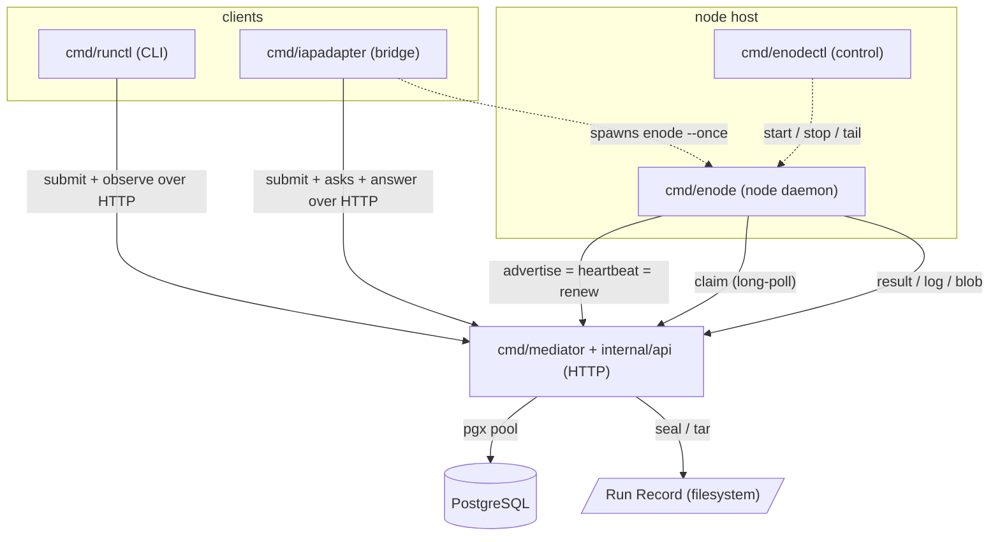
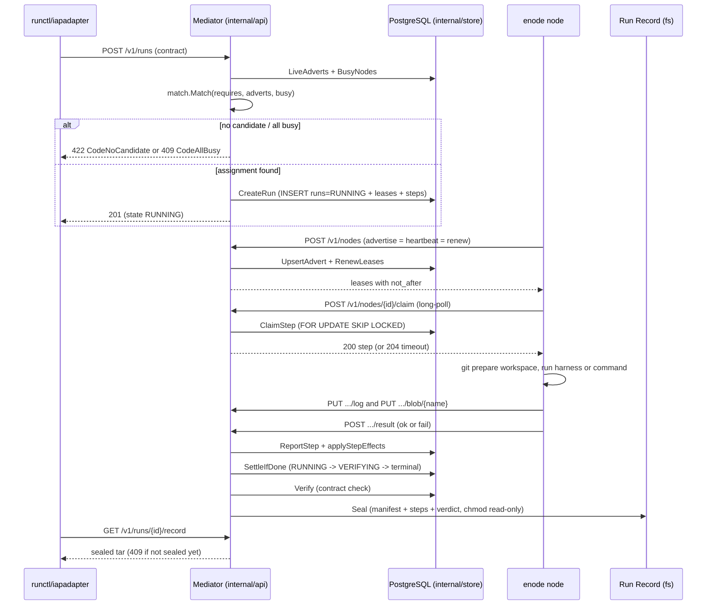

# 아키텍처 — 오늘의 코드

이 문서는 `github.com/taeels/enode` 저장소가 **지금 빌드되는 대로** 무엇으로
이루어져 있는지를 적는다 (`go.mod:1`, `go 1.26`). 설계 정본(`enode-design/`)이
그리는 앞으로의 모습이 아니라 현재 트리의 구조다. 정본이 이미 정했으나 코드가
아직 짓지 않은 자리(예: `GET /v1/nodes` · `QUEUED` · `WakeQueued` ·
`enodectl serve`)는 그 자리마다 오늘은 없다고 표시한다.

---

## System Overview

enode 는 하나의 **Mediator** 가 일감을 나눠 붙이고, 여러 대의 pull 전용
실행 노드(**enode**)가 그 일감을 당겨 실행하는 분산 에이전트 실행 시스템이다.
Mediator 는 짝짓기(matching) · 인가 · 결속(binding) · 기록(recording)만 하고
일을 직접 실행하지 않는다 (ADR-002). 노드는 서버 포트를 열지 않고 (ADR-014,
`advertise.go:16`) 언제나 Mediator 쪽으로만 나가는(HTTP outbound) 세 고루틴
— 탐지 · 광고 · 워커 — 으로 돈다.

경쟁이 붙는 가변 사실(노드 광고 · 임대 · Run 상태 · 단계 진행)은
PostgreSQL 에 있고, 봉인된 Run Record 는 파일시스템에 있다 (`schema.sql:1-8`).
짝짓기는 순수 함수 `internal/match` 이고, DB 는 결정된 배정만 트랜잭션으로
커밋한다.

바이너리는 다섯이다.

```text
   cmd/mediator     HTTP API 서버.  유일하게 포트를 여는 프로세스이고 DB·Record 를 진다
   cmd/enode        실행 노드 데몬.  포트를 안 열고 Mediator 로만 나간다 (pull 전용)
   cmd/enodectl     노드 로컬 제어 CLI.  한 머신의 enode 인스턴스를 뜨고·멈추고·꼬리를 본다
   cmd/runctl       사람·셸이 쓰는 무상태 클라이언트 CLI.  제출하고 잊는다
   cmd/iapadapter   "It's a Plan" 이슈 추적기를 fleet 에 잇는 유일한 바깥 향 브리지
```

Mediator 의 HTTP 표면은 **정확히 15 개의 라우트**다 (`api.go:61-75`), 모두
`s.auth(...)` 로 감싸여 있다. 라우트 목록은 아래 `internal/api` 항에 있다.

---

## Architecture Diagram



점선은 프로세스 기동(spawn), 실선은 HTTP 호출이다. `enodectl` 과 `iapadapter`
둘 다 형제 `enode` 바이너리를 exec 로 띄운다 (링크가 아니라 exec — `setup.go:10-27`,
`orchestrator.go`). 노드는 Mediator 를 향해서만 나가고, Mediator 는 노드를 결코
호출하지 못한다 (ADR-014). 노드가 일을 해도 되는지의 권위는 광고 응답에 실려 오는
임대의 `not_after` 시각이다 (ADR-016, `advertise.go:53`).

---

## Component Descriptions

### cmd/mediator

- **목적**: Mediator 프로세스 진입점. 설정 로드 · 토큰 부트스트랩 · store/Record 열기 ·
  스키마 마이그레이션 · 임대 reaper 고루틴 · HTTP serve/shutdown 을 엮고
  `api.New(...).Handler()` 를 유일한 핸들러로 마운트한다 (`main.go:105`).
- **책임**: `mediator setup` 서브커맨드로 DB/role/database 를 대화형으로 프로비저닝한다
  (`setup.go`, 플래그 파싱 전에 돌고 설정·DB 가 필요 없다). `serve` 는 claim 이 최대
  2h 매달릴 수 있어 `WriteTimeout` 을 일부러 안 건다 (`main.go:107-108`). reaper 를 먼저
  멈추고 pool 을 나중에 닫는 defer LIFO 순서에 의존한다 (`main.go:89-101`).
- **의존**: `internal/api` · `internal/store` · `internal/record` · `internal/config`.
- **유형**: 바이너리 (`package main`). 유일한 서버 데몬.

### cmd/enode

- **목적**: pull 전용 실행 노드 데몬. 설정 파일 경로에서 안정된 신원을 뽑고 (ADR-015),
  탐지 · 광고 · 워커 세 고루틴을 띄운다 (`main.go:233-238`).
- **책임**: git 워크스페이스를 준비하고, 에이전트 하네스 또는 command 단계를 실행하고,
  로그/blob 을 올리고, 결과를 POST 한다. inbound 포트가 0 개다 (`net.Listen` 없음).
- **의존**: `internal/enode` (로직 전부) · `internal/contract` (advert/plan 어휘) ·
  `internal/build` (`--version`).
- **유형**: 바이너리 (`package main`). 워커 데몬.

### cmd/enodectl

- **목적**: 한 머신 위 enode 인스턴스의 노드 로컬 제어면. 설정 파일 하나가 노드 신원이다
  (ADR-015).
- **책임**: 서브커맨드는 `setup · list · id · start · stop · logs · status · version` 이다
  (`main.go:45-66`). 라이브니스는 `.lock` 파일 + 소유 확인에서 끌어낸다 (`main.go:161-187`).
  darwin 에서 `caffeinate` 로 잠들기를 막는다. `serve` 와 `restart` 는 오늘 없다
  (둘 다 코드에 부재 — 확인됨).
- **의존**: `internal/enode` (`ConfDir`/`StateDir`/`Derive`). `setup` 은 링크하지 않고
  형제 `enode setup` 을 exec 한다 — `net/http`/`crypto/tls` 를 이 바이너리에서 빼기 위함
  (`setup.go:10-27`, avprobe 사건).
- **유형**: 바이너리 (`package main`). 노드 로컬 제어 CLI.

### cmd/runctl

- **목적**: 사람·셸이 Mediator 와 말하는 무상태 "제출하고 잊는" 표면.
- **책임**: 서브커맨드 열하나 — `submit · status · record · cancel · example · lint ·
  schema · capabilities · dry-run · asks · answer` (`main.go` 디스패치, 확인됨).
  `asks`/`answer` 는 이미 완성이고 스텁이 아니다. 종료 코드는 0-3 이다 (`main.go:35-40`).
- **의존**: `internal/runctl` (HTTP 클라이언트) · `internal/contract` (offline `example`/`lint`/
  `schema`). `Principal` 은 `git config --get user.email` 을 읽는다 (`client.go:34`).
- **유형**: 바이너리 (`package main`). 클라이언트 CLI.

### cmd/iapadapter

- **목적**: "It's a Plan" 이슈 추적기를 enode Mediator/fleet 에 잇는 유일한 바깥 향 성분
  (ADR-040 §2). DB 를 지지 않는다 — run ID 를 이슈 키에서 파생해 재기동에 안전하다
  (`main.go:584-607`, `itsaplan-<issueKey>-<n>`).
- **책임**: 추적기의 runner 프로토콜을 폴링(claim/heartbeat/result)하고, `enode --once`
  오케스트레이터를 띄워 광고를 기다린 뒤, 고정 템플릿 Run 계약을 제출하고(추론 0),
  되묻기를 이슈 코멘트로 중계하고, 완료 시 코멘트 + 컬럼 이동 + 결과를 쓴다.
- **의존**: `IAP` HTTP 클라이언트(추적기) · `Mediator` HTTP 클라이언트(enode) · `internal/config`
  형태의 자체 `adapter.yaml`. `enode --once` 를 서브프로세스로 exec 한다.
- **유형**: 바이너리 (`package main`). 브리지/어댑터 데몬. 저장소에서 유일하게 바깥을 향한다.

### internal/api

- **목적**: Mediator 의 HTTP 표면 전부. Go 1.22+ `http.ServeMux` 위의 REST 로 라우터
  의존이 없다. 계약을 받아 광고 노드에 짝지어 임대를 발급하고, Run 상태·ledger·blob·
  봉인 tar Record 를 낸다.
- **책임**: 15 개 라우트를 등록하고 (`api.go:61-75`) `s.auth` 로 감싼다. Bearer 토큰을
  상수시간 비교하고 (`api.go:116`), `X-Enode-Principal` 은 식별일 뿐 인가가 아니다
  (ADR-015, `api.go:120`). SQL 을 직접 쓰지 않고 전부 `store.Store` 에 위임한다.
  라우트 표 (METHOD path -> handler):

  ```text
   POST /v1/nodes                                  postNodes    (api.go:61)
   POST /v1/nodes/{id}/claim                        postClaim    (api.go:62)  long-poll, 204 on timeout
   POST /v1/runs/{run}/steps/{seq}/result           postResult   (api.go:63)
   POST /v1/runs                                    postRuns     (api.go:64)
   POST /v1/runs/dry-run                            postDryRun   (api.go:65)
   GET  /v1/runs/{id}                               getRun       (api.go:66)
   GET  /v1/capabilities                            getCapabilities (api.go:67)
   GET  /v1/asks                                    getAsks      (api.go:68)
   POST /v1/runs/{run}/steps/{seq}/answer           postAnswer   (api.go:69)
   GET  /v1/runs/{id}/ledger                        getLedger    (api.go:70)
   GET  /v1/runs/{id}/record                        getRecord    (api.go:71)  409 before sealed
   POST /v1/runs/{id}/cancel                        postCancel   (api.go:72)
   PUT  /v1/runs/{run}/steps/{seq}/log              putLog       (api.go:73)
   PUT  /v1/runs/{run}/steps/{seq}/blob/{name}      putBlob      (api.go:74)
   GET  /v1/runs/{run}/blob/{name}                  getBlob      (api.go:75)
  ```

  오늘 없는 것: `GET /v1/nodes` 는 부재이고 `POST /v1/nodes` 만 있다 (ADR-065 가 더한다).
  `GET /v1/runs` 목록 라우트도 부재다 (id 범위 GET 만 있다). `/ui/` 정적 서빙도 부재다
  (모두 확인됨).
- **의존**: `internal/store` · `internal/record` · `internal/match` (`api.go:398`) ·
  `internal/contract` · `internal/config`.
- **유형**: 라이브러리 (HTTP 핸들러 층).

### internal/store

- **목적**: Mediator 의 PostgreSQL 상태 층이자 시퀀서. 광고 upsert/read, 임대 발급/회수,
  Run 생성/상태전이, 단계 진행(claim/report/ask), 계약 검증(`Verify`), 종료 Run 의
  settle/seal, 만료 임대 reclaim(`Reap`) 을 담는다.
- **책임**: 테이블 `nodes` · `runs` · `leases` · `steps` (`schema.sql`) 을 진다. `Migrate` 는
  `schema.sql` 을 통째로 exec 하고 버전 마이그레이션 도구는 없다 (`ALTER ... ADD COLUMN
  IF NOT EXISTS`). Run 상태로 실제 쓰이는 값은 `RUNNING` · `VERIFYING` · `SUCCEEDED` ·
  `FAILED` 넷뿐이다. `RESOLVING`/`ALLOCATING` 상수는 정의만 되고 아무 데도 안 쓰이는 죽은
  상수이며 (`store.go:157-158`), **`QUEUED` 는 오늘 코드가 쓰지 않는다** — 주석
  (`reap.go:162`) 에만 나온다 (ADR-064 가 여는 값). `WakeQueued` 도 `internal/`·`cmd/`
  어디에도 없다 (요구 문서에만 있음, 확인됨).
- **의존**: pgx pool 뿐 (`store.go:27-28`) + 임베드된 `schema.sql`. `match.Match` 를 실행
  시점 acquire 에서 부른다 (`acquire.go:160`). asks 알림용 outbound webhook
  (`s.NotifyURL`, `ask.go:122`) — fire-and-forget, 인박스가 정본이다.
- **유형**: 라이브러리 (상태/영속 층). SQL 은 전부 여기 산다.

### internal/match

- **목적**: 결정 코어. 계약의 `requires` 를 광고 노드에 사상하는 순수·부작용 없는 함수.
  `POST /v1/runs` 와 dry-run 이 똑같이 쓴다.
- **책임**: `Match(reqs, adverts, busy)` 는 전 배정 `[]Assignment` 또는 타입된 거절
  `*Reject` 를 낸다. `CodeNoCandidate = 422` (영구 불가) 는 `CodeAllBusy = 409` (일시 점유)
  보다 먼저 이긴다 — 2-pass all-or-nothing (`match.go:89-102`). 광고를 attrCount 오름차순 ·
  NodeID 로 타이 브레이크해 정렬한다 (rank/score 가 아니라 결정론).
- **의존**: `internal/contract` 만 (`Require`/`Advert`/`Satisfies`). DB·파일·프로세스 접촉 없음.
  광고를 읽지 않고 받는다 — 호출자가 `LiveAdverts` 로 질의해 넘긴다.
- **유형**: 라이브러리 (순수 함수).

### internal/contract

- **목적**: Run 계약 문법의 정본 타입 모델 (`Contract` · `Require` · `Step` · `StepKind` ·
  `Condition` · `Loop` · `Dispatch` · `Acquire` · `Ask`) 과 `Contract.Validate()`. 더해
  plan 작성 에이전트에게 문법을 가르치고 강제하는 기계용 산출물(`Grammar` · `PlanShape` ·
  `CheckPlan` · 붙여 실행하는 `Example`)을 담는다.
- **책임**: 단계는 agent/run/acquire/ask 중 정확히 하나다 (`Kind`, contract.go:796-820).
  능력 어휘는 `agent.reason` 과 `orchestration` 으로 닫혀 있고 나머지는 subset 매칭 속성이다.
  `CheckPlan` 은 두 번째 검증기를 두지 않고 `Contract.Validate()` 를 스텁으로 재사용한다.
- **의존**: `internal/schema` (form-only 검증). `examples/*.json` 을 `//go:embed` 한다.
- **유형**: 라이브러리 (도메인 모델 · 문법 단일 원천).

### internal/schema

- **목적**: 품질을 판정할 수 있는 어떤 키워드도 거부하는, 일부러 불구가 된 JSON Schema.
  form-only 검증만 한다.
- **책임**: 허용은 `type/required/properties/enum/items/additionalProperties/title/description`
  뿐이고 (`schema.go:26-42`), 크기·길이·개수·pattern·format 키워드는 계약 검증 시점에 하드
  거부된다. `CheckBoundary` 는 form-only 게이트, `Validate` 는 문서 검사다.
- **의존**: 표준 라이브러리 (구조 검사만).
- **유형**: 라이브러리 (검증).

### internal/record

- **목적**: 파일시스템 위의 불변·자기완결 Run Record 를 짓고 봉인하며 tar 로 낸다.
- **책임**: 디렉터리 `run-<id>/` 에 `manifest.json` · `steps/NN-*.json` · `logs/NN-*.log` ·
  `blobs/NN.A-<name>` · `verdict.json` 을 둔다. `Seal` 은 파일을 `0o444`, 디렉터리를 `0o555`
  로 chmod 하고 (`record.go:174,181`) 멱등이다. `Sealed` 는 `verdict.json` 의 쓰기 비트가
  꺼졌는지로 판정한다 (`record.go:78`). 로그는 `limit` 에서 잘라 표시하고(lossy), blob 은
  초과 시 `ErrTooBig` 로 거부한다(all-or-nothing).
- **의존**: 파일시스템만. DB·네트워크 없음.
- **유형**: 라이브러리 (파일시스템 Record store).

### internal/enode

- **목적**: enode 데몬의 로직 전부. `Client`(유일한 outbound 방향) · `Advertiser` ·
  `Detector` · `Worker` 와 워크스페이스/하네스/env/lock 기계.
- **책임**: 세 고루틴을 각자 시계로 돌린다 — 탐지는 자기 고루틴/시계(기본 5분,
  `DefaultDetectEvery`)로 돌아 느린 외부 probe 가 heartbeat 를 막지 못한다 (ADR-068).
  워커는 `Client.Claim` 을 long-poll 하고 (`claim.go:114`), `Held.Valid` 를 다시 확인한 뒤
  하네스/command 를 실행한다. 하네스·command stdout 은 전부 `bytes.Buffer` 에 모았다가
  종료 후에만 decode/업로드한다 — 라이브 tee 가 없다 (`runner.go:94-106`, `claim.go:563-576`).
  능력·임대는 데몬 메모리에만 있고, 유일한 디스크 상태는 설정 파일 · 단일 인스턴스 lock ·
  선택적 log/pid/ready 파일이다.
- **의존**: `internal/contract` · `internal/build`. 외부 프로세스는 git 과 하네스(기본 `claude`),
  그리고 instrumentation hook 이 재귀 exec 하는 enode 자신이다.
- **유형**: 라이브러리 (노드 데몬 로직). 플랫폼 build-tag 쌍 셋: `console_*` · `disk_*` · `lock_*`.

### internal/runctl

- **목적**: runctl 이 쓰는 Mediator HTTP 클라이언트와 DTO.
- **책임**: `Submit` · `Asks` · `Answer` · `Status` · `Cancel` · `Record` · `Wait` ·
  `Capabilities` 를 `Client.do` 로 태운다. 토큰은 `Authorization: Bearer <token>`
  (`client.go:64`), 식별은 `X-Enode-Principal: <git email>`. `Terminal` 은 `SUCCEEDED`·
  `FAILED` 만 참이다 (`client.go:208`). `HTTP` 타임아웃은 고정 60s, `Wait` 는 폴링이다.
- **의존**: 표준 `net/http`. `Principal` 은 `git config --get user.email` 을 exec 한다.
- **유형**: 라이브러리 (HTTP 클라이언트).

### internal/config

- **목적**: Mediator 의 YAML 설정과 비밀/토큰 쓰기.
- **책임**: `Config` 는 `Database` · `Artifacts{Root, MaxBlobBytes}` · `Claim{LongPollSeconds}` ·
  `Notify{AsksURL}` · `Contract` · `Lease{TTLSeconds, RenewSeconds, NotAfterFactor}` 를 담는다
  (`config.go:13`). 기본값은 `Lease{TTLSeconds:3600, RenewSeconds:60, NotAfterFactor:3}` ·
  `Claim{LongPollSeconds:7200}` (2h, ADR-015 §5) · `MaxBlobBytes: 10<<20` (10 MiB)
  (`config.go:75-83`). `not_after` TTL 은 `RenewSeconds * NotAfterFactor = 180s` 로 Mediator
  쪽에서 계산되고 (`api.go:207/235`) 노드에는 `Lease.NotAfter` 로만 도착한다. `write.go` 는
  `NewToken`/`EnsureToken`/`SetDatabaseURL`/`SetArtifactsRoot`/`Create` 로 설정을 만든다.
- **의존**: `gopkg.in/yaml.v3`.
- **유형**: 라이브러리 (설정).

### internal/build

- **목적**: 이 실행파일이 무엇인가(버전·커밋·릴리스)를 담는다 (`build.go:1`). `<cmd> --version`
  이 이것을 찍는다.
- **책임**: `Version(cmd)` 는 `enode <commit> <time> <os/arch> <goversion>` 한 줄을 낸다
  (`build.go:36-39`). `Commit`/`Release` 는 링커가 `-ldflags` 로 박고, 없으면 `fromVCS()` 가
  Go 의 VCS 스탬프에서 읽는다. 광고에는 안 싣는다 — 매처가 동등 비교뿐이라 버전 문자열은
  매칭에 못 쓴다 (`build.go:12-13`). CI 커버리지 계약에서 정확히 80.0% (16/20) 로 고정된
  작은 패키지다 (`.coverage-contract.yml:56-59`).
- **의존**: 표준 `runtime/debug`.
- **유형**: 라이브러리 (빌드 정보).

---

## Data Flow

핵심 트랜잭션은 submit -> match -> lease -> claim -> run -> seal 이다. 아래는 성공 경로다.



흐름의 요점.

- 제출은 두 자리에서 거절된다. 매처 거절(`rej != nil`, `api.go:398-408`)은
  `CreateRejectedRun` 으로 `runs` 행 하나를 `state=FAILED` 로 남긴다 —
  Record 는 봉인되지 않으므로 그 Run 의 `GET .../record` 는 409 다. 반면 임대 PK 충돌
  (`ErrNodeTaken`, `api.go:457-463`)은 트랜잭션이 통째로 롤백되어 **`runs` 행이 아예 안
  남는다**.
- 오늘 코드는 성공 신규 Run 에 `201` 을 낸다. 정본이 여는 `202 QUEUED` 응답은 코드에
  없다 (`QUEUED` 를 쓰지 않으므로 — 위 `internal/store` 항 참조).
- `VERIFYING` 은 후속 tx 밖에서 pool 로 먼저 쓰이고 (`reap.go:278-280`), 종료 상태는
  그 뒤 tx 에서 쓰인다 (`reap.go:313`) — 관측자가 `RUNNING -> VERIFYING` 을 커밋 전에 볼 수
  있다.

### ASKED 우회 (ADR-032 · ADR-047)

계약에 `kind='ask'` 단계가 있으면 흐름은 seal 로 곧장 가지 않고 **사람의 답을
기다리며 갈라진다.** `raiseAsks` 가 `needs` 가 모두 DONE/SKIPPED 인 PENDING ask 단계를
`state='ASKED'` 로 올리고 `ask_deadline` 을 건다 (`ask.go:67-70`). Run 생성 시
(`store.go:307`) 와 매 단계 후 (`afterStep`, `claim.go:851`) 불린다.

ASKED 인 Run 은 reap 대상에서 빠진다 — reap SQL 이 `AND NOT EXISTS (SELECT 1 FROM steps
st WHERE st.run_id = runs.run_id AND st.state = 'ASKED')` 로 제외하기 때문이다
(`reap.go:61-63`, ADR-047). 노드에서 아무것도 안 도는 동안 답을 기다리므로 임대가
만료되어도 회수하지 않는다. 답은 `POST /v1/runs/{run}/steps/{seq}/answer` 로 오는 단일
주소 쓰기이고 blob PUT 과 똑같이 검증된다 — 422 면 저장 안 되고 질문은 열린 채 남는다.
발견은 폴링 인박스 `GET /v1/asks` 가 정본이고, webhook 은 재시도 없는 보조다. 기본 대기는
무한이다. 답이 들어와 검증을 통과하면 `AnswerStep` 이 흐름을 이어 `SettleIfDone` 로
합류하고 위의 seal 경로로 돌아온다.

---

## Integration Points

### PostgreSQL (pgx)

Mediator 만 DB 를 만진다. `internal/store` 가 pgx pool 로 연결하고 (`store.go:27-28`),
임베드된 `schema.sql` 을 `Migrate` 가 통째로 exec 한다 — 별도 마이그레이션 도구 없이
`ALTER ... ADD COLUMN IF NOT EXISTS` 로 더한다. 테이블은 `nodes` · `runs` · `leases` ·
`steps` 넷이다. 할당은 PK 충돌 + 트랜잭션 롤백(`CreateRun`), claim 은
`FOR UPDATE ... SKIP LOCKED LIMIT 1` 로 서로 다른 두 동시성 기제를 쓴다
(`store.go:239-241`). `leases.node_id` 가 PRIMARY KEY 라 노드당 임대는 하나이고 이것이
불변식 I1 을 강제한다 (`schema.sql:58`). 접속 문자열은 `mediator setup` 이
프로비저닝하고 설정에 쓴다.

### Claude 하네스 서브프로세스

노드만 하네스를 exec 한다. `runHarness` (`runner.go:88`) 가 유일한 exec 관문이라
env allowlist 를 한 곳에서 강제한다 — `os.Environ()` 은 결코 상속하지 않고 `harnessEnv`
가 화이트리스트로 조립한다 (`env.go:97`). 하네스 레지스트리에는 오늘 `claudeHarness{}`
하나뿐이고 (`harness.go:228`), 기본 바이너리는 `claude`, `Local.HarnessBin` 오버라이드는
그 어댑터에만 적용된다. stdout 은 전부 버퍼에 모았다가 종료 후 `Decode` 한다 — 라이브
스트림이 없다. `Version` 은 캐시하지 않고 단계마다 다시 probe 해 하네스 드리프트를
잡는다 (`runner.go:118`). instrumentation hook 은 `os.Executable` 로 enode 자신을 재귀
exec 한다 (`runner.go:60`). CI 는 이 하네스의 stub 을 PATH 에 두어 테스트를 안정화한다
(`ci.yml:63-70`).

### git

노드는 워크스페이스 준비에 git 을 shell out 한다 — `reset --hard` · `checkout --detach` ·
`fetch` · `rev-parse` · `clean -df`, 그리고 `repo forall` (`workspace.go`). 워크스페이스
diff 도 git 으로 `$OUT` 에 담는다 (`diff.go`). 클라이언트 쪽에서는 runctl·enodectl·
iapadapter 가 `git config --get user.email` 을 읽어 `X-Enode-Principal` 식별자를 만든다
(`client.go:34`). 저장소 자체는 노드의 광고 속성이지 Mediator 를 통과하지 않는다 (ADR-017).

### 그 밖의 외부 접점

- asks 알림 outbound webhook: `internal/store` 가 `s.NotifyURL` 로 `AskEvent` JSON 을
  fire-and-forget POST 한다 (`ask.go:115-129`) — 재시도 없음, 인박스가 정본.
- iapadapter 는 두 HTTP 표면(추적기의 runner 프로토콜 + Mediator REST)에 붙고 `enode --once`
  를 서브프로세스로 띄운다. 저장소에서 유일하게 바깥을 향한 성분이다.

---

## Infrastructure Components

배포 모델은 `packaging/` 의 OS 설치본이 전부다. **클라우드도 CDK 도 Terraform 도
Kubernetes 매니페스트도 스캔 자료에 없다** — 인프라라 부를 것은 OS 설치본 · GitHub Actions
CI 워크플로 · 테스트용 로컬 docker Postgres 뿐이다.

### OS 설치본 (packaging/)

세 플랫폼 모두 오늘은 **설치만** 하고 서비스 매니저를 걸지 않는다.

```text
   Linux     nfpm 이 .deb/.rpm 을 만든다.  바이너리는 /usr/bin, 설정 디렉터리는 /etc/enode,
             예제는 /usr/share/doc.  systemd 유닛은 일부러 안 싣는다 — 노드용 enode@.service
             템플릿과 mediator 용 enode-mediator.service 는 크리덴셜 게이트웨이 결정 대기로 보류
   macOS     install.sh 가 ~/.local/bin 에 복사만 한다.  아무것도 시작하지 않는다 —
             기동은 enodectl 의 일이고 launchd 는 기본이 아니다 (PATH 최소주의).
             build.sh/check-signature.py 로 ad-hoc 코드 서명
   Windows   wixl(msitools)로 Linux 에서 MSI 를 빌드한다.  C:\Program Files\enode 에 깔고
             ServiceInstall 도 PATH 수정도 없다 (wixl 에 <Environment> 가 없음)
```

즉 세 OS 모두 systemd/launchd/Windows 서비스 통합이 지금은 없고 install-only 다.
`enodectl setup` 은 형제 `enode setup` 을 exec 해 `crypto/tls` 를 이 바이너리에서 뺀다 —
rc13 에서 AhnLab, rc15 에서 Defender 가 `enodectl.exe` 를 삭제한 사건 때문이고 (avprobe),
CI 가 `enodectl.exe` 의 `crypto/tls` T 심볼 <= 10 · `net/http` T 심볼 <= 50 을 강제해
재링크를 막는다 (`ci.yml:479-485`).

### CI 게이트 (.github/workflows/ci.yml)

`test` 잡은 실제 `postgres:17` 서비스를 띄우고(`ci.yml:20-26`, `ENODE_TEST_DATABASE_URL`)
format · vet · lint(경고 전용, 유일한 continue-on-error) · govulncheck · 테스트 · 패키지당
80% 커버리지 바닥 · skip 감시를 건다. U+2605 장식 문자는 별도 grep 게이트로 파일 수 0 을
강제한다 (`ci.yml:74-82`) — 이 저장소 표기 규약의 하드 라인이다. `cross` 잡은 3 플랫폼
크로스빌드와 enodectl 심볼 캡을 잰다. push 는 `main` 에서만, PR 은 전 브랜치에서 돈다.

### 데이터 계층

유일한 외부 상태 의존은 PostgreSQL 이다. CI 와 로컬 테스트는 `postgres:17` 컨테이너를
쓴다 (`scripts/testdb.sh`, DB `enode_test`, 포트 55434). 운영 DB 는 `mediator setup` 이
대화형으로 role/database 를 프로비저닝하고 접속 문자열을 설정에 쓴다. 봉인 Run Record 는
DB 가 아니라 `cfg.Artifacts.Root` 아래 파일시스템에 산다 (I4 는 FS 불변성이 필요하다).

### 모듈

모듈은 `github.com/taeels/enode`, `go 1.26` (toolchain `go1.26.6`). 직접 의존은 셋뿐이다 —
`github.com/jackc/pgx/v5` · `golang.org/x/sys` · `gopkg.in/yaml.v3` (그 외 7 개는 간접).
