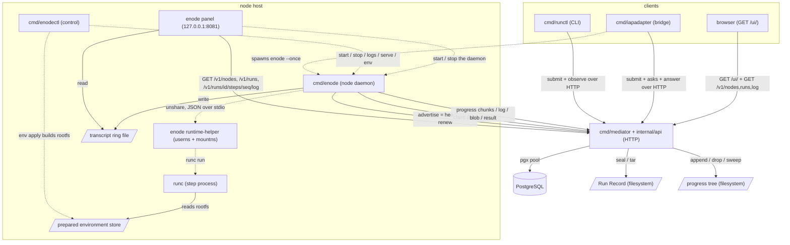
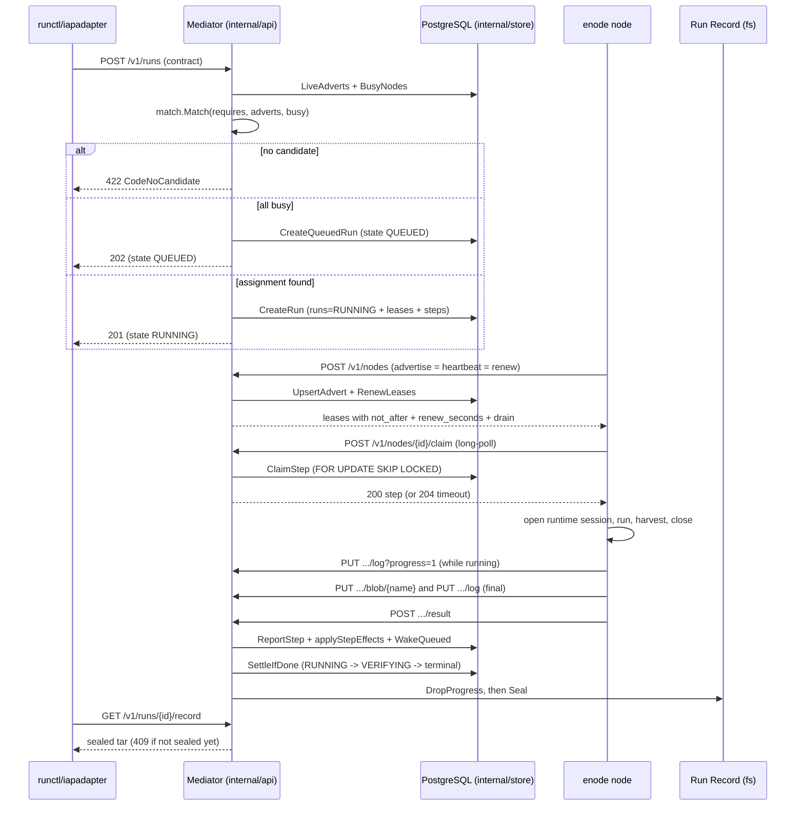

# 아키텍처 — 오늘의 코드

이 문서는 `github.com/taeels/enode` 저장소가 **지금 빌드되는 대로** 무엇으로
이루어져 있는지를 적는다 (`go.mod`, `go 1.26` · toolchain `go1.26.6`). 설계
정본(`enode-design/`)이 그리는 앞으로의 모습이 아니라 현재 트리의 구조다.
정본이 이미 정했으나 코드가 아직 짓지 않은 자리는 그 자리마다 오늘은 없다고
표시한다.

**2026-09-23 전면 재측정.** 2026-09-15 판을 대체한다. 기준 커밋은 `195a5d0` —
`origin/main`(`073f5f1`) 위에 `unit/runtime-environment-profile` 을 합친 나무다.
그 사이에 패키지 셋(`internal/environment` · `internal/transcript` ·
`internal/transcriptui`)이 생겼고 노드에 격리 실행 경계(`StepRuntime`)가 섰다.
재측정의 범위와 방법은 `reverse-engineering-timestamp.md`.

---

## System Overview

enode 는 하나의 **Mediator** 가 일감을 나눠 붙이고, 여러 대의 pull 전용
실행 노드(**enode**)가 그 일감을 당겨 실행하는 분산 에이전트 실행 시스템이다.
Mediator 는 짝짓기(matching) · 인가 · 결속(binding) · 기록(recording)만 하고
일을 직접 실행하지 않는다 (ADR-002). 노드는 서버 포트를 열지 않고 (ADR-014)
언제나 Mediator 쪽으로만 나가는(HTTP outbound) 세 고루틴 — 탐지 · 광고 · 워커 —
으로 돈다.

경쟁이 붙는 가변 사실(노드 광고 · 임대 · Run 상태 · 단계 진행)은
PostgreSQL 에 있고, 봉인된 Run Record 는 파일시스템에 있다. 짝짓기는 순수 함수
`internal/match` 이고, DB 는 결정된 배정만 트랜잭션으로 커밋한다.

**단계는 이제 실행 경계를 지난다** (ADR-073). 노드 설정이 실행 환경 profile 을
가리키면 데몬은 기동 전에 준비도를 재고, profile 의 driver 에 따라 단계를
host 에서 그대로(`native`) 또는 user namespace 안의 overlay 워크스페이스 위 runc
컨테이너에서(`runc-overlay`) 돌린다. profile 이 없는 노드는 전과 같이 native 다.

바이너리는 다섯이다.

```text
   cmd/mediator     HTTP API 서버.  유일하게 포트를 여는 프로세스이고 DB·Record 를 진다
   cmd/enode        실행 노드 데몬.  포트를 안 열고 Mediator 로만 나간다 (pull 전용)
                    하위명령 다섯이 더 있다 — runtime-helper · hook · setup · panel · env
   cmd/enodectl     노드 로컬 제어 CLI.  한 머신의 enode 인스턴스를 뜨고·멈추고·준비하고·본다
   cmd/runctl       사람·셸이 쓰는 무상태 클라이언트 CLI.  제출하고 잊는다
   cmd/iapadapter   "It's a Plan" 이슈 추적기를 fleet 에 잇는 유일한 바깥 향 브리지
```

Go 패키지는 **스물하나**다 (`go list ./...`). 비테스트 소스 132 파일 · 31,551 줄.

**HTTP 를 여는 프로세스는 둘이다.** Mediator 말고 노드 제어판(`enode panel`)이
기본 `127.0.0.1:8081` 에 붙는다. 데몬(`cmd/enode`)은 여전히 안 연다.

Mediator 의 HTTP 표면은 **27 개 라우트**다 — `api.go` 의 스물하나와
`demo_gallery.go` 의 여섯. 목록은 `api-documentation.md`.

---

## Architecture Diagram



점선은 프로세스 기동(spawn), 실선은 HTTP 호출 또는 파일 접근이다. 노드는
Mediator 를 향해서만 나가고, Mediator 는 노드를 결코 호출하지 못한다 (ADR-014).
노드가 일을 해도 되는지의 권위는 광고 응답에 실려 오는 임대의 `not_after` 시각이다
(ADR-016).

**runtime helper 는 데몬의 자식이고 단계 하나만 산다.** 부모가 죽으면 `Pdeathsig` 와
`unshare --kill-child` 가 helper 와 runc 를 함께 거둔다. native 노드에는 이 두 상자가
없다.

---

## Component Descriptions

### cmd/mediator

- **목적**: Mediator 프로세스 진입점. 설정 로드 · 토큰 부트스트랩 · store/Record 열기 ·
  스키마 마이그레이션 · 임대 reaper 고루틴 · HTTP serve/shutdown 을 엮고
  `api.New(...).Handler()` 를 유일한 핸들러로 마운트한다.
- **책임**: `mediator setup` 이 DB/role/database 를 대화형으로 프로비저닝한다. `serve` 는
  claim 이 오래 매달릴 수 있어 `WriteTimeout` 을 일부러 안 건다. reaper 가 진행 트리의
  고아 쓸기를 함께 진다.
- **의존**: `internal/api` · `internal/store` · `internal/record` · `internal/config`.
- **유형**: 바이너리 (`package main`). 유일한 서버 데몬.

### cmd/enode

- **목적**: pull 전용 실행 노드 데몬. 설정 파일 경로에서 안정된 신원을 뽑고 (ADR-015),
  탐지 · 광고 · 워커 세 고루틴을 띄운다.
- **책임**: 하위명령 다섯을 `main()` 앞에서 가로챈다.

  ```text
     enode runtime-helper   runc-overlay 가 unshare 안에서 자기를 다시 띄운 것.  사적 진입점
     enode hook             하네스 훅.  자기를 재귀 exec 한 것이 부른다
     enode setup            노드 설정 만들기.  enodectl setup 이 exec 위임한다
     enode panel            제어판 서버.  enodectl serve 가 exec 위임한다
     enode env check|apply  실행 환경 준비.  enodectl env 가 exec 위임한다
  ```

  **기동이 준비도를 잰다.** 설정에 `environment` 가 있으면 `CheckWithRuntime` 이
  `ready` 가 아닐 때 exit 1 로 멈추고 `enodectl env check · apply` 를 가리킨다.
  ready 면 현재 manifest 를 읽어 결과 기록(`execenv.Record`)을 만들고 driver 에 따라
  `NativeRuntime` 또는 `RuncOverlayRuntime` 을 Worker 에 끼운다. 기동은 환경을
  고치지 않는다.
- **의존**: `internal/enode` · `internal/environment` · `internal/panel` · `internal/build`.
- **유형**: 바이너리 (`package main`). 워커 데몬 + 제어판 숙주 + runtime helper.

### cmd/enodectl

- **목적**: 한 머신 위 enode 인스턴스의 노드 로컬 제어면. 설정 파일 하나가 노드 신원이다.
- **책임**: 서브커맨드는 `list · setup · env · id · start · stop · logs · serve · status ·
  version` 이다. `env` 가 신규다 — 형제 `enode env` 를 exec 한다. `start` 는 설정에
  `environment` 가 있으면 `enode env check` 를 먼저 exec 하고, 준비가 안 됐으면 띄우지
  않는다. `restart` 는 오늘도 없다.
- **의존**: `internal/enode` · `internal/proc`. `setup` · `serve` · `env` 셋 다 링크하지
  않고 형제 `enode` 를 exec 한다 — `net/http`/`crypto/tls` 를 이 바이너리에서 빼기
  위함이다 (avprobe 사건).
- **유형**: 바이너리 (`package main`). 노드 로컬 제어 CLI.

### cmd/runctl

- **목적**: 사람·셸이 Mediator 와 말하는 무상태 "제출하고 잊는" 표면.
- **책임**: 서브커맨드 열하나 — `submit · status · record · cancel · example · lint ·
  schema · capabilities · dry-run · asks · answer`. 종료 코드는 0-3 이다.
- **오늘 없는 것**: `runctl mcp` 는 부재다.
- **의존**: `internal/runctl` · `internal/contract`.
- **유형**: 바이너리 (`package main`). 클라이언트 CLI.

### cmd/iapadapter

- **목적**: "It's a Plan" 이슈 추적기를 enode Mediator/fleet 에 잇는 유일한 바깥 향 성분
  (ADR-040 §2). DB 를 지지 않는다.
- **책임**: 추적기의 runner 프로토콜을 폴링하고, `enode --once` 오케스트레이터를 띄워
  광고를 기다린 뒤, 고정 템플릿 Run 계약을 제출하고, 되묻기를 이슈 코멘트로 중계한다.
- **의존**: 내부 패키지 0. `enode --once` 를 서브프로세스로 exec 한다.
- **유형**: 바이너리 (`package main`). 기준선 뒤로 안 바뀌었다.

### internal/api

- **목적**: Mediator 의 HTTP 표면 전부. Go 1.22+ `http.ServeMux` 위의 REST 로 라우터
  의존이 없다.
- **책임**: 라우트 27 을 등록한다. 인증은 세 겹이다 — `s.auth` · `read(...)`(데모 모드면
  무인증 + 한도) · 무인증 정적. `read` 가 감싸는 것이 넷이 됐다 — nodes · runs ·
  run 상세 · **GET log**. 진행 중 단계의 로그를 내는 `log.go` 가 신규다 — 봉인 전은 진행
  파일(원문), 봉인 뒤는 `logs/`(선별본)를 내고 그 갈림을 헤더에 적는다. `PUT log` 는
  `?progress=1` 로 두 파일로 갈린다. SQL 을 직접 쓰지 않고 전부 `store.Store` 에 위임한다.
- **파일**: `api.go`(1,122 줄) · `log.go` · `nodes.go` · `runs.go` · `ratelimit.go` ·
  `demo.go` · `demo_gallery.go` · `demo_gallery_history.go`.
- **의존**: `internal/store` · `internal/record` · `internal/match` · `internal/contract` ·
  `internal/config` · `internal/schema` · `internal/api/ui` · `internal/transcript`.
- **유형**: 라이브러리 (HTTP 핸들러 층).

### internal/api/ui

- **목적**: `GET /ui/` 아래 정적 화면. 랜딩 · 카드뉴스 · 데모 · 함대 현황판 네 번들이다.
- **책임**: `static/` 을 `//go:embed` 로 물고 `http.FileServerFS` 로 낸다. 모든 응답에 보안
  헤더 다섯. 함대 현황판이 선택한 단계의 로그를 `GET .../log` 로 폴링해 트랜스크립트
  카드를 그린다(`transcript-poller.mjs`). 카드 렌더러는 `internal/transcriptui` 의 것을
  같은 바이트로 낸다.
- **의존**: `internal/transcriptui`. **`internal/store` 를 참조하지 않는다** (구조 불변식).
- **유형**: 라이브러리 (정적 자산 + 얇은 핸들러).

### internal/panel

- **목적**: 노드 소유자가 자기 기계에서 자기 노드 하나를 보고 통제하는 제어판 서버.
- **책임**: 무상태다. 라우트 열하나이고 전부 자기 프로세스가 연다. 트랜스크립트 카드가
  링을 읽어 사건 열로 그리고, 지난 단계는 Mediator 의 `GET .../log` 로 받는다
  (2026-09-15 판은 봉인 tar 를 받아 풀었다). 모든 응답에 보안 헤더 다섯이 붙는다.
  loopback 바인딩이면 인증이 없고, 아니면 `panel_token` 이 필수다.
- **의존**: `internal/enode` · `internal/runctl` · `internal/proc` · `internal/contract` ·
  `internal/transcript` · `internal/transcriptui`. `internal/store` 와 `internal/api` 를 안
  문다 (`boundary_test.go`).
- **유형**: 라이브러리 (노드 로컬 HTTP 서버).

### internal/proc

- **목적**: 잠금 파일에서 데몬 pid 를 읽고 그 프로세스를 멈추고 자식을 떼어낸다.
- **의존**: 표준 라이브러리 + `golang.org/x/sys`. 기준선 뒤로 안 바뀌었다.
- **유형**: 라이브러리. 빌드 태그 쌍 하나.

### internal/store

- **목적**: Mediator 의 PostgreSQL 상태 층이자 시퀀서.
- **책임**: 테이블 `nodes` · `runs` · `leases` · `steps` 를 진다. `Migrate` 는
  `schema.sql` 을 통째로 exec 한다 — **기준선 뒤로 스키마가 한 줄도 안 바뀌었다.**
  `StepResult` 가 `environment` 필드를 얻었고, 봉인이 진행 트리를 먼저 걷고, 회수기가
  고아 진행 트리를 쓴다.
- **단계 상태**: `PENDING` · `CLAIMED` · `DONE` · `FAILED` · `SKIPPED` · `ASKED`. `CLAIMED` 가
  claim 부터 result 까지 한 칸이다 — 명령이 끝났는지를 담는 열이 없다.
- **의존**: pgx pool + `internal/contract` · `internal/match` · `internal/record` ·
  `internal/schema` · **`internal/environment`**(결과 타입 하나).
- **유형**: 라이브러리 (상태/영속 층). SQL 은 전부 여기 산다.

### internal/match

- **목적**: 결정 코어. 계약의 `requires` 를 광고 노드에 사상하는 순수·부작용 없는 함수.
- **책임**: `CodeNoCandidate = 422` 가 `CodeAllBusy = 409` 보다 먼저 이긴다 — 2-pass
  all-or-nothing. 부분집합 비교이고 술어도 부정 조건도 없다.
- **의존**: `internal/contract` 만. 기준선 뒤로 안 바뀌었다.
- **유형**: 라이브러리 (순수 함수).

### internal/contract

- **목적**: Run 계약 문법의 정본 타입 모델과 `Contract.Validate()`, 그리고 plan 작성
  에이전트에게 문법을 가르치는 기계용 산출물.
- **책임**: 단계는 agent/run/acquire/ask 중 정확히 하나다. **`Workspace` 에서 `Rev` 가
  빠졌다** (ADR-072) — 이제 `repo` 하나다. 단계에 `effect` · 예산 · `sync` · `builds[]` ·
  merge kind 는 없다.
- **의존**: `internal/schema`.
- **유형**: 라이브러리 (도메인 모델 · 문법 단일 원천).

### internal/schema · internal/config · internal/runctl · internal/build

기준선 뒤로 뜻이 안 바뀌었다. `internal/runctl` 에 `StepLog`(GET log 의 원문과 헤더)가
더해졌다. `internal/build` 는 여전히 정확히 80.0% (16/20) 로 하한에 붙어 있다.

### internal/record

- **목적**: 파일시스템 위의 불변·자기완결 Run Record 를 짓고 봉인하며 tar 로 낸다.
  그리고 **봉인 전의 원문이 쌓이는 진행 파일**을 기록 디렉터리의 형제에 둔다.
- **책임**: `run-<id>/` 에 `manifest.json` · `steps/NN-*.json` · `logs/NN-*.log` ·
  `blobs/NN.A-<name>` · `verdict.json`. `Seal` 은 `0o444` / `0o555` 로 굳히고 멱등이다.
  `AppendLog` 가 파일 총 길이를 돌려준다. 진행 트리는 `<Root>/progress/run-<id>/` 이고
  시도가 바뀌면 앞 시도를 걷고, 총 길이 상한에서 표시 줄 하나를 붙이고 멈춘다.
- **의존**: 파일시스템만.
- **유형**: 라이브러리.

### internal/transcript (신규)

- **목적**: 하네스 stdout(NDJSON)을 화면이 그리는 사건 열로 읽는 유일한 길.
- **책임**: `Kind` 는 닫힌 어휘 일곱 — 하네스가 내는 여섯(init · text · tool_use ·
  tool_result · result · raw)과 enode 가 찍는 `capped` 하나. 봉인 로그의 껍데기 줄을 짓는 `Shell` 과 읽는 `Parse` 가 한 패키지에
  산다. 파일도 소켓도 시계도 못 만진다 — 의존 그래프가 그렇게 막는다.
- **의존**: 표준 라이브러리 넷. 봉인이 `boundary_test.go` 에 있다.
- **유형**: 라이브러리 (순수 파서).

### internal/transcriptui (신규)

- **목적**: 트랜스크립트 카드 렌더러 `card.mjs` 한 장을 `embed.FS` 로 든다.
- **책임**: 제어판과 현황판이 각자 라우트로 같은 바이트를 낸다. 문장이 0 이라 커버리지
  표에 안 나온다 — 설계다.
- **유형**: 라이브러리 (정적 자산 하나).

### internal/environment (신규)

- **목적**: 노드 로컬 실행 환경 profile 과 그 준비 산출물 (ADR-073).
- **책임**:

  ```text
     profile     YAML 한 장.  api_version enode.dev/v1alpha1 · kind execution-environment.
                 host(apt 패키지 · subuid/subgid 크기 · unprivileged userns) ·
                 rootfs(debootstrap · release · arch · apt · locale · 사용자) ·
                 runtime(driver native | runc-overlay · workspace_target · /tmp 크기 · ssh) ·
                 verify(실행파일 · locale)
     check       사실을 재서 상태 일곱 중 하나로 판정한다.  ready 면 실제 runtime smoke
     apply       계획한 연산을 실행한다 — host 패키지(sudo) · debootstrap · rootfs 봉인 ·
                 manifest 게시.  profile 이 도중에 바뀌면 멈춘다
     manifest    prepared_environment_id = 정규화 투영의 sha256.  profile sha256 을 든다
     record      단계 결과에 실리는 식별자 — profile · 준비 산출물 · runtime · uid/gid · /tmp
  ```

- **의존**: 표준 + `yaml.v3`. 내부 의존 0.
- **유형**: 라이브러리. 빌드 태그 쌍 둘 (`privilege_*` · `runtime_driver_*`).

### internal/enode

- **목적**: enode 데몬의 로직 전부. 비테스트 41 파일 10,137 줄로 가장 큰 패키지다.
- **책임**: 세 고루틴을 각자 시계로 돌린다 — 탐지(기본 5분) · 광고(기본 60초) · 워커.
  워커는 `Client.Claim` 을 롱폴하고, `Held.Valid` 를 다시 확인한 뒤 단계를 연다.
  2026-09-15 판 뒤에 늘어난 자리가 여섯이다.

  ```text
     runtime.go             StepRuntime · StepSession · NativeRuntime.  단계의 수명을 소유한다
     runc_overlay_linux.go  RuncOverlayRuntime · helper · OCI config · 준비도 smoke
     environment.go         노드 설정의 environment 바인딩과 공유 profile 을 읽는다
     overlay_linux.go       overlay 탐침 — kernel · userns · fuse 사다리 (ADR-070 §5.7)
     emit.go · upload.go    하네스 줄을 사건으로 흘리고, 도는 동안의 원문을 Mediator 로 민다
     detect.go 의 확장      machine · arch.<이름> 광고 (ADR-070 §2.2)
  ```

- **의존**: `internal/contract` · `internal/environment` · `internal/transcript`. 외부
  프로세스는 git · 하네스(기본 `claude`) · enode 자신 · runc-overlay 면 `unshare` 와 `runc`.
- **유형**: 라이브러리. 빌드 태그 쌍 다섯: `console_*` · `disk_*` · `lock_*` · `overlay_*` ·
  `runc_overlay_*`.

---

## Data Flow

### Run 하나 — Mediator 에서 본 것

핵심 트랜잭션은 submit -> match -> lease -> claim -> run -> seal 이다. 아래는 성공 경로다.



- 제출의 착지가 셋이다 — 201 RUNNING · 202 QUEUED (ADR-064) · 422 FAILED.
- `VERIFYING` 은 후속 tx 밖에서 먼저 쓰이고 종료 상태는 그 뒤 tx 에서 쓰인다.
- **단계 상태는 claim 부터 result 까지 `CLAIMED` 하나다.** Mediator 가 보는 단계의
  사건은 셋뿐이다 — claim 된 순간(`started_at`), 진행 청크, result 가 닿은 순간
  (`ended_at = now()`).

### 단계 하나 — 노드 안에서 (신규 절)

`claim.go` 의 `execute` 와 `runAgentStep` 이다. 줄 번호는 `195a5d0` 기준.

```text
   1   Held.Valid(run) 를 확인한다.  아니면 안 돈다 (ADR-010)
   2   링을 비운다.  $OUT 을 host 임시 디렉터리로 만든다
   3   워크스페이스 준비 — reset --hard · clean -df (계약에 workspace 가 있을 때)
   4   stampNow — 기준 시각.  이 뒤에 바뀐 것이 「이 단계가 만든 것」이다
   5   $IN 을 host 임시 디렉터리로 만들고 입력 blob 을 받아 깐다.  0555 로 잠근다
   6   임대 감시 고루틴 — 1초마다 not_after 를 보고 지나면 runCtx 를 끊는다
   7   runtime.Open  (claim.go:634)
   8   agent 면 runAgentStep 으로.  command 면 argv 의 $IN · $OUT 을 runtime 경로로 푼다
   9   session.Run — stdout·stderr 를 버퍼 + 링 + 진행 업로더로 tee 한다
  10   session.Harvest  (command: claim.go:691-694 · agent: :876-882)
  11   session.Close
  12   업로드 — blob 들과 단계 끝 로그 (순서는 경로마다 다르다)
  13   report — result 가 닿을 때까지 다시 보낸다 (ADR-030)
```

**9 와 13 사이가 밖에서 안 보인다.** 명령이 끝나도 단계는 `CLAIMED` 이고 광고는
평소대로 나간다. 그 사이에 노드가 하는 일이 셋이다.

```text
   Harvest   command 단계는 Discover: true 와
             RecordDiff: (워크스페이스 설정 있음 && 계약에 workspace 있음) 으로 부른다.
             agent 단계는 하네스가 완주했을 때만 같은 둘을 켠다.
               Discover    changedSince — 워크스페이스 전체를 걷어 기준 시각 뒤 바뀐 것
               RecordDiff  git diff --binary 를 $OUT/workspace.diff 로
             둘 다 비용이 결과가 아니라 워크스페이스 크기를 따른다
   Close     runc-overlay 면 helper 가 마운트를 풀고 runRoot 를 RemoveAll 한다.
             삭제가 upper 의 항목 수에 비례한다
   업로드     $OUT 의 산출물마다 PUT blob.  workspace.diff · workspace.changed 도 blob 이다
```

단계 시간 로그(`step finished ... took`)는 `Run` 시작부터 재므로 이 셋이 다 든다.

### runc-overlay 세션 — 노드 안의 격리 (신규 절)

```text
   Open      <scratch>/enode-runc-XXXX 를 runRoot 로 만들고
             unshare --user --map-root-user --map-auto --mount --fork --kill-child
             -- enode runtime-helper 를 띄운다 (Setpgid · Pdeathsig SIGKILL)
   helper    runRoot 아래 bundle · state · upper · work · merged · lower-ro · in-ro · ssh-ro.
             워크스페이스를 lower-ro 에 재귀 읽기 전용 bind (mount_setattr),
             $IN 을 in-ro 에, ssh_dir 를 ssh-ro 에 같은 식으로.
             overlay lowerdir=lower-ro,upperdir=upper,workdir=work -> merged
   거절      runRoot 와 워크스페이스가 서로를 품으면 · runRoot 가 overlayfs 위면 ·
             경로에 , 나 : 가 있으면 · rootfs 에 목표 디렉터리가 없으면
   Project   하네스 · enode · 계장 · 자격증명 helper 를 /run/enode/ 아래로 (agent 만)
   Run       OCI config 를 bundle 에 쓰고 runc run.  rootfs 는 읽기 전용,
             merged 를 workspace_target 에 rw bind, $IN ro, $OUT rw, /tmp tmpfs,
             user · pid · ipc · uts · mount · cgroup namespace, capability 0,
             NoNewPrivileges, RLIMIT_NOFILE 1024.  끝나면 runc delete --force
   Harvest   helper 가 merged 를 워크스페이스로 바꿔 native 수확을 부른다
   Close     close 요청 -> helper 가 마운트 넷을 MNT_DETACH 로 풀고 runRoot 를 RemoveAll.
             부모도 helper 를 기다린 뒤(3초) runRoot 를 한 번 더 RemoveAll 한다
```

**lower 는 절대 안 바뀐다** — 쓰기는 전부 upper 에 간다. 그리고 **upper 는 세션과 함께
버려진다** — 단계가 워크스페이스에 쓴 것 중 `$OUT` 에 옮겨지지 않은 것은 사라진다.
lower 에 합치는 경로가 없다.

`runRoot` 를 `RemoveAll` 하는 자리가 다섯이다 — `Open` 의 실패 갈래(`:143` ~ `:170`) ·
세션 `Close`(`:437`) · `abort`(`:451`) · helper `cleanup`(`:1017`) · 준비도 smoke 의
probe 디렉터리(`:1212`). trash 로 옮기는 자리는 없다.

### 하네스 출력이 흐르는 길

```text
   에이전트 단계   stdout -> bytes.Buffer + 링 + 진행 업로더 + 사건 배출기
                   단계 끝에 selectLogs 가 크기 절단 선별본을 짓고 PUT log 한 번
   명령 단계       stdout·stderr -> bytes.Buffer + 링 + 진행 업로더
                   단계 끝에 버퍼 전체를 PUT log 한 번
   진행 업로더     2초 또는 64 KiB 마다 PUT log?progress=1.  못 보낸 것은 1 MiB 까지 든다.
                   실행을 안 막는다 — 네트워크를 기다리지 않는다
```

2026-09-15 판이 적은 「에이전트 단계의 링이 비어 있다」와 「도는 동안 사건이 안
난다」는 더 참이 아니다. 링 tee 가 되살아났고(트랜스크립트 회차의 질문 2 = A), 흘리는
일(`emit.go`)과 판정하는 일(`Decode`)이 갈렸다. `Decode` 는 여전히 끝난 뒤 한 번
읽는다 — 종료코드를 인자로 받으므로 그것이 설계다.

### ASKED 우회 (ADR-032 · ADR-047)

계약에 `kind='ask'` 단계가 있으면 흐름은 사람의 답을 기다리며 갈라진다. `raiseAsks`
가 준비된 ask 단계를 `ASKED` 로 올리고 `ask_deadline` 을 건다. ASKED 인 Run 은 reap
대상에서 빠진다. 답은 `POST .../answer` 로 오는 단일 주소 쓰기이고 blob PUT 과 똑같이
검증된다. 기준선 뒤로 안 바뀌었다.

---

## Integration Points

### PostgreSQL (pgx)

Mediator 만 DB 를 만진다. 테이블은 `nodes` · `runs` · `leases` · `steps` 넷이다.
할당은 PK 충돌 + 트랜잭션 롤백, claim 은 `FOR UPDATE ... SKIP LOCKED LIMIT 1` 로
서로 다른 두 동시성 기제를 쓴다. `leases.node_id` 가 PRIMARY KEY 라 노드당 임대는
하나이고 이것이 불변식 I1 을 강제한다.

### Claude 하네스 서브프로세스

노드만 하네스를 exec 한다. `runHarness` 가 유일한 exec 관문이라 env allowlist 를
한 곳에서 강제한다. 이제 그 exec 도 `StepSession.Run` 을 지난다 — runc-overlay 노드에서는
하네스가 rootfs 안에서 돌고, 하네스 실행파일과 enode 와 계장 디렉터리가 `/run/enode/`
아래로 투영된다. 투영하기 전에 그 실행파일의 동적 의존이 rootfs 안에서 풀리는지 ELF 로
확인한다.

### runc 와 Linux namespace (신규)

runc-overlay 노드만이다. 특권이 0 이다 — `unshare --map-root-user --map-auto` 가 여는
user namespace 안에서 overlay 를 마운트하고 runc 를 띄운다. host 의 subordinate ID
범위가 profile 의 `subuid_size` · `subgid_size` 이상이어야 하고, rootfs 사용자의 uid ·
gid 가 그 범위 안에 들어야 한다. `env check` 가 그것과 unprivileged userns 를 smoke 로
잰다.

### 실행 환경 store (신규)

`env apply` 가 host 에서 debootstrap 으로 rootfs 를 짓고 `chmod -R a-w` 로 굳혀
`<store>` 아래에 prepared environment 로 게시한다. 이 과정만 sudo 를 쓴다. 데몬과
단계는 그 rootfs 를 읽기만 한다.

### git

노드는 워크스페이스 준비에 git 을 shell out 한다 — `reset --hard` · `clean -df`,
그리고 `repo forall`. repo 신원을 유도할 때 `rev-parse` 를 쓴다. **`checkout` 과 `fetch` 가 빠졌다** — 계약이
리비전을 안 적는다 (ADR-072). 워크스페이스 diff 도 git 으로 `$OUT` 에 담는다.

### 브라우저

`GET /ui/` 아래 정적 번들 넷. 함대 현황판은 관측 라우트 셋을 5초로 폴링하고,
선택한 단계의 로그를 `GET .../log` 로 따로 폴링한다.

### 그 밖의 외부 접점

- asks 알림 outbound webhook: fire-and-forget, 인박스가 정본.
- iapadapter 는 두 HTTP 표면에 붙고 `enode --once` 를 서브프로세스로 띄운다.

---

## Infrastructure Components

배포 모델은 `packaging/` 의 OS 설치본이 전부다. **클라우드도 CDK 도 Terraform 도
Kubernetes 매니페스트도 없다.**

### OS 설치본 (packaging/)

세 플랫폼 모두 오늘은 **설치만** 하고 서비스 매니저를 걸지 않는다.

```text
   Linux     nfpm 이 .deb/.rpm 을 만든다.  systemd 유닛은 일부러 안 싣는다
   macOS     install.sh 가 ~/.local/bin 에 복사만 한다.  ad-hoc 코드 서명
   Windows   wixl(msitools)로 리눅스에서 MSI 를 빌드한다.  ServiceInstall 도 PATH 수정도 없다
```

설치본은 runc · uidmap · debootstrap 을 의존으로 싣지 않는다 — runc-overlay 노드의
host 패키지는 profile 이 선언하고 `env apply` 가 깐다.

### CI 게이트 (.github/workflows/ci.yml)

`test` 잡은 실제 `postgres:17` 서비스를 띄우고 format · vet · lint(경고 전용) ·
govulncheck · 테스트 · 커버리지 · 스킵 감시를 건다. 차단 게이트는 다섯이다.

```text
   U+2605 을 담은 파일 수         상한 0
   출력 문자열의 장식 문자         별도 스텝
   패키지별 커버리지               하한 80%.  프로파일에서 직접 센다
   허용목록 밖의 스킵              상한 0.  go list ./... 로 패키지 수까지 센다
   enodectl.exe 심볼 상한          crypto/tls 10 · net/http 50 (cross 잡)
```

**runc-overlay 의 실제 격리 경로는 CI 에 없다.** 기본 테스트는 helper 프로토콜을 가짜
프로세스로 돌리고, 실제 namespace 게이트는 `integration` 태그 시험이다.

### 데이터 계층

유일한 외부 상태 의존은 PostgreSQL 이다. 봉인 Run Record 와 진행 트리는 DB 가 아니라
`cfg.Artifacts.Root` 아래 파일시스템에 산다. 노드 쪽의 링 · 정책 · 상태 파일 · 준비
산출물 store · runtime scratch 도 파일이고 DB 를 안 만진다.

### 모듈

`github.com/taeels/enode`, `go 1.26` (toolchain `go1.26.6`). 직접 의존은 셋뿐이다 —
`github.com/jackc/pgx/v5 v5.10.0` · `golang.org/x/sys v0.47.0` · `gopkg.in/yaml.v3 v3.0.1`
(그 외 일곱은 간접). 기준선 뒤로 안 바뀌었다.
