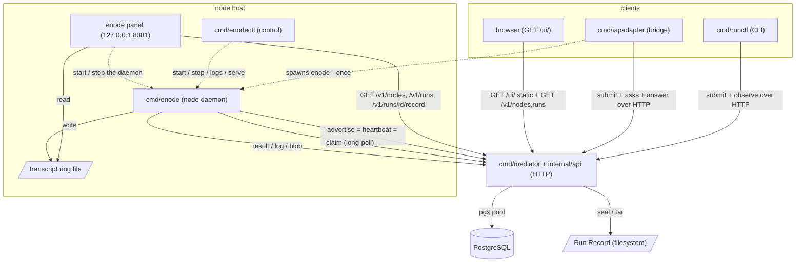
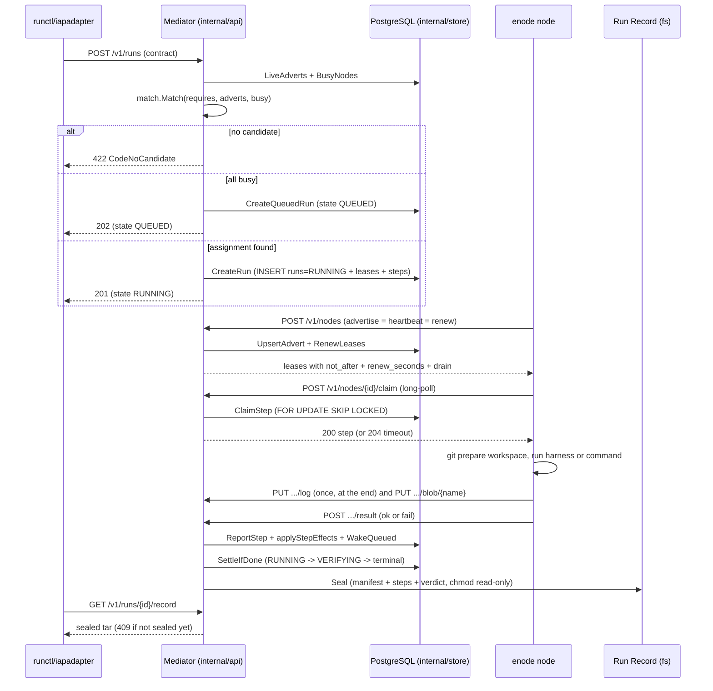

# 아키텍처 — 오늘의 코드

이 문서는 `github.com/taeels/enode` 저장소가 **지금 빌드되는 대로** 무엇으로
이루어져 있는지를 적는다 (`go.mod:8`, `go 1.26` · toolchain `go1.26.6`). 설계
정본(`enode-design/`)이 그리는 앞으로의 모습이 아니라 현재 트리의 구조다.
정본이 이미 정했으나 코드가 아직 짓지 않은 자리는 그 자리마다 오늘은 없다고
표시한다.

**2026-09-15 전면 재측정.** 2026-09-08 판과 2026-09-11 부분 갱신판을 대체한다.
그 사이에 패키지 셋(`internal/panel` · `internal/proc` · `internal/api/ui`)이
생겼고 라우트가 15 에서 26 이 됐다. 재측정의 범위와 방법은
`reverse-engineering-timestamp.md`.

---

## System Overview

enode 는 하나의 **Mediator** 가 일감을 나눠 붙이고, 여러 대의 pull 전용
실행 노드(**enode**)가 그 일감을 당겨 실행하는 분산 에이전트 실행 시스템이다.
Mediator 는 짝짓기(matching) · 인가 · 결속(binding) · 기록(recording)만 하고
일을 직접 실행하지 않는다 (ADR-002). 노드는 서버 포트를 열지 않고 (ADR-014,
`advertise.go`) 언제나 Mediator 쪽으로만 나가는(HTTP outbound) 세 고루틴
— 탐지 · 광고 · 워커 — 으로 돈다.

경쟁이 붙는 가변 사실(노드 광고 · 임대 · Run 상태 · 단계 진행)은
PostgreSQL 에 있고, 봉인된 Run Record 는 파일시스템에 있다. 짝짓기는 순수 함수
`internal/match` 이고, DB 는 결정된 배정만 트랜잭션으로 커밋한다.

바이너리는 다섯이다.

```text
   cmd/mediator     HTTP API 서버.  유일하게 포트를 여는 프로세스이고 DB·Record 를 진다
   cmd/enode        실행 노드 데몬.  포트를 안 열고 Mediator 로만 나간다 (pull 전용)
                    하위명령 셋이 더 있다 — hook · setup · panel
   cmd/enodectl     노드 로컬 제어 CLI.  한 머신의 enode 인스턴스를 뜨고·멈추고·본다
   cmd/runctl       사람·셸이 쓰는 무상태 클라이언트 CLI.  제출하고 잊는다
   cmd/iapadapter   "It's a Plan" 이슈 추적기를 fleet 에 잇는 유일한 바깥 향 브리지
```

Go 패키지는 **열여덟**이다 (`go list ./...`). 비테스트 소스 97 파일 · 24,534 줄.

**HTTP 를 여는 프로세스가 둘이 됐다.** Mediator 말고 노드 제어판(`enode panel`)이
기본 `127.0.0.1:8081` 에 붙는다. 데몬(`cmd/enode`)은 여전히 안 연다 — 제어판은
별개 프로세스이고 `enodectl serve` 가 그 하위명령으로 exec 위임한다.

Mediator 의 HTTP 표면은 **26 개 라우트**다. 세는 자리가 둘이다 — `api.go` 의
등록 열일곱, `demo_gallery.go` 의 여섯, 그리고 `/{$}` 리다이렉트와 `/ui/` 정적
둘. `api.go` 한 파일의 `mux.HandleFunc` 만 세면 17 이 나오고 아홉을 놓친다.
목록은 `api-documentation.md`.

---

## Architecture Diagram



점선은 프로세스 기동(spawn), 실선은 HTTP 호출 또는 파일 접근이다. 노드는
Mediator 를 향해서만 나가고, Mediator 는 노드를 결코 호출하지 못한다 (ADR-014).
노드가 일을 해도 되는지의 권위는 광고 응답에 실려 오는 임대의 `not_after` 시각이다
(ADR-016).

**제어판은 데몬을 안 통한다.** 값을 셋에서 따로 읽는다 — 로컬 파일(설정 ·
정책 · 상태 · 링 · 잠금) · 로컬 프로세스 · Mediator 조회. 하나가 죽어도 나머지는
그린다 (`panel.go` 의 패키지 주석).

---

## Component Descriptions

### cmd/mediator

- **목적**: Mediator 프로세스 진입점. 설정 로드 · 토큰 부트스트랩 · store/Record 열기 ·
  스키마 마이그레이션 · 임대 reaper 고루틴 · HTTP serve/shutdown 을 엮고
  `api.New(...).Handler()` 를 유일한 핸들러로 마운트한다.
- **책임**: `mediator setup` 서브커맨드로 DB/role/database 를 대화형으로 프로비저닝한다
  (플래그 파싱 전에 돌고 설정·DB 가 필요 없다). `serve` 는 claim 이 최대 2h 매달릴 수
  있어 `WriteTimeout` 을 일부러 안 건다. reaper 를 먼저 멈추고 pool 을 나중에 닫는
  defer LIFO 순서에 의존한다.
- **의존**: `internal/api` · `internal/store` · `internal/record` · `internal/config`.
- **유형**: 바이너리 (`package main`). 유일한 서버 데몬.

### cmd/enode

- **목적**: pull 전용 실행 노드 데몬. 설정 파일 경로에서 안정된 신원을 뽑고 (ADR-015),
  탐지 · 광고 · 워커 세 고루틴을 띄운다.
- **책임**: git 워크스페이스를 준비하고, 에이전트 하네스 또는 command 단계를 실행하고,
  로그/blob 을 올리고, 결과를 POST 한다. 데몬 자신은 inbound 포트가 0 개다.
  하위명령 셋을 `main()` 앞에서 가로챈다.

  ```text
     enode hook     하네스 훅.  자기를 재귀 exec 한 것이 부른다
     enode setup    노드 설정 만들기.  enodectl setup 이 exec 위임한다
     enode panel    제어판 서버.  enodectl serve 가 exec 위임한다
  ```

- **의존**: `internal/enode` (로직 전부) · `internal/panel` (panel 하위명령) ·
  `internal/contract` · `internal/build`.
- **유형**: 바이너리 (`package main`). 워커 데몬 + 제어판 숙주.

### cmd/enodectl

- **목적**: 한 머신 위 enode 인스턴스의 노드 로컬 제어면. 설정 파일 하나가 노드 신원이다
  (ADR-015).
- **책임**: 서브커맨드는 `list · setup · id · start · stop · logs · serve · status ·
  version` 이다. 라이브니스는 `.lock` 파일 + 소유 확인에서 끌어낸다. darwin 에서
  `caffeinate` 로 잠들기를 막는다. **`serve` 가 2026-09-08 판 뒤에 생겼다** —
  형제 `enode panel` 을 exec 한다. `restart` 는 오늘도 없다.
- **의존**: `internal/enode` (`ConfDir`/`StateDir`/`Derive`) · `internal/proc`.
  `setup` 과 `serve` 둘 다 링크하지 않고 형제 `enode` 를 exec 한다 —
  `net/http`/`crypto/tls` 를 이 바이너리에서 빼기 위함이다 (avprobe 사건).
- **유형**: 바이너리 (`package main`). 노드 로컬 제어 CLI.

### cmd/runctl

- **목적**: 사람·셸이 Mediator 와 말하는 무상태 "제출하고 잊는" 표면.
- **책임**: 서브커맨드 열하나 — `submit · status · record · cancel · example · lint ·
  schema · capabilities · dry-run · asks · answer`. 종료 코드는 0-3 이다.
  `shape.go` 가 계약 문법과 팩 모양을 사람에게 설명한다.
- **오늘 없는 것**: **`runctl mcp` 는 부재다** (확인됨 — `cmd/` 어디에도 MCP 서버
  하위명령이 없다). 짝 팩(harness-components)의 3.3.1 이 그것을 여는 자리이고
  아직 `main` 에 안 들어왔다.
- **의존**: `internal/runctl` (HTTP 클라이언트) · `internal/contract`.
  `Principal` 은 `git config --get user.email` 을 읽는다.
- **유형**: 바이너리 (`package main`). 클라이언트 CLI.

### cmd/iapadapter

- **목적**: "It's a Plan" 이슈 추적기를 enode Mediator/fleet 에 잇는 유일한 바깥 향 성분
  (ADR-040 §2). DB 를 지지 않는다 — run ID 를 이슈 키에서 파생해 재기동에 안전하다.
- **책임**: 추적기의 runner 프로토콜을 폴링(claim/heartbeat/result)하고, `enode --once`
  오케스트레이터를 띄워 광고를 기다린 뒤, 고정 템플릿 Run 계약을 제출하고(추론 0),
  되묻기를 이슈 코멘트로 중계하고, 완료 시 코멘트 + 컬럼 이동 + 결과를 쓴다.
- **의존**: `IAP` HTTP 클라이언트(추적기) · `Mediator` HTTP 클라이언트(enode) · 자체
  `adapter.yaml`. `enode --once` 를 서브프로세스로 exec 한다.
- **유형**: 바이너리 (`package main`). 브리지/어댑터 데몬. 저장소에서 유일하게 바깥을 향한다.

### internal/api

- **목적**: Mediator 의 HTTP 표면 전부. Go 1.22+ `http.ServeMux` 위의 REST 로 라우터
  의존이 없다. 계약을 받아 광고 노드에 짝지어 임대를 발급하고, Run 상태·ledger·blob·
  봉인 tar Record 를 낸다. 관측 라우트 둘과 데모 표면이 그 위에 얹혔다.
- **책임**: 라우트 26 개를 등록한다. 인증은 세 겹이다.

  ```text
     s.auth       Bearer 토큰 상수시간 비교.  쓰기 전부와 실 함대의 읽기
     read(...)    조건부 래퍼.  데모 모드면 s.limit(무인증 + 한도), 아니면 s.auth
     무인증       GET /{$} 리다이렉트와 GET /ui/ 정적 파일
  ```

  `read` 가 감싸는 것은 `GET /v1/nodes` · `GET /v1/runs` · `GET /v1/runs/{id}` 셋이다.
  조건부 등록이 아니라 조건부 래퍼인 것이 설계다 — 라우트 표의 개수와 패턴이 모드와
  무관하게 같다. 데모 모드의 무인증은 `ADR-065` §2 를 벗어나는 것으로 코드 주석이
  명시한다 (준수가 아니라 벗어남으로 적혀 있다).
  SQL 을 직접 쓰지 않고 전부 `store.Store` 에 위임한다.
- **파일**: `api.go`(1,200 줄 · 라우팅과 핵심 핸들러) · `nodes.go` · `runs.go` ·
  `ratelimit.go` · `demo.go` · `demo_gallery.go` · `demo_gallery_history.go`.
- **의존**: `internal/store` · `internal/record` · `internal/match` · `internal/contract` ·
  `internal/config` · `internal/schema` · `internal/api/ui`.
- **유형**: 라이브러리 (HTTP 핸들러 층).

### internal/api/ui

**2026-09-08 판에 없던 패키지다.**

- **목적**: `GET /ui/` 아래 정적 화면. 랜딩 · 카드뉴스 · 데모 · 함대 현황판 네 번들이다.
- **책임**: `static/` 을 `//go:embed` 로 물고 `http.FileServerFS` 로 낸다. 디렉터리
  목록을 안 낸다 — `index.html` 이 없는 디렉터리는 404 다. 모든 응답에 보안 헤더
  다섯을 싣는다 (`Content-Security-Policy` · `Strict-Transport-Security` ·
  `X-Content-Type-Options` · `X-Frame-Options` · `Referrer-Policy`). 데모 페이지에만
  `frame-src` 를 열고, 그 origin 은 `static/demo/settings.json` 을 파싱해 얻는다 —
  사설 호스트 · 숫자 호스트 · 자격증명 비슷한 질의 키를 전부 거절한다.
- **화면**: 함대 현황판은 `static/fleet/` 과 `static/shared/fleet/` 의 ES 모듈이다.
  `ObservationClient` 가 `GET /v1/nodes` · `/v1/runs` · `/v1/asks` 를 **5초**로 폴링하고
  선택된 Run 은 `GET /v1/runs/{id}` 를 따로 문다. `DashboardView` 가 장면 둘(함대 ·
  작업 그래프)과 인스펙터를 그린다. 브라우저 테스트는 `tests/*.test.mjs` 열넷이다.
- **의존**: 표준 라이브러리만. **`internal/store` 를 참조하지 않는다** (구조 불변식).
- **유형**: 라이브러리 (정적 자산 + 얇은 핸들러).

### internal/panel

**2026-09-08 판에 없던 패키지다.**

- **목적**: 노드 소유자가 자기 기계에서 자기 노드 하나를 보고 통제하는 제어판 서버
  (`enode-features` 3.1.2).
- **책임**: 무상태다. 라우트 열이고 전부 자기 프로세스가 연다.

  ```text
     GET  /                화면 한 장 (page.go 의 indexHTML · 시안 design/enode-ux.pen)
     GET  /api/state       신원 · 탐지 능력 · 프로세스 · 현재 작업 · drain · Mediator
     POST /api/drain       정책 파일에 graceful | at-boundary 를 쓴다
     POST /api/undrain     푼다.  자동 복귀는 없다
     POST /api/stop        도는 Run 을 먼저 cancel 하고 데몬을 끈다
     POST /api/start       자기 실행파일을 --config 로 다시 띄운다 (부모에서 떼어낸다)
     GET  /api/logs        데몬 로그의 꼬리 200 줄
     GET  /api/transcript  로컬 링 파일 (1초 폴링 대상)
     GET  /api/runs        GET /v1/runs 를 받아 이 노드가 assigned 인 것만
     GET  /api/record      GET /v1/runs/{id}/record 의 tar 에서 logs/ 만 꺼낸다
  ```

  loopback 바인딩이면 인증이 없다 — 그 기계에 접속한 것이 소유의 증거다 (ADR-063 §3).
  loopback 이 아니면 정책 파일의 `panel_token` 이 필수이고 없으면 **뜨기를 거부한다.**
  Mediator 토큰을 재사용하지 않는다.
- **의존**: `internal/enode` (신원 · 정책 · 상태 · 링) · `internal/runctl` (Mediator 조회) ·
  `internal/proc` · `internal/contract`. `internal/store` 와 `internal/api` 를 안 문다
  (`boundary_test.go` 가 그것을 센다).
- **유형**: 라이브러리 (노드 로컬 HTTP 서버).

### internal/proc

**2026-09-08 판에 없던 패키지다.**

- **목적**: 잠금 파일에서 데몬 pid 를 읽고 그 프로세스를 멈추고 자식을 떼어낸다.
- **책임**: `PidFromLock` 은 `<config>.lock` 의 첫 줄을 읽고 `OwnsConfig` 로 그 pid 가
  실제로 그 설정을 열고 있는지 확인한다 — 파일의 존재만으로는 아무것도 못 말한다
  (enode 는 끝나도 잠금 파일을 안 지운다). `SignalStop` 과 `DetachAttr` 은 유닉스와
  윈도우 파일로 갈린다.
- **의존**: 표준 라이브러리 + `golang.org/x/sys`.
- **유형**: 라이브러리 (프로세스 조회 · 제어). 빌드 태그 쌍 하나.

### internal/store

- **목적**: Mediator 의 PostgreSQL 상태 층이자 시퀀서.
- **책임**: 테이블 `nodes` · `runs` · `leases` · `steps` 를 진다. `Migrate` 는
  `schema.sql` 을 통째로 exec 하고 버전 마이그레이션 도구는 없다.
  **`QUEUED` 가 구현됐다** — 2026-09-08 판은 「오늘 코드가 쓰지 않는다」로 적었으나
  `queue.go` 가 생겼고 `CreateQueuedRun` · `WakeQueued` · `WakeQueuedNow` 가 산다
  (ADR-064). 점유 실패한 제출을 죽이지 않고 QUEUED 로 받아 두었다가 임대가 지워지는
  지점마다 훑어 승격한다. 관측 표면 `Nodes` · `Runs` · `Steps` 도 여기 있다 (ADR-065).
- **의존**: pgx pool + 임베드된 `schema.sql` + `internal/contract` · `internal/match` ·
  `internal/record`. asks 알림용 outbound webhook (fire-and-forget, 인박스가 정본).
- **유형**: 라이브러리 (상태/영속 층). SQL 은 전부 여기 산다.

### internal/match

- **목적**: 결정 코어. 계약의 `requires` 를 광고 노드에 사상하는 순수·부작용 없는 함수.
  `POST /v1/runs` 와 dry-run 이 똑같이 쓴다.
- **책임**: `Match(reqs, adverts, busy)` 는 전 배정 또는 타입된 거절을 낸다.
  `CodeNoCandidate = 422` (영구 불가) 가 `CodeAllBusy = 409` (일시 점유) 보다 먼저
  이긴다 — 2-pass all-or-nothing. 광고를 attrCount 오름차순 · NodeID 로 타이 브레이크해
  정렬한다 (rank/score 가 아니라 결정론).
- **의존**: `internal/contract` 만. DB·파일·프로세스 접촉 없음.
- **유형**: 라이브러리 (순수 함수).

### internal/contract

- **목적**: Run 계약 문법의 정본 타입 모델과 `Contract.Validate()`. 더해 plan 작성
  에이전트에게 문법을 가르치고 강제하는 기계용 산출물(`Grammar` · `PlanShape` ·
  `CheckPlan` · 붙여 실행하는 `Example`)을 담는다.
- **책임**: 단계는 agent/run/acquire/ask 중 정확히 하나다. 능력 어휘는 `agent.reason` 과
  `orchestration` 으로 닫혀 있고 나머지는 subset 매칭 속성이다. `CheckPlan` 은 두 번째
  검증기를 두지 않고 `Contract.Validate()` 를 스텁으로 재사용한다. `advert.go` 가
  광고 어휘와 drain 상수 셋을 진다.
- **의존**: `internal/schema` (form-only 검증). `examples/*.json` 을 `//go:embed` 한다.
- **유형**: 라이브러리 (도메인 모델 · 문법 단일 원천).

### internal/schema

- **목적**: 품질을 판정할 수 있는 어떤 키워드도 거부하는, 일부러 불구가 된 JSON Schema.
  form-only 검증만 한다.
- **책임**: 허용은 `type/required/properties/enum/items/additionalProperties/title/
  description` 뿐이고, 크기·길이·개수·pattern·format 키워드는 계약 검증 시점에 하드
  거부된다.
- **의존**: 표준 라이브러리.
- **유형**: 라이브러리 (검증).

### internal/record

- **목적**: 파일시스템 위의 불변·자기완결 Run Record 를 짓고 봉인하며 tar 로 낸다.
- **책임**: 디렉터리 `run-<id>/` 에 `manifest.json` · `steps/NN-*.json` · `logs/NN-*.log` ·
  `blobs/NN.A-<name>` · `verdict.json` 을 둔다. `Seal` 은 파일을 `0o444`, 디렉터리를
  `0o555` 로 chmod 하고 멱등이다. `Sealed` 는 `verdict.json` 의 쓰기 비트가 꺼졌는지로
  판정한다. `AppendLog` 는 이어 붙이기(`O_APPEND`)이고 **호출 한 번의 바이트 수**를
  돌려준다 — 파일의 총 길이가 아니다. 상한도 호출마다 걸린다.
- **의존**: 파일시스템만. DB·네트워크 없음.
- **유형**: 라이브러리 (파일시스템 Record store).

### internal/enode

- **목적**: enode 데몬의 로직 전부. `Client`(유일한 outbound 방향) · `Advertiser` ·
  `Detector` · `Worker` 와 워크스페이스/하네스/env/lock 기계. 비테스트 33 파일 7,769 줄로
  가장 큰 패키지다.
- **책임**: 세 고루틴을 각자 시계로 돌린다 — 탐지는 자기 고루틴/시계(기본 5분)로 돌아
  느린 외부 probe 가 heartbeat 를 막지 못한다 (ADR-068). 워커는 `Client.Claim` 을
  long-poll 하고, `Held.Valid` 를 다시 확인한 뒤 하네스/command 를 실행한다.
  2026-09-08 판 뒤에 늘어난 자리가 다섯이다.

  ```text
     policy.go       소유자 정책 파일.  drain 과 panel_token (ADR-063)
     status.go       상태 파일.  탐지 능력과 그 시각을 제어판이 읽는다 (ADR-068)
     transcript.go   고정 크기 트랜스크립트 링 파일.  제어판이 1초로 읽는다
     mcp.go          MCP 허용목록 · 팩 tar 읽기 · 노드 선언
     runner.go 의 계장  가짜 홈 · 팩 펴기 · 허용목록 · 자격증명 복사 (짝 팩)
  ```

- **의존**: `internal/contract` · `internal/build`. 외부 프로세스는 git 과 하네스(기본
  `claude`), 그리고 instrumentation hook 이 재귀 exec 하는 enode 자신이다.
- **유형**: 라이브러리 (노드 데몬 로직). 플랫폼 build-tag 쌍 셋: `console_*` · `disk_*` ·
  `lock_*`.

### internal/runctl

- **목적**: runctl 과 제어판이 쓰는 Mediator HTTP 클라이언트와 DTO.
- **책임**: `Submit` · `Asks` · `Answer` · `Status` · `Cancel` · `Record` · `Wait` ·
  `Capabilities` · `Nodes` · `Runs` 를 `Client.do` 로 태운다. 토큰은
  `Authorization: Bearer`, 식별은 `X-Enode-Principal`. `Terminal` 은 `SUCCEEDED`·
  `FAILED` 만 참이다. `HTTP` 는 필드라 제어판이 3초 타임아웃으로 갈아 끼운다.
- **의존**: 표준 `net/http`.
- **유형**: 라이브러리 (HTTP 클라이언트).

### internal/config

- **목적**: Mediator 의 YAML 설정과 비밀/토큰 쓰기.
- **책임**: `Config` 는 `Database` · `Artifacts{Root, MaxBlobBytes}` · `Claim{LongPollSeconds}` ·
  `Notify{AsksURL}` · `Contract` · `Lease{TTLSeconds, RenewSeconds, NotAfterFactor}` 와
  데모 스위치 둘(`Demo` · `DemoGallery`)을 담는다. `not_after` TTL 은
  `RenewSeconds * NotAfterFactor` 로 Mediator 쪽에서 계산되고 노드에는
  `Lease.NotAfter` 로만 도착한다.
- **의존**: `gopkg.in/yaml.v3`.
- **유형**: 라이브러리 (설정).

### internal/build

- **목적**: 이 실행파일이 무엇인가(버전·커밋·릴리스)를 담는다. `<cmd> --version` 이
  이것을 찍는다.
- **책임**: `Version(cmd)` 는 한 줄을 낸다. `Commit`/`Release` 는 링커가 `-ldflags` 로
  박고, 없으면 Go 의 VCS 스탬프에서 읽는다. 광고에는 안 싣는다 — 매처가 동등 비교뿐이라
  버전 문자열은 매칭에 못 쓴다. 커버리지 계약에서 정확히 80.0% (16/20) 로 고정된
  작은 패키지다.
- **의존**: 표준 `runtime/debug`.
- **유형**: 라이브러리 (빌드 정보).

---

## Data Flow

핵심 트랜잭션은 submit -> match -> lease -> claim -> run -> seal 이다. 아래는 성공 경로다.



흐름의 요점.

- 제출의 거절이 셋으로 갈렸다. 매처가 「후보가 없다」면 `422` 이고 `runs` 행 하나가
  `state=FAILED` 로 남는다. 「전부 점유」면 이제 죽지 않고 `QUEUED` 로 들어간다
  (ADR-064) — 2026-09-08 판이 「오늘 코드가 안 쓴다」로 적은 자리가 이것이다.
  임대 PK 충돌은 트랜잭션이 통째로 롤백되어 `runs` 행이 아예 안 남는다.
- `VERIFYING` 은 후속 tx 밖에서 pool 로 먼저 쓰이고 종료 상태는 그 뒤 tx 에서 쓰인다 —
  관측자가 `RUNNING -> VERIFYING` 을 커밋 전에 볼 수 있다.
- **로그는 단계당 한 번 올라간다.** 노드가 `PUT .../log` 를 부르는 자리는 단계 끝
  하나이고 본문은 그 단계의 출력 전체다. 도중에 올리는 경로가 없다.

### 하네스 출력이 흐르는 길 (2026-09-12 에 바뀌었다)

```text
   에이전트 단계   stdout -> bytes.Buffer -> selectLogs 선별 -> PUT log (단계 끝 한 번)
                   링 tee 없음.  runner.go 의 ⑥ 이 껐다
   명령 단계       stdout·stderr -> io.MultiWriter(buf, ring) -> PUT log (단계 끝 한 번)
                   링 tee 있음.  claim.go 가 건다
```

`Argv` 는 이미 `-p --output-format stream-json --verbose` 다. 그래서 하네스가 도는
동안 사건 줄이 실제로 흐른다 — 그런데 그것을 받는 `Decode` 가 아직 배치다
(`io.ReadAll` 로 EOF 까지 읽고 `final` 사건 하나만 낸다). 그리고 링 tee 가 꺼져 있어
**에이전트 단계의 트랜스크립트 링에는 아무것도 안 들어온다.**

`selectLogs` 는 `logs/` 를 **허용목록으로 거른다** — 첫 `system/init` 줄과 마지막
`result` 줄과 stderr 만 전문이고, 나머지 사건은 껍데기(사건 종류 · 도구 이름 ·
성공 여부 · 토큰 수)로 바뀐다. 걷은 양을 `{"type":"enode.elided",...}` 한 줄로 남긴다.
근거는 봉인 기록의 자격증명 누출이다 (짝 팩 `decisions.md` 6절 ⑰ · ⑱ · ⑲).

### ASKED 우회 (ADR-032 · ADR-047)

계약에 `kind='ask'` 단계가 있으면 흐름은 seal 로 곧장 가지 않고 **사람의 답을
기다리며 갈라진다.** `raiseAsks` 가 `needs` 가 모두 DONE/SKIPPED 인 PENDING ask 단계를
`state='ASKED'` 로 올리고 `ask_deadline` 을 건다. Run 생성 시와 매 단계 후 불린다.

ASKED 인 Run 은 reap 대상에서 빠진다 — reap SQL 이 ASKED 단계가 있는 Run 을
제외하기 때문이다 (ADR-047). 노드에서 아무것도 안 도는 동안 답을 기다리므로 임대가
만료되어도 회수하지 않는다. 답은 `POST /v1/runs/{run}/steps/{seq}/answer` 로 오는 단일
주소 쓰기이고 blob PUT 과 똑같이 검증된다 — 422 면 저장 안 되고 질문은 열린 채 남는다.
발견은 폴링 인박스 `GET /v1/asks` 가 정본이고, webhook 은 재시도 없는 보조다.

---

## Integration Points

### PostgreSQL (pgx)

Mediator 만 DB 를 만진다. `internal/store` 가 pgx pool 로 연결하고, 임베드된
`schema.sql` 을 `Migrate` 가 통째로 exec 한다 — 별도 마이그레이션 도구 없이
`ALTER ... ADD COLUMN IF NOT EXISTS` 로 더한다. 테이블은 `nodes` · `runs` · `leases` ·
`steps` 넷이다. 할당은 PK 충돌 + 트랜잭션 롤백, claim 은
`FOR UPDATE ... SKIP LOCKED LIMIT 1` 로 서로 다른 두 동시성 기제를 쓴다.
`leases.node_id` 가 PRIMARY KEY 라 노드당 임대는 하나이고 이것이 불변식 I1 을 강제한다.

### Claude 하네스 서브프로세스

노드만 하네스를 exec 한다. `runHarness` 가 유일한 exec 관문이라 env allowlist 를
한 곳에서 강제한다 — `os.Environ()` 은 결코 상속하지 않고 `harnessEnv` 가
화이트리스트로 조립한다. 하네스 레지스트리에는 오늘 `claudeHarness{}` 하나뿐이다.

exec 앞에 치명 검사가 모여 있다 (`runner.go` 의 ① ~ ⑥). 계장 임시 디렉터리를 못
만들면 단계가 실패하고, 그 아래 **가짜 홈**(`CLAUDE_CONFIG_DIR`)이 서고, 팩이
`--plugin-dir` 로 펴지고, MCP 허용목록이 `--strict-mcp-config --mcp-config=` 로
걸리고, OAuth 자격증명이 0600 으로 복사된다. 디렉터리는 단계 끝에 지워진다 —
보존 스위치를 일부러 안 뒀다.

`Version` 은 캐시하지 않고 단계마다 다시 probe 해 하네스 드리프트를 잡는다.
`Usable` 은 `claude auth status --json` 으로 「있다」와 「쓸 수 있다」를 가른다
(ADR-059) — 형식을 모르면 쓸 수 있는 쪽으로 본다. CI 는 이 하네스의 stub 을 PATH 에
두어 테스트를 안정화한다.

### git

노드는 워크스페이스 준비에 git 을 shell out 한다 — `reset --hard` · `checkout --detach` ·
`fetch` · `rev-parse` · `clean -df`, 그리고 `repo forall`. 워크스페이스 diff 도 git 으로
`$OUT` 에 담는다. 클라이언트 쪽에서는 runctl·enodectl·iapadapter 가
`git config --get user.email` 을 읽어 `X-Enode-Principal` 식별자를 만든다.

### 브라우저

`GET /ui/` 아래 정적 번들 넷이 붙는다. 함대 현황판은 관측 라우트 셋을 5초로 폴링하고,
데모 번들은 무인증 읽기 셋과 데모 제출 라우트를 쓴다. 갤러리는 외부 Amplify origin 과
디스크의 worker 를 거치는 별도 흐름이다.

### 그 밖의 외부 접점

- asks 알림 outbound webhook: `internal/store` 가 `AskEvent` JSON 을 fire-and-forget
  POST 한다 — 재시도 없음, 인박스가 정본.
- iapadapter 는 두 HTTP 표면(추적기의 runner 프로토콜 + Mediator REST)에 붙고
  `enode --once` 를 서브프로세스로 띄운다. 저장소에서 유일하게 바깥을 향한 성분이다.

---

## Infrastructure Components

배포 모델은 `packaging/` 의 OS 설치본이 전부다. **클라우드도 CDK 도 Terraform 도
Kubernetes 매니페스트도 없다** — 인프라라 부를 것은 OS 설치본 · GitHub Actions
CI 워크플로 · 테스트용 로컬 docker Postgres 뿐이다.

### OS 설치본 (packaging/)

세 플랫폼 모두 오늘은 **설치만** 하고 서비스 매니저를 걸지 않는다.

```text
   Linux     nfpm 이 .deb/.rpm 을 만든다.  바이너리는 /usr/bin, 설정은 /etc/enode,
             예제는 /usr/share/doc.  systemd 유닛은 일부러 안 싣는다
   macOS     install.sh 가 ~/.local/bin 에 복사만 한다.  아무것도 시작하지 않는다 —
             기동은 enodectl 의 일이고 launchd 는 기본이 아니다.
             build.sh/check-signature.py 로 ad-hoc 코드 서명
   Windows   wixl(msitools)로 리눅스에서 MSI 를 빌드한다.  C:\Program Files\enode 에
             깔고 ServiceInstall 도 PATH 수정도 없다
```

`enodectl setup` 과 `enodectl serve` 는 형제 `enode` 를 exec 해 `crypto/tls` 와
`net/http` 를 이 바이너리에서 뺀다 — rc13 에서 AhnLab, rc15 에서 Defender 가
`enodectl.exe` 를 삭제한 사건 때문이고, CI 가 `enodectl.exe` 의 `crypto/tls` T 심볼
10 이하 · `net/http` T 심볼 50 이하를 강제해 재링크를 막는다.

### CI 게이트 (.github/workflows/ci.yml)

`test` 잡은 실제 `postgres:17` 서비스를 띄우고 format · vet · lint(경고 전용, 유일한
continue-on-error) · govulncheck · 테스트 · 커버리지 · 스킵 감시를 건다. 차단 게이트는
다섯이다.

```text
   U+2605 을 담은 파일 수         상한 0.  이진 파일은 -I 로 건너뛴다
   출력 문자열의 장식 문자         별도 스텝.  위 한 글자 검사의 구멍을 메운다
   패키지별 커버리지               하한 80%.  프로파일에서 직접 세므로 열여덟이 다 걸린다
   허용목록 밖의 스킵              상한 0.  go list ./... 로 패키지 수까지 센다
   enodectl.exe 심볼 상한          crypto/tls 10 · net/http 50 (cross 잡)
```

커버리지 하한은 `.coverage-contract.yml` 이 값의 정본이고 CI 가 집행한다. 기준선 표는
열다섯 패키지뿐이라 **새로 생긴 셋(`panel` · `proc` · `api/ui`)이 표에 없다** —
그래도 게이트는 프로파일에서 직접 세므로 이 셋도 80% 를 넘어야 한다.

### 데이터 계층

유일한 외부 상태 의존은 PostgreSQL 이다. CI 와 로컬 테스트는 `postgres:17` 컨테이너를
쓴다 (`scripts/testdb.sh`, DB `enode_test`, 포트 55434). 운영 DB 는 `mediator setup` 이
대화형으로 role/database 를 프로비저닝하고 접속 문자열을 설정에 쓴다. 봉인 Run Record 는
DB 가 아니라 `cfg.Artifacts.Root` 아래 파일시스템에 산다 (I4 는 FS 불변성이 필요하다).
노드의 트랜스크립트 링도 파일이고 DB 를 안 만진다.

### 모듈

모듈은 `github.com/taeels/enode`, `go 1.26` (toolchain `go1.26.6`). 직접 의존은 셋뿐이다 —
`github.com/jackc/pgx/v5 v5.10.0` · `golang.org/x/sys v0.47.0` · `gopkg.in/yaml.v3 v3.0.1`
(그 외 일곱은 간접).
