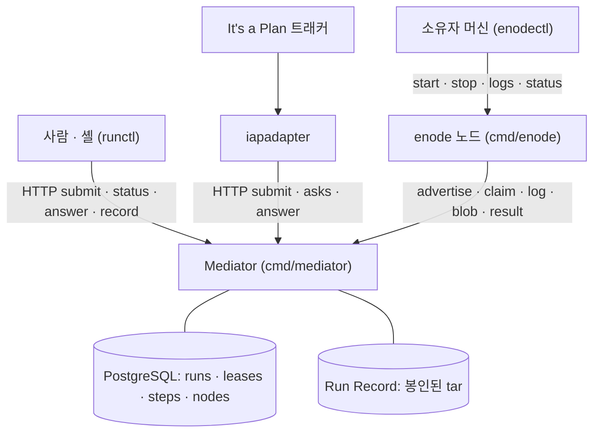

# Business Overview — enode / Mediator

이 문서는 지금 이 저장소에 **실제로 들어 있는 코드**가 무엇을 하는지를 사업 언어로
적는다. 설계가 앞으로 더하려는 것(정본 canon 의 ADR 들이 예고한 기능)은 여기서
사업 흐름으로 세지 않는다 — 필요한 자리에서 **오늘은 없다**고만 밝힌다.

enode 는 하나의 **Mediator** 가 일감을 받아 능력이 맞는 **노드**에 붙이고, 그
노드가 스스로 당겨가 실행하는 분산 에이전트 실행 시스템이다. Mediator 는 맞추고
(match) · 권한을 주고(lease) · 순서를 세우고(sequence) · 기록을 봉인하는(seal) 일만
한다. **일은 절대 직접 실행하지 않는다 (ADR-002)** — 실행은 enode 노드의 몫이다
(`internal/api` overview).

---

## Business Context Diagram

이 그림은 오늘의 연결선만 그린다. **모든 화살표는 노드에서 Mediator 로 나가는
방향이다** — enode 는 인바운드 포트를 하나도 열지 않으므로 Mediator 가 노드를
부르는 선은 없다 (ADR-014, `internal/enode/advertise.go:16`).

---

## Business Description

### Business Description

사업의 중심 사실은 **임대(lease)** 다. 노드 하나는 한 번에 최대 하나의 Run 에만
묶인다 — 이 불변식 I1 을 `leases` 테이블의 `node_id` 기본키 충돌이 강제한다
(`internal/store/schema.sql:58`, `enode-design/protocol/INVARIANTS.md:146`). 일이
들어오는 경로는 셋이다. 사람과 셸은 `runctl` 로, "It's a Plan" 이슈 트래커는
`iapadapter` 로, 둘 다 Mediator 의 REST 로 계약을 던진다. 노드는 `enode` 데몬이며,
소유자 머신에서 `enodectl` 로 켜고 끈다.

권한과 임대는 Mediator 의 PostgreSQL 에만 산다(경합이 있는 가변 사실 — 광고 ·
임대 · Run 상태 · 단계 진행). 끝난 Run 의 **Run Record** 만 파일시스템에 봉인된
tar 로 남는다 (`internal/store/store.go` schema.sql:1-8, `internal/record/record.go`).
매칭은 부수효과 없는 순수 함수이고(`internal/match`), DB 는 결정된 배정을
트랜잭션으로만 커밋한다.

Run 이 오늘 실제로 쓰는 상태는 넷이다 — `RUNNING`(생성 시) · `VERIFYING` ·
`SUCCEEDED` · `FAILED` (`internal/store/reap.go:279,319`, `store.go:344`). 상수
`RESOLVING` 과 `ALLOCATING` 은 정의만 되어 있고 어디에도 쓰이지 않는 죽은 값이며
(`store.go:157-158`), **`QUEUED` 는 오늘 없다** — 코드에는 주석 한 줄로만 나타난다
(`reap.go:162`). 단계(step)의 상태 어휘는 `PENDING` · `CLAIMED` · `DONE` · `FAILED`
· `SKIPPED` · `ASKED` 다 (`internal/store/verdict.go:19-32`).

### Business Transactions

아래는 오늘의 코드가 지지하는 사업 거래다. 각 거래의 착지점과 없는 조각을 함께
적는다.

1. **계약 제출 (submit contract).** 제출자는 `POST /v1/runs` 로 계약을 던지고,
   실제 배정 없이 맞춰만 보려면 `POST /v1/runs/dry-run` 을 쓴다
   (`internal/api/api.go:64-65`). 오늘의 성공 응답은 새 Run 이다 — **`202 QUEUED`
   응답은 없다** (QUEUED 자체가 없으므로). 거절은 세 자리에서 난다: 매처가
   영구 불가로 판단하면 `422 CodeNoCandidate`, 전부 점유면 `409 CodeAllBusy`
   (`api.go:398-408`, `internal/match/match.go:24-25`), 배정 중 다른 Run 이 노드를
   먼저 채가면 `409` 로 전면 롤백된다 (`ErrNodeTaken`, `api.go:457-463`,
   `store.go:270-271`).

2. **매칭과 임대 (match + lease a node).** `match.Match` 은 계약의 `requires` 를
   광고하는 노드에 맞추는 순수 함수다 (`match.go:66`). 후보를 속성 수로 정렬해
   먼저 영구 불가(422)를 훑고 그다음 일시 점유(409)를 본다 — **전부 아니면 전무**의
   2-패스다 (`match.go:89-102`). 결정된 배정은 `CreateRun` 이 한 트랜잭션에서
   `runs` 행과 `leases` 행으로 커밋한다 (`store.go`, `api.go:454`). `busy` 집합은
   `SELECT node_id FROM leases` 로 만들고(`store.go:350`), dry-run 은 이 집합을 비운
   채 본다 (`api.go:389-396`).

3. **단계 실행 (run steps).** 노드는 `POST /v1/nodes/{id}/claim` 을 롱폴로 당겨
   (최대 `Claim.LongPollSeconds`, 없으면 `204`) 단계를 하나 받는다
   (`api.go:62`, claim 은 `FOR UPDATE ... SKIP LOCKED LIMIT 1`, `claim.go:270-293`).
   노드는 워크스페이스를 준비하고 에이전트 하네스 또는 command 단계를 돌린 뒤,
   로그를 `PUT .../log` 로, 산출 blob 을 `PUT .../blob/{name}` 로 올리고
   `POST .../result` 로 결과를 보고한다 (`api.go:63,73,74`). `ReportStep` 이 단계를
   전진시키고 `applyStepEffects` 가 확장 · 분기 · 부분 임대 해제를 적용한다
   (`claim.go:854-863`, `release.go:64-74`).

4. **질문과 답 (ask / answer).** 계약의 `ask` 단계는 선행 단계가 다 끝나면
   `PENDING` 에서 `ASKED` 로 승격된다 (`ask.go:67-70`). 대기 중인 질문은
   `GET /v1/asks` 인박스로만 정본을 이룬다 (`api.go:68`). 답은
   `POST /v1/runs/{run}/steps/{seq}/answer` 로 들어오며 blob 과 똑같이 스키마
   검증을 거친다 — 틀리면 저장되지 않고 질문은 열린 채 남는다 (`api.go:69`,
   ADR-032). 웹훅 통지는 있으나 재시도 없는 fire-and-forget 이고 인박스가
   권위다 (`ask.go:115-129`).

5. **기록 봉인 (seal record).** 모든 단계가 끝나면 `SettleIfDone` 가 `VERIFYING`
   으로 올린 뒤 `Verify`(순수 계약 검증)를 돌리고 종료 상태를 확정한다
   (`reap.go:235,278-280,306`). 봉인은 `manifest.json` · `steps/NN-*.json` ·
   `verdict.json` 을 쓰고 파일과 디렉터리를 읽기전용으로 chmod 하는 것이다
   (`record.go:92-121`, `0o444`/`0o555`). `GET /v1/runs/{id}/record` 는 봉인된
   tar 를 스트리밍하되, **봉인 전에는 `409 "run is not sealed yet"`** 를 낸다
   (`api.go:823-824`). 거절된(FAILED) Run 은 Record 를 봉인하지 않으므로 record
   요청에 계속 409 가 난다 (`store.go:341-344`).

6. **취소 (cancel).** `POST /v1/runs/{id}/cancel` 은 종료 아닌 어느 상태의 Run 이든
   `FAILED` 로 내리고, `PENDING`/`CLAIMED`/`ASKED` 단계를 실패시키고, `leases` 를
   전부 지우고, 봉인한다 (`api.go:72`, `reap.go:170-179`). 이미 종료면 무연산으로
   멱등하고, verdict 노트에 `"cancelled by: " + by` 를 남긴다. `by` 는
   `X-Enode-Principal` 에서 온 호출자 신원이다 (`api.go:624`).

7. **임대 회수 (lease reclaim / reaping).** `RunReaper` 가 주기적으로 `Reap` 을
   돌려, 마감이 지난 질문을 만료시키고, 임대가 만료된 Run 을 `FAILED` 로 내리고,
   종료된 Run 의 임대를 지우고, 봉인한다 (`reap.go`). **`ASKED` Run 은 회수하지
   않는다** — 사람의 답을 기다리는 Run 은 그 노드에서 아무것도 안 돌므로 I1 충돌이
   없다 (ADR-047, `reap.go:38,61-63`). 주의: 소유자가 손으로 노드를 빼는 **drain
   정책(ADR-063)은 오늘 코드에 없다** — `Draining`/`DrainingNodes` 심볼이
   `match`/`store`/`contract` 어디에도 없고, 회수의 유일한 축은 임대 만료다
   (match-contract scan). 오늘의 "회수"는 시간 기반 임대 만료뿐이다.

8. **관측 (observe).** `GET /v1/capabilities` 는 함대의 능력 어휘를 합쳐서 낸다
   (`api.go:67`). 한 Run 의 진행은 `GET /v1/runs/{id}` 가 `runView`(단계 포함)로,
   산출물 목록은 `GET /v1/runs/{id}/ledger` 가 낸다 (`api.go:66,70`). 소유자는
   `enodectl list`/`status` 로 자기 머신의 데몬을 관측한다. 오늘 **없는 것**:
   함대 노드 스냅샷 `GET /v1/nodes`(등록이 없고 `POST /v1/nodes` 만 있다,
   `api.go:61`), Run 목록 `GET /v1/runs`(id 범위 GET 만 있다), 그리고
   `GET /v1/runs/{id}` 의 `requires` 필드(ADR-069, 미구현).

### Business Dictionary

- **노드 (node).** 하나의 실행 단위이자 하나의 워크스페이스. `enode` 데몬이며
  스스로 광고하고(ADR-012) 인바운드 포트를 열지 않는다(ADR-014). 신원은 설정
  파일 경로에 매인 해시다 (`internal/enode/identity.go`, ADR-015).
- **임대 (lease).** 노드를 Run 에 묶는 권한. `leases` 테이블에서 `node_id` 가
  기본키라 노드당 하나뿐이다 (`schema.sql:58`). `run_id` · `not_after` · `nonce` 를
  진다. 노드가 단계를 돌려도 되는지의 권위는 이 `not_after` 시각이다 (ADR-016).
- **소유자 (owner).** 노드를 가진 사람. 신원은 `X-Enode-Principal`(= git
  `user.email`)로 self-report 되며 **검증하지 않는다** — 신원이지 인증이 아니다
  (ADR-015, `api.go:120`, `mediator-api.md:36`). 인증은 Bearer 토큰이 한다
  (`api.go:116`). 소유자 정책(drain)은 canon 에 있으나 오늘 코드엔 없다.
- **광고 (advert).** 노드가 `POST /v1/nodes` 로 보내는 능력 선언. **광고 = 하트비트
  = 임대 갱신**이 한 몸이다 (`advertise.go`). 매 주기 새로 만들어 보낸다
  (`advertise.go:146-147`). `nodes.expires_at > now()` 인 광고만 살아 있는 것으로
  본다 (`store.go:112`).
- **정책 (policy).** 소유자가 노드에 거는 규칙(첫 정책이 drain, ADR-063). **오늘
  코드에 없다** — 광고 경로에서 어떤 정책 파일도 읽지 않는다 (node-daemon scan).
- **Run.** 제출된 계약 하나의 실행 인스턴스. `runs` 테이블에 상태와 계약이 산다.
  오늘 쓰는 상태는 `RUNNING`/`VERIFYING`/`SUCCEEDED`/`FAILED` 뿐이다.
- **단계 (step).** 계약 안의 한 작업. 종류는 정확히 하나 — `agent` · `run` ·
  `ask` · `acquire` (`contract.go`, `StepKind`). 상태는 `PENDING`/`CLAIMED`/
  `DONE`/`FAILED`/`SKIPPED`/`ASKED` (`verdict.go:19-32`).
- **계약 (contract).** Run 의 문법 — `requires` · `steps` · `success_when` ·
  능력 어휘 (`internal/contract/contract.go:59`). 문법의 정본은
  `contract.Grammar` 이고 `expands` 단계 프롬프트에 주입된다 (ADR-045).
- **요구 (require).** 계약이 원하는 노드 명세 — `as`(역할) · `capability` ·
  `count` · `attrs` (`contract.go:307`). 매처가 이걸 광고에 맞춘다.
- **능력 (capability).** 노드가 할 수 있는 것 — `capability` 문자열 + `attrs`.
  어휘는 `agent.reason` 과 `orchestration` 으로 닫혀 있고 나머지는 부분집합으로
  맞춘다 (`advert.go`, `contract.go:38-56`).
- **매칭 (match).** 요구를 광고에 대응시키는 순수 함수. 순위(rank)가 아니라 속성
  수 오름차순 결정론 정렬이다 (`match.go:81-87`).
- **Run Record / 기록.** 끝난 Run 의 자기완결적 불변 tar. 파일시스템에 살고
  봉인 후 읽기전용이다 (I4, `record.go`).
- **원장 (ledger).** 한 Run 이 낸 산출물의 발견용 목록. 본문은 담지 않는다
  (`GET /v1/runs/{id}/ledger`, `observe.go`).
- **질문/답 (ask / answer).** `ask` 단계가 사람에게 묻는 산출물. 답은 인박스에서
  발견되고 blob 처럼 검증되어 하나의 주소로 쓰인다 (ADR-032).
- **회수 (reap).** 만료된 임대를 되돌려 노드를 풀고, 임대가 끊긴 Run 을 실패로
  내리는 주기 작업 (`RunReaper`/`Reap`).

---

## Component Level Business Descriptions

### mediator (`cmd/mediator` + `internal/api` · `store` · `match` · `contract` · `schema` · `record`)

**Purpose.** 시스템의 유일한 HTTP 표면이자 결정의 중심. 모든 프로토콜 상호작용
(제출 · claim · result · answer · cancel · record)이 이 15 개 라우트를 지난다
(`api.go:61-75`). 맞추고 · 권한을 주고 · 순서를 세우고 · 봉인하고 · 회수한다.
**일은 직접 실행하지 않는다** (ADR-002).

**Responsibilities.**
- 인증(Bearer 토큰 상수시간 비교)과 신원(`X-Enode-Principal`, 검증 안 함)을
  모든 라우트 앞의 `auth` 미들웨어에서 가른다 (`api.go:108-120`).
- 계약을 받아 `match.Match` 로 맞추고, 결정을 `CreateRun` 트랜잭션으로
  `runs`+`leases` 에 커밋한다. 거절은 422/409 로 나눈다.
- `POST /v1/nodes` 광고를 받아 노드를 살려두고(하트비트+임대 갱신), 재기동한
  인스턴스가 남긴 CLAIMED 단계를 `FailRestarted` 로 정리한다 (`api.go:218-224`).
- claim 롱폴로 단계를 배급하고(no `WriteTimeout` — 클레임이 최대 2h 매달릴 수
  있어 의도적으로 뺐다, `main.go:107-108`), 결과 보고로 단계를 전진시키며
  확장/분기/부분 임대 해제를 적용한다.
- ask 를 승격하고 인박스로 노출하며 답을 스키마 검증해 채택한다.
- Run 이 끝나면 검증하고 Record 를 봉인하며, `GET .../record` 로 tar 를 낸다
  (봉인 전 409).
- `RunReaper` 고루틴으로 만료 임대를 회수하고 종료 Run 을 봉인한다 (`ASKED`
  제외, ADR-047).
- 상태는 PostgreSQL(경합 가변 사실)에, 끝난 기록은 파일시스템(불변 tar)에 나눠
  둔다. **오늘 없는 표면**: `GET /v1/nodes`, `GET /v1/runs`(목록), `202 QUEUED`,
  `/ui/` 정적 파일 서빙 (전부 REFUTED/ABSENT, mediator-api scan).

### enode (`cmd/enode` + `internal/enode`)

**Purpose.** 실행 노드 데몬. **당기기만 하는(pull-only) 일꾼**이다 — 서버 포트를
열지 않고(ADR-014, `advertise.go:16`) 세 고루틴 모두 Mediator 로 아웃바운드로만
나간다. 노드 하나가 곧 워크스페이스 하나다 (ADR-017).

**Responsibilities.**
- **탐지(detector).** 자기 시계(기본 5분, `DefaultDetectEvery`)로 이 머신이 할 수
  있는 것을 재서 능력을 만든다. 광고와 분리되어 있어 느린 프로브가 하트비트를
  막지 못한다 (ADR-068, `detector.go:29,96`).
- **광고(advertiser).** 매 주기(기본 60초) 능력을 새로 담아 `POST /v1/nodes` 로
  보낸다. 응답의 임대 목록으로 `Held` 를 통째로 갈아끼우고 `renew_seconds` 를
  받아 주기를 맞춘다 (`advertise.go:130-185`).
- **워커(worker).** `POST /v1/nodes/{id}/claim` 을 롱폴로 당겨 단계를 받고, 임대를
  즉시 `Held.Add` 로 기록한다. 시작 전 `Held.Valid` 를 재확인하고 임대가 만료되면
  실행 컨텍스트를 취소하는 1초 감시자를 띄운다 (`claim.go:348-523`).
- 워크스페이스를 git 으로 정돈(reset/checkout/fetch/clean)하고, 에이전트 하네스
  (기본 `claude`) 또는 command 단계를 돌린다. stdout 은 통째로 버퍼링한 뒤
  실행이 끝나고서 디코드/업로드한다 — 라이브 스트림/tee 는 없다 (`runner.go`,
  `claim.go:563-576`).
- 로그를 `PUT .../log`, 산출 blob 을 `PUT .../blob/{name}` 로 올리고
  `POST .../result` 로 보고하며, 배달될 때까지(또는 4xx 거절/임대 소멸까지)
  재시도한다.
- 유일한 온디스크 상태는 설정 파일(`local.yaml`, YAML) · 단일 인스턴스 락 ·
  선택적 로그/pid/ready 파일뿐이다. 능력과 임대는 데몬 메모리에만 산다.
  **정책/ring 파일을 읽는 코드는 오늘 없다** (node-daemon scan).

### enodectl (`cmd/enodectl`)

**Purpose.** 한 머신 위의 enode 데몬 인스턴스를 다루는 **노드-로컬 제어면**. 설정
파일 하나가 곧 노드 신원이다 (ADR-015).

**Responsibilities.**
- 서브커맨드는 정확히 `setup` · `list` · `id` · `start` · `stop` · `logs` ·
  `status` · `version`(+ help) 이다 (`main.go:45-66`). **`serve` 와 `restart` 는
  없다** (node-control scan, 둘 다 CONFIRMED ABSENT).
- 데몬을 켜고(`start`, `--config` 로 `enode` 실행) 끄고(`stop`, 20×500ms 폴 후
  `SIGKILL`) 로그를 tail 하고(`logs`/`status`) `node_id` 를 미리 계산한다
  (`id`, `enode.Derive`).
- 생사는 `.lock` 파일의 pid + 소유권 확인으로만 판정한다 — 별도 pid 원장은 없다
  (`main.go:161-187`).
- macOS 에서 `caffeinate` 로 잠을 막는다(darwin 전용, 다른 OS 는 무연산).
- **`setup` 은 링크가 아니라 exec 로 형제 `enode` 바이너리에 위임한다** —
  `net/http`/`crypto/tls` 를 이 바이너리에 끌어들이지 않으려는 것으로, 안티바이러스
  오탐(rc13 AhnLab 삭제 사건)과 바이너리 크기 회귀를 피한다 (`setup.go:10-27`,
  `scripts/avprobe/README.md`).

### runctl (`cmd/runctl` + `internal/runctl`)

**Purpose.** 사람과 셸이 Mediator 와 말하는 **상태 없는 "던지고 잊는" 클라이언트
CLI**. HTTP 로만 나가고 DB 는 건드리지 않는다.

**Responsibilities.**
- 서브커맨드는 정확히 열하나 — `submit` · `dry-run` · `status` · `record` ·
  `cancel` · `example` · `lint` · `schema` · `capabilities` · `asks` · `answer`
  (node-control scan, CONFIRMED). `asks`/`answer` 는 스텁이 아니라 인박스 렌더링과
  답 조립(`--json`/`--set`)까지 구현되어 있다 (`main.go:197-312`).
- 계약을 `POST /v1/runs`(또는 `/dry-run`)로 제출하고, `GET /v1/runs/{id}` 로
  상태를 폴하며(`Wait`, 기본 2초 간격), `GET /v1/runs/{id}/record` 로 봉인 tar 를
  받고, `POST .../cancel` 로 취소한다 (`internal/runctl/client.go`).
- `example`/`lint`/`schema` 는 오프라인 계약 저작 도구로, `contract.Example`/
  `Contract.Validate`/구조체 리플렉션에 얹혀 있다 (`shape.go`).
- 인증은 `Authorization: Bearer <token>`, 신원은 `X-Enode-Principal: <git email>`
  로 붙인다 (`client.go:64`). `ENODE_MEDIATOR`/`ENODE_TOKEN` 를 읽되 명시적
  `--token=` 을 env 가 덮어쓰지 않게 `flag.Visit` 로 가린다.
- 종료 코드 계약은 0–3 이다 — 실행 중이거나 취소된 Run 은 0, `FAILED` 는 1
  (`main.go:35-40`). 종료 판정은 `Terminal`(오직 `SUCCEEDED`/`FAILED`)이 한다
  (`client.go:208`).

### iapadapter (`cmd/iapadapter`)

**Purpose.** "It's a Plan" 이슈 트래커를 enode mediator/함대에 잇는 **유일한
바깥-대면 다리** (ADR-040). 이슈 하나를 Run 하나로 바꾼다.

**Responsibilities.**
- 트래커의 러너 프로토콜을 폴한다 — `claim`/`heartbeat`/`result`
  (`itsaplan.go`). 이슈마다 고루틴 하나, 작업마다 하트비트 고루틴 하나를 띄우고
  종료 시 `WaitGroup` 으로 배수한다 (`main.go:139-170`).
- enode 오케스트레이터(`enode --once --ready-file`)를 띄워 Mediator 에 광고할
  때까지 기다린 뒤, 추론 0 의 고정 템플릿 계약을 제출한다 (`orchestrator.go`,
  `contract.go`).
- Mediator 의 clarification 질문(ask)을 이슈 댓글로 되돌리고, 질문을 넘길 때는
  오케스트레이터를 죽이지 않고 `Detach` 해 답이 오면 이어가게 한다
  (`main.go:225-234`).
- 완료 시 댓글 + 컬럼 이동 + 결과를 쓴다.
- **DB 를 갖지 않는다** — Run ID 를 이슈 키에서 파생(`itsaplan-<issueKey>-<n>`,
  1..50 세대 탐침)하므로 재기동에 안전하고 멱등하다 (`main.go:584-607`).
- Mediator 쪽 클라이언트는 `GetRun`/`SubmitRun`/`Capabilities`/`Asks`/`Answer`/
  `Ledger`/`Blob` 등 기존 REST 를 감싼다 — 새 의미를 더하지 않는다.
