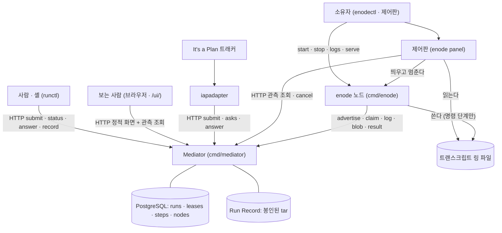

# Business Overview — enode / Mediator

이 문서는 지금 이 저장소에 **실제로 들어 있는 코드**가 무엇을 하는지를 사업 언어로
적는다. 설계가 앞으로 더하려는 것은 여기서 사업 흐름으로 세지 않는다 — 필요한
자리에서 오늘은 없다고만 밝힌다.

**2026-09-15 전면 재측정.** 2026-09-08 판이 「오늘 없다」로 적은 것 여럿이 그 뒤에
생겼다 — QUEUED · drain 정책 · 함대 스냅샷 · Run 목록 · 정적 화면 · 노드 제어판.
그 자리마다 바뀐 사실을 표시한다.

enode 는 하나의 **Mediator** 가 일감을 받아 능력이 맞는 **노드**에 붙이고, 그
노드가 스스로 당겨가 실행하는 분산 에이전트 실행 시스템이다. Mediator 는 맞추고
(match) · 권한을 주고(lease) · 순서를 세우고(sequence) · 기록을 봉인하는(seal) 일만
한다. **일은 절대 직접 실행하지 않는다 (ADR-002)** — 실행은 enode 노드의 몫이다.

---

## Business Context Diagram



**Mediator 에서 노드로 가는 화살표가 없다** — enode 는 인바운드 포트를 하나도
열지 않으므로 Mediator 가 노드를 부르는 선이 없다 (ADR-014).

제어판이 2026-09-08 판 뒤에 생겼다. 그것은 노드를 통하지 않고 **값을 셋에서 따로
읽는다** — 로컬 파일 · 로컬 프로세스 · Mediator 조회.

---

## Business Description

사업의 중심 사실은 **임대(lease)** 다. 노드 하나는 한 번에 최대 하나의 Run 에만
묶인다 — 이 불변식 I1 을 `leases` 테이블의 `node_id` 기본키 충돌이 강제한다.
일이 들어오는 경로는 넷이다. 사람과 셸은 `runctl` 로, 이슈 트래커는 `iapadapter`
로, 시연 관객은 브라우저의 데모 화면으로, 갤러리는 별도 브로커 흐름으로 계약을
던진다. 노드는 `enode` 데몬이며 소유자 머신에서 `enodectl` 이나 제어판으로 켜고 끈다.

권한과 임대는 Mediator 의 PostgreSQL 에만 산다. 끝난 Run 의 **Run Record** 만
파일시스템에 봉인된 tar 로 남는다. 매칭은 부수효과 없는 순수 함수이고, DB 는
결정된 배정을 트랜잭션으로만 커밋한다.

**Run 상태에 `QUEUED` 가 들어왔다** (ADR-064). 오늘 실제로 쓰는 값은 다섯이다 —
`QUEUED` · `RUNNING` · `VERIFYING` · `SUCCEEDED` · `FAILED`. 2026-09-08 판은
`QUEUED` 를 「주석에만 있다」로 적었고 그 사이에 `internal/store/queue.go` 가
생겼다. 단계 상태 어휘는 그대로 여섯이다 — `PENDING` · `CLAIMED` · `DONE` ·
`FAILED` · `SKIPPED` · `ASKED`.

---

## Business Transactions

1. **계약 제출 (submit contract).** 제출자는 `POST /v1/runs` 로 계약을 던지고,
   실제 배정 없이 맞춰만 보려면 `POST /v1/runs/dry-run` 을 쓴다. 착지가 셋이다.

   ```text
      201 RUNNING    배정이 났다.  runs 행과 leases 행이 한 트랜잭션에 든다
      202 QUEUED     후보는 있는데 전부 점유.  죽이지 않고 큐에 받는다 (ADR-064)
      422            영구 불가.  후보가 아예 없다.  runs 행 하나가 FAILED 로 남는다
   ```

   **`202 QUEUED` 가 생겼다.** 2026-09-08 판은 「전부 점유면 409」로 적었고
   그 자리를 `enqueue` 가 대체했다. 임대 PK 충돌은 여전히 전면 롤백이고
   `runs` 행이 안 남는다.

2. **매칭과 임대 (match + lease a node).** `match.Match` 은 계약의 `requires` 를
   광고하는 노드에 맞추는 순수 함수다. 후보를 속성 수로 정렬해 먼저 영구 불가를
   훑고 그다음 일시 점유를 본다 — **전부 아니면 전무**의 2-패스다. dry-run 은
   `busy` 집합을 비운 채 본다.

3. **큐 승격 (wake queued).** 임대가 지워지는 지점마다 큐를 훑어 승격한다 —
   단계 보고 뒤 · 만료 회수 · 취소 · drain 해제를 받은 광고 · 기동. 트랜잭션
   안에서 도는 `WakeQueued` 와 자기 트랜잭션을 여는 `WakeQueuedNow` 둘이다.
   **2026-09-08 판에 없던 거래다.**

4. **단계 실행 (run steps).** 노드는 `POST /v1/nodes/{id}/claim` 을 롱폴로 당겨
   (최대 2h, 없으면 `204`) 단계를 하나 받는다. 워크스페이스를 준비하고 에이전트
   하네스 또는 command 단계를 돌린 뒤, 로그를 `PUT .../log` 로, 산출 blob 을
   `PUT .../blob/{name}` 로 올리고 `POST .../result` 로 결과를 보고한다.
   **로그는 단계 끝에 한 번 올라간다** — 도중에 올리는 경로가 없다.

5. **질문과 답 (ask / answer).** 계약의 `ask` 단계는 선행 단계가 다 끝나면
   `PENDING` 에서 `ASKED` 로 승격된다. 대기 중인 질문은 `GET /v1/asks` 인박스로만
   정본을 이룬다. 답은 `POST /v1/runs/{run}/steps/{seq}/answer` 로 들어오며 blob 과
   똑같이 스키마 검증을 거친다 — 틀리면 저장되지 않고 질문은 열린 채 남는다.
   계약이 답할 사람을 지정했으면 `X-Enode-Principal` 로 403 을 낸다.

6. **기록 봉인 (seal record).** 모든 단계가 끝나면 `SettleIfDone` 가 `VERIFYING`
   으로 올린 뒤 계약 검증을 돌리고 종료 상태를 확정한다. 봉인은 `manifest.json` ·
   `steps/NN-*.json` · `verdict.json` 을 쓰고 파일과 디렉터리를 읽기전용으로
   chmod 하는 것이다. `GET /v1/runs/{id}/record` 는 봉인된 tar 를 내되 **봉인 전에는
   `409`** 다 (I4).

7. **취소 (cancel).** `POST /v1/runs/{id}/cancel` 은 종료 아닌 어느 상태의 Run 이든
   `FAILED` 로 내리고, 단계를 실패시키고, 임대를 지우고, 봉인한다. 이미 종료면
   무연산으로 멱등하고 verdict 노트에 취소자를 남긴다.

8. **임대 회수 (lease reclaim / reaping).** `RunReaper` 가 주기적으로 `Reap` 을
   돌려, 마감이 지난 질문을 만료시키고, 임대가 만료된 Run 을 `FAILED` 로 내리고,
   종료된 Run 의 임대를 지우고, 봉인하고, 큐를 훑는다. `ASKED` Run 은 회수하지
   않는다 (ADR-047).

9. **자원 회수 정책 — drain (owner drains a node).** **2026-09-08 판에 없던
   거래다.** 소유자가 자기 기계의 정책 파일에 `graceful` 또는 `at-boundary` 를
   쓰면(제어판의 버튼이 그것을 쓴다) 데몬이 광고 직전마다 그 파일을 읽어 광고에
   싣는다. 중앙은 받아 적을 뿐 판정하지 않는다 (ADR-063). 광고 응답이 `drain` 을
   되돌려 주고, `at-boundary` 면 단계 경계에서 멈춘다. verdict 에
   `drain:<node_id>` 가 남아 진짜 실패와 갈린다. **정본은 노드의 파일이다** —
   그 기계에 접속했다는 것이 소유의 증거다.

10. **관측 (observe).** 2026-09-08 판이 「없다」로 적은 것 셋이 다 생겼다.

    ```text
       GET /v1/nodes          관측된 함대 스냅샷.  질의 인자를 안 받는다 (ADR-065)
       GET /v1/runs           지금 무엇이 도는가.  좁히기 넷 · 최신이 앞
       GET /v1/runs/{id}      단계 열 + requires (ADR-069) + warnings
       GET /ui/               정적 화면 넷 — 랜딩 · 카드뉴스 · 데모 · 함대 현황판
    ```

    **판정을 안 싣는다** — 「이 노드는 왜 안 맞나」를 서버가 내지 않고 관측
    경로에서 매처가 안 돈다 (ADR-065). 화면은 5초로 폴링한다.

11. **노드 소유자의 관측과 통제 (node owner runs the panel).** **2026-09-08 판에
    없던 거래다.** `enodectl serve` 가 제어판을 띄우면 소유자는 자기 기계에서
    신원 · 탐지 능력 · 프로세스 · 현재 작업 · drain 상태 · Mediator 도달 여부를
    한 화면에서 보고, drain 을 걸고 풀고, 데몬을 띄우고 멈춘다. 멈춤은 도는 Run 을
    먼저 취소해 「소유자가 껐다」가 기록에 남게 한다. 값의 출처가 셋으로 갈려 있어
    Mediator 가 죽어도 로컬 묶음은 그대로 선다.

12. **하네스 출력 읽기 (read what the harness says).** 제어판의 트랜스크립트
    카드가 노드의 링 파일을 1초로 읽는다. **오늘 그 카드가 에이전트 단계에서
    비어 있다** — 하네스 stdout 의 링 tee 가 꺼져 있기 때문이다 (짝 팩
    `decisions.md` 6절 ⑲). 명령 단계만 흐른다. 지난 Run 의 트랜스크립트는
    봉인 tar 를 통째로 받아 `logs/` 만 꺼내 보인다. **중앙에는 실시간 트랜스크립트
    표면이 없다** — 올리는 `PUT` 만 있고 내려받는 `GET` 이 없다.

13. **시연 (demo).** 설정 스위치가 켜진 인스턴스에서 읽기 셋이 무인증으로 열리고
    전역 토큰버킷(초당 120 · 버스트 240)이 걸린다. 관객은 게스트 이름으로 고정
    시나리오를 제출한다. 갤러리는 외부 origin 과 디스크의 worker 를 거치는 별도
    흐름이고 HMAC 로 서명된다. **`ADR-065` §2 를 벗어나는 것으로 코드가 명시한다** —
    준수가 아니라 벗어남으로 적혀 있다.

---

## Business Dictionary

- **노드 (node).** 하나의 실행 단위이자 하나의 워크스페이스. `enode` 데몬이며
  스스로 광고하고(ADR-012) 인바운드 포트를 열지 않는다(ADR-014). 신원은 설정
  파일 경로에 매인 해시다 (ADR-015).
- **임대 (lease).** 노드를 Run 에 묶는 권한. `leases` 테이블에서 `node_id` 가
  기본키라 노드당 하나뿐이다. `run_id` · `not_after` · `nonce` 를 진다. 노드가
  단계를 돌려도 되는지의 권위는 이 `not_after` 시각이다 (ADR-016).
- **소유자 (owner).** 노드를 가진 사람. 신원은 `X-Enode-Principal`(= git
  `user.email`)로 자기 신고되며 **검증하지 않는다** — 신원이지 인증이 아니다.
  인증은 Bearer 토큰이 한다. **소유의 증거는 그 기계에 접속했다는 것이다**
  (ADR-063 §3) — 그래서 loopback 제어판에는 인증이 없다.
- **광고 (advert).** 노드가 `POST /v1/nodes` 로 보내는 능력 선언. **광고 =
  하트비트 = 임대 갱신**이 한 몸이다. 매 주기 새로 만들어 보낸다. 2026-09-08 판
  뒤에 `policy.drain` 이 실리기 시작했다.
- **정책 (policy).** 소유자가 노드에 거는 규칙. 첫 정책이 drain 이다 (ADR-063).
  **오늘 코드에 있다** — `internal/enode/policy.go` 가 설정 파일 옆의 정책 파일을
  읽고 쓰며 데몬이 광고 직전마다 읽는다. 캐시가 없다. 같은 파일이 제어판의
  `panel_token` 도 진다.
- **상태 파일 (status file).** 데몬이 탐지 능력과 그 시각을 적는 파일 (ADR-068).
  광고에는 안 싣는다 — 매처가 쓸 것이 아니고 싣는 순간 프로토콜이 는다. 제어판이
  그것을 읽는다.
- **링 (transcript ring).** 노드의 고정 크기 트랜스크립트 파일. 512 KiB. 회전 ·
  자르기 · 삭제를 안 하고 `WriteAt` 만 쓴다 — 윈도우가 그 설계를 정했다. 새 단계가
  시작할 때 비우고 세대를 올린다.
- **Run.** 제출된 계약 하나의 실행 인스턴스. 오늘 쓰는 상태는 `QUEUED` ·
  `RUNNING` · `VERIFYING` · `SUCCEEDED` · `FAILED` 다.
- **단계 (step).** 계약 안의 한 작업. 종류는 정확히 하나 — `agent` · `run` ·
  `ask` · `acquire`.
- **계약 (contract).** Run 의 문법 — `requires` · `steps` · `success_when` ·
  능력 어휘. 문법의 정본은 `contract.Grammar` 이고 계획 단계 프롬프트에 주입된다.
- **능력 (capability).** 노드가 할 수 있는 것 — 능력 문자열 + 속성. 어휘는
  `agent.reason` 과 `orchestration` 으로 닫혀 있고 나머지는 부분집합으로 맞춘다.
- **매칭 (match).** 요구를 광고에 대응시키는 순수 함수. 순위가 아니라 속성 수
  오름차순 결정론 정렬이다.
- **Run Record / 기록.** 끝난 Run 의 자기완결적 불변 tar. 봉인 후 읽기전용이다
  (I4). **봉인되지 않은 것은 Record 가 아니다** — 진행 상태는 DB 의 지금 값이고
  Record 는 파일이다.
- **진행 관측 (observation).** 실행 중에 밖에서 보이는 것 (ADR-025). 본문도
  판정도 안 싣는다 — 실으면 「이걸로 충분한데 왜 Record 를 기다리나」가 되고 그
  순간 I4 가 형해화된다.
- **회수 (reap).** 만료된 임대를 되돌려 노드를 풀고, 임대가 끊긴 Run 을 실패로
  내리는 주기 작업.
- **계장 (instrumentation).** 하네스를 띄우기 직전에 짓는 사적인 세계. 가짜 홈 ·
  훅 설정 · MCP 허용목록 · 팩 · 복사한 자격증명이 임시 디렉터리에 서고 단계 끝에
  통째로 지워진다. **보존 스위치를 일부러 안 뒀다.**
- **제어판 (panel).** 노드 소유자가 자기 기계에서 자기 노드 하나를 보는 화면.
  데몬과 다른 프로세스다.

---

## Component Level Business Descriptions

### mediator (`cmd/mediator` + `internal/api` · `store` · `match` · `contract` · `schema` · `record` · `api/ui`)

**Purpose.** 시스템의 유일한 중앙 HTTP 표면이자 결정의 중심. 프로토콜 상호작용
전부가 이 26 개 라우트를 지난다. 맞추고 · 권한을 주고 · 순서를 세우고 · 봉인하고 ·
회수한다. **일은 직접 실행하지 않는다** (ADR-002).

**Responsibilities.**
- 인증(Bearer 토큰 상수시간 비교)과 신원(검증 안 함)을 가른다. 데모 모드에서는
  읽기 셋이 무인증 + 한도로 바뀐다.
- 계약을 받아 맞추고, 배정이 나면 커밋하고, 전부 점유면 큐에 받고, 후보가 없으면
  거절한다.
- 광고를 받아 노드를 살려두고, 재기동한 인스턴스가 남긴 CLAIMED 단계를 정리하고,
  소유자 drain 정책을 받아 적어 되돌려 준다.
- claim 롱폴로 단계를 배급하고, 결과 보고로 단계를 전진시키며 확장 · 분기 · 부분
  임대 해제를 적용하고 큐를 훑는다.
- ask 를 승격하고 인박스로 노출하며 답을 스키마 검증해 채택한다.
- Run 이 끝나면 검증하고 Record 를 봉인하며 tar 를 낸다.
- **함대와 Run 을 관측 표면으로 낸다** (ADR-065) — 판정을 싣지 않는다.
- **화면을 낸다** — `/ui/` 아래 임베드 정적 파일 넷. 보안 헤더 다섯이 붙는다.

### enode (`cmd/enode` + `internal/enode`)

**Purpose.** 실행 노드 데몬. **당기기만 하는 일꾼**이다 — 서버 포트를 열지 않고
세 고루틴 모두 Mediator 로 아웃바운드로만 나간다. 노드 하나가 곧 워크스페이스
하나다 (ADR-017).

**Responsibilities.**
- **탐지.** 자기 시계(기본 5분)로 이 머신이 할 수 있는 것을 재서 능력을 만든다.
  광고와 분리되어 있어 느린 프로브가 하트비트를 막지 못한다 (ADR-068). 결과를
  상태 파일에 적어 제어판이 읽게 한다.
- **광고.** 매 주기(기본 60초) 능력과 정책을 새로 담아 보낸다. 응답의 임대
  목록으로 보유 임대를 통째로 갈아끼우고 주기를 응답에서 받는다.
- **워커.** claim 을 롱폴로 당겨 단계를 받고, 시작 전 임대 유효를 재확인하고,
  임대가 만료되면 실행 컨텍스트를 취소하는 감시자를 띄운다. 새 단계가 시작할 때
  링을 비운다.
- 워크스페이스를 git 으로 정돈하고, 하네스나 command 단계를 돌린다. 하네스는
  계장 뒤에만 뜬다 — 가짜 홈 · 훅 · MCP 허용목록 · 팩이 서지 않으면 단계가 실패한다.
- 로그를 단계 끝에 한 번 올린다. **에이전트 단계의 로그는 허용목록으로 걸러진다** —
  첫 `init` 과 마지막 `result` 와 stderr 만 전문이고 나머지는 껍데기다.
- 유일한 온디스크 상태는 설정 파일 · 정책 파일 · 상태 파일 · 링 파일 · 잠금 파일 ·
  선택적 로그다. 임대와 능력은 메모리에 있다.

### panel (`internal/panel`, `enode panel` 하위명령)

**Purpose.** 노드 소유자가 자기 기계에서 자기 노드 하나를 보고 통제하는 화면.
**2026-09-08 판에 없던 성분이다.**

**Responsibilities.**
- 값을 셋에서 따로 읽어 그린다 — 로컬 파일 · 로컬 프로세스 · Mediator 조회.
  하나가 죽어도 나머지는 산다.
- drain 을 걸고 푼다 (정책 파일 쓰기). 데몬을 띄우고 멈춘다.
- 하네스 트랜스크립트와 데몬 로그를 다른 물건으로 나란히 보인다.
- 지난 작업 목록을 Mediator 에서 받아 자기 `node_id` 로 거른다 — 서버에 노드
  필터를 안 만든다.
- loopback 이면 인증이 없고, LAN 노출이면 정책 파일의 토큰이 필수이며 없으면
  **뜨기를 거부한다.** Mediator 토큰을 재사용하지 않는다.

### enodectl (`cmd/enodectl`)

**Purpose.** 한 머신 위의 enode 데몬 인스턴스를 다루는 노드-로컬 제어면.

**Responsibilities.**
- 서브커맨드는 `setup` · `list` · `id` · `start` · `stop` · `logs` · `serve` ·
  `status` · `version` 이다. **`serve` 가 2026-09-08 판 뒤에 생겼다.** `restart` 는
  오늘도 없다.
- 생사는 잠금 파일의 pid + 소유권 확인으로만 판정한다.
- macOS 에서 잠을 막는다.
- **`setup` 과 `serve` 는 링크가 아니라 exec 로 형제 `enode` 에 위임한다** —
  네트워크 스택을 이 바이너리에 안 끌어들이려는 것이고 CI 가 심볼 상한으로
  그것을 집행한다.

### runctl (`cmd/runctl` + `internal/runctl`)

**Purpose.** 사람과 셸이 Mediator 와 말하는 상태 없는 「던지고 잊는」 클라이언트 CLI.

**Responsibilities.**
- 서브커맨드 열하나 — `submit` · `dry-run` · `status` · `record` · `cancel` ·
  `example` · `lint` · `schema` · `capabilities` · `asks` · `answer`.
  **`mcp` 는 없다.**
- 오프라인 계약 저작 도구(`example`/`lint`/`schema`)가 계약 문법을 사람과 기계에
  가르친다.
- 종료 코드 계약은 0-3 이다. 종료 판정은 `SUCCEEDED`/`FAILED` 둘뿐이다.
- 클라이언트 패키지를 제어판이 함께 쓴다 — 제어판이 자기 HTTP 클라이언트를 안 짓는다.

### iapadapter (`cmd/iapadapter`)

**Purpose.** 이슈 트래커를 enode 함대에 잇는 유일한 바깥-대면 다리 (ADR-040).
이슈 하나를 Run 하나로 바꾼다.

**Responsibilities.**
- 트래커의 러너 프로토콜을 폴링하고, 오케스트레이터 노드를 띄워 광고를 기다린 뒤
  추론 0 의 고정 템플릿 계약을 제출한다.
- 되묻기를 이슈 댓글로 되돌리고, 질문을 넘길 때 오케스트레이터를 죽이지 않고
  떼어 놓는다.
- **DB 를 갖지 않는다** — Run ID 를 이슈 키에서 파생하므로 재기동에 안전하고
  멱등하다.
- 내부 패키지를 하나도 안 문다. 저장소에서 유일하게 자족적인 바이너리다.
