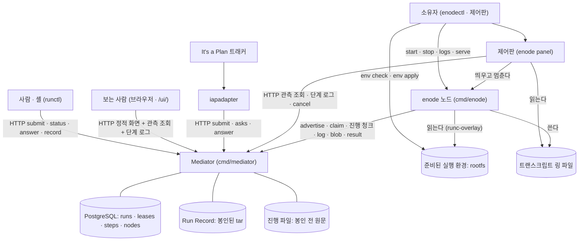

# Business Overview — enode / Mediator

이 문서는 지금 이 저장소에 **실제로 들어 있는 코드**가 무엇을 하는지를 사업 언어로
적는다. 설계가 앞으로 더하려는 것은 여기서 사업 흐름으로 세지 않는다 — 필요한
자리에서 오늘은 없다고만 밝힌다.

**2026-09-23 전면 재측정.** 기준 커밋 `195a5d0`. 2026-09-15 판 뒤에 거래 셋이
생겼다 — 실행 환경 준비 · 격리 실행 · 도는 동안의 원문 읽기. 그 자리마다 바뀐
사실을 표시한다.

enode 는 하나의 **Mediator** 가 일감을 받아 능력이 맞는 **노드**에 붙이고, 그
노드가 스스로 당겨가 실행하는 분산 에이전트 실행 시스템이다. Mediator 는 맞추고
(match) · 권한을 주고(lease) · 순서를 세우고(sequence) · 기록을 봉인하는(seal) 일만
한다. **일은 절대 직접 실행하지 않는다 (ADR-002)** — 실행은 enode 노드의 몫이다.

---

## Business Context Diagram



**Mediator 에서 노드로 가는 화살표가 없다** — enode 는 인바운드 포트를 하나도
열지 않으므로 Mediator 가 노드를 부르는 선이 없다 (ADR-014).

**소유자가 노드 기계에 환경을 준비한다** — 2026-09-15 판에 없던 선이다. 준비는
데몬이 아니라 소유자가 `enodectl env apply` 로 한다. 데몬은 준비된 것을 읽기만 한다.

---

## Business Description

사업의 중심 사실은 **임대(lease)** 다. 노드 하나는 한 번에 최대 하나의 Run 에만
묶인다 — 이 불변식 I1 을 `leases` 테이블의 `node_id` 기본키 충돌이 강제한다.
일이 들어오는 경로는 넷이다. 사람과 셸은 `runctl` 로, 이슈 트래커는 `iapadapter`
로, 시연 관객은 브라우저의 데모 화면으로, 갤러리는 별도 브로커 흐름으로 계약을
던진다. 노드는 `enode` 데몬이며 소유자 머신에서 `enodectl` 이나 제어판으로 켜고 끈다.

권한과 임대는 Mediator 의 PostgreSQL 에만 산다. 끝난 Run 의 **Run Record** 만
파일시스템에 봉인된 tar 로 남는다. 도는 동안의 원문은 봉인 전까지만 사는 **진행
파일**에 쌓이고, 봉인이 그것을 지운다.

**노드는 이제 두 방식으로 단계를 돌린다** (ADR-073). native 노드는 host 에서 바로
돌리고, runc-overlay 노드는 준비된 rootfs 위의 컨테이너에서 워크스페이스를 읽기
전용 바닥으로 두고 돌린다 — 단계가 워크스페이스에 쓴 것은 단계가 끝나면 버려지고
`$OUT` 에 낸 것만 남는다. 어느 방식으로 돌았는지가 단계 결과(`environment`)에 남는다.

Run 상태는 다섯이다 — `QUEUED` · `RUNNING` · `VERIFYING` · `SUCCEEDED` · `FAILED`.
단계 상태는 여섯이다 — `PENDING` · `CLAIMED` · `DONE` · `FAILED` · `SKIPPED` · `ASKED`.
**둘 다 기준선 뒤로 안 바뀌었다.**

---

## Business Transactions

1. **계약 제출 (submit contract).** `POST /v1/runs` 로 계약을 던지고, 맞춰만 보려면
   `POST /v1/runs/dry-run` 을 쓴다. 착지가 셋이다 — 201 RUNNING · 202 QUEUED (ADR-064) ·
   422 FAILED. **계약의 `workspace` 가 `repo` 하나만 적는다** — 리비전 칸이 빠졌다
   (ADR-072). 어느 기준 위에 서는지는 계약이 아니라 노드의 광고가 말할 자리다.

2. **매칭과 임대 (match + lease a node).** `match.Match` 은 계약의 `requires` 를
   광고하는 노드에 맞추는 순수 함수다. 전부 아니면 전무의 2-패스다.

3. **큐 승격 (wake queued).** 임대가 지워지는 지점마다 큐를 훑어 승격한다.

4. **단계 실행 (run steps).** 노드는 `claim` 을 롱폴로 당겨 단계를 하나 받는다.
   워크스페이스를 되돌리고(reset · clean), 입력을 `$IN` 에 깔고, 실행 경계를 열어
   에이전트 하네스 또는 명령을 돌린다. 끝나면 수확하고 산출 blob 과 로그를 올리고
   `POST .../result` 로 결과를 보고한다. **도는 동안의 원문은 2초마다 진행 청크로
   올라간다** — 2026-09-15 판의 「도중에 올리는 경로가 없다」는 더 참이 아니다.

   **명령이 끝난 뒤부터 결과가 닿을 때까지는 밖에서 안 보인다.** 단계는 claim 부터
   result 까지 `CLAIMED` 하나이고, 그 사이 노드는 워크스페이스 전체를 걷고(변경 목록) ·
   `git diff` 를 떠 `$OUT` 에 담고 · runc-overlay 면 세션의 scratch 를 지운 뒤에야
   보고한다. 임대는 그동안 계속 쥐어져 있다.

5. **질문과 답 (ask / answer).** `ask` 단계가 `ASKED` 로 올라가 인박스
   (`GET /v1/asks`)에 서고, 답은 `POST .../answer` 로 스키마 검증을 거쳐 들어온다.

6. **기록 봉인 (seal record).** 모든 단계가 끝나면 `SettleIfDone` 이 `VERIFYING` 으로
   올린 뒤 종료 상태를 확정한다. 봉인은 먼저 진행 트리를 걷고, `manifest.json` ·
   `steps/NN-*.json` · `verdict.json` 을 쓰고 읽기전용으로 굳힌다. 봉인 전의
   `GET .../record` 는 `409` 다 (I4).

7. **취소 (cancel).** 종료 아닌 어느 상태의 Run 이든 `FAILED` 로 내리고 봉인한다.

8. **임대 회수 (lease reclaim / reaping).** `RunReaper` 가 마감이 지난 질문을
   만료시키고, 임대가 만료된 Run 을 `FAILED` 로 내리고, 봉인하고, 큐를 훑고, **고아
   진행 트리를 쓴다**(마지막 쓰기부터 6시간).

9. **자원 회수 정책 — drain (owner drains a node).** 소유자가 정책 파일에 `graceful`
   또는 `at-boundary` 를 쓰면 데몬이 광고 직전마다 읽어 싣는다. 중앙은 받아 적을
   뿐이다 (ADR-063). draining 노드는 후보에서 빠진다.

10. **관측 (observe).** `GET /v1/nodes` · `GET /v1/runs` · `GET /v1/runs/{id}` ·
    `GET /ui/` · **`GET /v1/runs/{run}/steps/{seq}/log`**. 판정을 안 싣는다 (ADR-065).
    진행 조회가 단계의 상태와 시각을 내지만 **그 단계가 명령을 도는 중인지 끝난 뒤의
    일을 하는 중인지는 안 낸다.**

11. **노드 소유자의 관측과 통제 (node owner runs the panel).** 제어판이 신원 · 탐지 능력 ·
    프로세스 · 현재 작업 · drain · Mediator 도달을 한 화면에 보이고, drain 을 걸고 풀고,
    데몬을 띄우고 멈춘다.

12. **하네스 출력 읽기 (read what the harness says).** 2026-09-15 판은 「에이전트 단계의
    카드가 비어 있다」로 적었다. **오늘은 흐른다.** 제어판의 카드는 노드의 링을 1초로
    읽어 사건 열로 그리고, 함대 현황판의 카드는 Mediator 의 `GET .../log` 를 폴링한다.
    두 카드가 같은 렌더러(`internal/transcriptui`)와 같은 파서(`internal/transcript`)를
    쓴다. 봉인 뒤에는 같은 라우트가 선별본을 낸다 — 도구 결과와 인자를 512 바이트로
    자른 것이다 (ADR-071).

13. **실행 환경 준비 (owner prepares the execution environment).** **2026-09-15 판에 없던
    거래다** (ADR-073). 노드 설정이 공유 profile 을 가리키면, 소유자는
    `enodectl env check <이름>` 으로 host 와 준비 산출물의 사실을 보고,
    `enodectl env apply <이름>` 으로 host 패키지를 깔고 debootstrap 으로 rootfs 를 지어
    불변 산출물로 게시한다. 데몬은 기동할 때 다시 재서 준비가 안 됐으면 뜨지 않는다 —
    **기동은 환경을 고치지 않는다.**

14. **격리 실행 (run a step in isolation).** **2026-09-15 판에 없던 거래다** (ADR-073).
    runc-overlay 노드는 단계마다 user namespace 를 열고, 워크스페이스를 읽기 전용 바닥으로
    한 overlay 를 세우고, 준비된 rootfs 위의 runc 컨테이너에서 명령이나 하네스를 돌린다.
    단계가 워크스페이스에 쓴 것은 overlay 의 위층(upper)에 쌓이고 세션을 닫을 때 통째로
    지워진다. **워크스페이스 원본은 절대 안 바뀐다.** 위층을 바닥에 합치는 경로는 없다.

15. **시연 (demo).** 설정 스위치가 켜진 인스턴스에서 읽기 넷이 무인증으로 열리고
    전역 토큰버킷이 걸린다. `ADR-065` §2 를 벗어나는 것으로 코드가 명시한다.

### 오늘 없는 거래

정본(enode-design `369270a`)이 정했으나 코드가 짓지 않은 것이다. 요구는 회차의 팩이
진다 — 여기는 부재의 기록이다.

```text
   명령 종료를 따로 알린다          ADR-075 결정 7 — exited 보고 · phase · 예산 둘
   결과를 commit set 으로 좁힌다      ADR-075 — 오늘은 워크스페이스 전체를 걷는다
   끝난 단계의 scratch 를 trash 로    ADR-076 §4.1 — 오늘은 보고 전에 RemoveAll 한다
   실패한 단계의 상태를 보존한다       ADR-076 — capture · Checkpoint Store 가 없다
   주기 굽기 · 위층을 바닥에 합친다    ADR-077 — merge 단계 · lower 상태 · 잠금이 없다
   노드가 선 IR 을 광고한다           ADR-072 §6.4 — ir · repo.built 키가 없다
   Windows 격리 실행                 ADR-074 — StepRuntime 구현이 linux 뿐이다
```

---

## Business Dictionary

- **노드 (node).** 하나의 실행 단위이자 하나의 워크스페이스. 스스로 광고하고
  (ADR-012) 인바운드 포트를 열지 않는다(ADR-014). 신원은 설정 파일 경로에 매인
  해시다 (ADR-015).
- **기계 (machine).** 노드가 선 host. **광고의 `machine` 키가 신규다** (ADR-070 §2.2) —
  같은 기계의 노드를 셀 수 있게 hostname 을 싣는다. 능력이 아니라 사실이라 이것만
  있으면 광고하지 않는다.
- **임대 (lease).** 노드를 Run 에 묶는 권한. 노드당 하나뿐이다. 노드가 단계를 돌려도
  되는지의 권위는 `not_after` 시각이다 (ADR-016).
- **소유자 (owner).** 노드를 가진 사람. 신원은 `X-Enode-Principal` 로 자기 신고되며
  검증하지 않는다. **소유의 증거는 그 기계에 접속했다는 것이다** (ADR-063 §3).
- **광고 (advert).** 노드가 `POST /v1/nodes` 로 보내는 능력 선언. **광고 = 하트비트 =
  임대 갱신**이 한 몸이다. 신규 키 셋 — `machine` · `arch.<이름>=yes` ·
  `overlay=kernel|userns|fuse`.
- **정책 (policy).** 소유자가 노드에 거는 규칙. 첫 정책이 drain 이다 (ADR-063).
- **상태 파일 (status file).** 데몬이 탐지 능력과 그 시각을 적는 파일 (ADR-068).
- **링 (transcript ring).** 노드의 고정 크기 트랜스크립트 파일. 512 KiB. 새 단계가
  시작할 때 비우고 세대를 올린다. 에이전트 단계와 명령 단계 둘 다 흐른다.
- **진행 파일 (progress file).** Mediator 쪽의 봉인 전 원문. 기록 디렉터리의 형제
  (`<Root>/progress/run-<id>/`)에 살고 봉인이 지운다. **Record 가 아니다.**
- **실행 환경 profile (execution environment profile).** 노드 기계를 어떻게 준비하고
  단계를 어떻게 돌릴지를 적는 YAML 한 장 (ADR-073). 여러 노드가 공유하고 노드 설정은
  경로만 가리킨다.
- **준비 산출물 (prepared environment).** `env apply` 가 지은 불변 rootfs 와 그 manifest.
  `prepared_environment_id` 가 식별자다.
- **runtime · 실행 경계 (StepRuntime).** 단계 하나의 수명 — 열기 · 투영 · 실행 · 수확 ·
  닫기 — 을 소유하는 것. `native` 와 `runc-overlay` 둘이다.
- **lower · upper.** runc-overlay 의 바닥과 위층. lower 는 노드의 워크스페이스(읽기 전용),
  upper 는 단계가 쓴 것이 쌓이는 세션 자리다.
- **runRoot · scratch.** 노드 설정의 `environment.scratch` 아래 세션마다 생기는 디렉터리.
  upper · work · merged · bundle 이 여기 있고 세션을 닫을 때 지운다.
- **수확 (harvest).** 단계가 끝난 뒤 결과를 모으는 일. 계약이 지목한 경로의 변경 여부 ·
  collect 글롭 · 워크스페이스 전체의 변경 목록 · `git diff` 를 `$OUT` 에 담는다.
- **Run.** 제출된 계약 하나의 실행 인스턴스.
- **단계 (step).** 계약 안의 한 작업. 종류는 정확히 하나 — `agent` · `run` · `ask` ·
  `acquire`.
- **계약 (contract).** Run 의 문법 — `requires` · `steps` · `success_when` · 능력 어휘.
- **매칭 (match).** 요구를 광고에 대응시키는 순수 함수. 부분집합 비교이고 술어가 없다.
- **Run Record / 기록.** 끝난 Run 의 자기완결적 불변 tar. **봉인되지 않은 것은 Record 가
  아니다** (I4).
- **진행 관측 (observation).** 실행 중에 밖에서 보이는 것 (ADR-025). 본문도 판정도 안
  싣는다. 단계 로그의 진행 조각은 관측이지 Record 가 아니다.
- **계장 (instrumentation).** 하네스를 띄우기 직전에 짓는 사적인 세계. 단계 끝에 통째로
  지워진다.
- **제어판 (panel).** 노드 소유자가 자기 기계에서 자기 노드 하나를 보는 화면.

---

## Component Level Business Descriptions

### mediator (`cmd/mediator` + `internal/api` · `store` · `match` · `contract` · `schema` · `record` · `api/ui`)

**Purpose.** 시스템의 유일한 중앙 HTTP 표면이자 결정의 중심. 라우트 27. 맞추고 ·
권한을 주고 · 순서를 세우고 · 봉인하고 · 회수한다. **일은 직접 실행하지 않는다.**

**Responsibilities.**
- 인증(Bearer 토큰)과 신원(검증 안 함)을 가른다.
- 계약을 받아 맞추고, 배정이 나면 커밋하고, 전부 점유면 큐에 받고, 후보가 없으면 거절한다.
- 광고를 받아 노드를 살려두고 drain 정책을 받아 적어 되돌려 준다.
- claim 롱폴로 단계를 배급하고, 결과 보고로 단계를 전진시킨다.
- **도는 동안의 원문을 진행 파일로 받고 조회에 낸다.** 봉인 때 걷는다.
- Run 이 끝나면 검증하고 Record 를 봉인하며 tar 를 낸다.

### enode (`cmd/enode` + `internal/enode` + `internal/environment`)

**Purpose.** 실행 노드 데몬. **당기기만 하는 일꾼**이다.

**Responsibilities.**
- **탐지.** 자기 시계(기본 5분)로 능력을 잰다 — 하네스 · repo · MCP · **overlay 사다리**.
  값싼 사실(os · host_arch · ws · **machine** · arch)은 광고마다 잰다.
- **광고.** 매 주기(기본 60초) 능력과 정책을 새로 담아 보낸다.
- **워커.** claim 을 롱폴로 당겨 단계를 받고, 임대를 재확인하고, 실행 경계를 열어 돌린다.
- **기동 전 준비도.** profile 이 있으면 준비가 ready 여야 뜬다. 고치지 않는다.
- **격리.** runc-overlay 면 단계마다 namespace 와 overlay 를 세우고 닫을 때 지운다.
- 도는 동안 링과 Mediator 로 원문을 흘리고, 끝나면 선별본을 올린다.

### panel (`internal/panel`, `enode panel` 하위명령)

**Purpose.** 노드 소유자가 자기 기계에서 자기 노드 하나를 보고 통제하는 화면.

**Responsibilities.**
- 값을 셋에서 따로 읽어 그린다 — 로컬 파일 · 로컬 프로세스 · Mediator 조회.
- drain 을 걸고 푼다. 데몬을 띄우고 멈춘다.
- 하네스 트랜스크립트를 사건 카드로, 데몬 로그를 원문으로 나란히 보인다. 지난 단계는
  Mediator 의 단계 로그 조회로 받는다.
- loopback 이면 인증이 없고, LAN 노출이면 토큰이 필수다.

### enodectl (`cmd/enodectl`)

**Purpose.** 한 머신 위의 enode 데몬 인스턴스를 다루는 노드-로컬 제어면.

**Responsibilities.**
- 서브커맨드 열 — `setup` · `list` · **`env`** · `id` · `start` · `stop` · `logs` ·
  `serve` · `status` · `version`.
- **실행 환경을 재고 준비한다** — `env check` 와 `env apply`. `start` 가 check 를 먼저 돈다.
- `setup` · `serve` · `env` 는 링크가 아니라 exec 로 형제 `enode` 에 위임한다.

### runctl (`cmd/runctl` + `internal/runctl`)

**Purpose.** 사람과 셸이 Mediator 와 말하는 상태 없는 클라이언트 CLI.

**Responsibilities.**
- 서브커맨드 열하나. **`mcp` 는 없다.** 클라이언트 패키지를 제어판이 함께 쓴다.

### iapadapter (`cmd/iapadapter`)

**Purpose.** 이슈 트래커를 enode 함대에 잇는 유일한 바깥-대면 다리 (ADR-040).
기준선 뒤로 안 바뀌었다.
