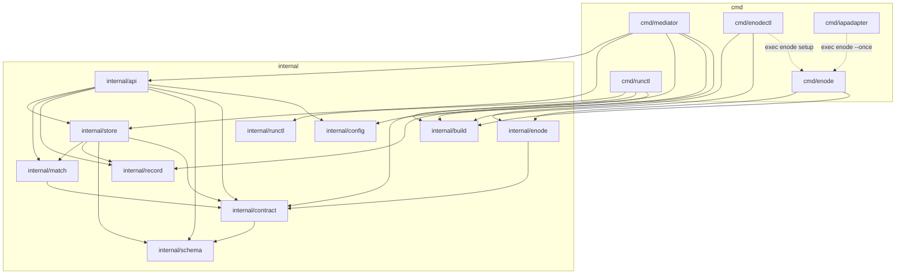

# 의존 관계 — 오늘의 코드

이 문서는 **지금 저장소에 있는 코드**의 의존을 적는다. 요구 팩이 더할 것(예:
`GET /v1/nodes`, `QUEUED`, `enodectl serve`)은 여기 없으며, 없다고 적을 자리에서는
없다고 말한다. 모듈은 `github.com/taeels/enode`, Go 1.26 (toolchain go1.26.6)이다.

의존은 두 갈래다 — 저장소 안 패키지끼리의 import (Internal), 그리고 `go.mod` 가
지는 외부 모듈 (External).

---

## Internal Dependencies

`import` 그래프는 비-테스트 소스만 센다. 화살표는 「왼쪽이 오른쪽을 import 한다」다.
점선은 import 가 아니라 **런타임 서브프로세스 실행**(`exec`)이다 — 링크되지 않는다.



읽는 법 — 세 갈래로 갈린다.

```text
   Mediator 쪽    cmd/mediator -> internal/api -> {store · match · record · schema · contract}
                  HTTP 표면(api)이 위, 영속(store)이 아래, 판단(match)은 순수 함수
   Node 쪽        cmd/enode · cmd/enodectl -> internal/enode -> internal/contract 뿐
                  노드는 안으로 포트를 안 열고 위 계층을 import 하지 않는다
   Client 쪽      cmd/runctl -> internal/runctl(HTTP DTO) + internal/contract(오프라인 저작)
                  cmd/iapadapter -> 저장소 안 패키지를 하나도 import 하지 않는다
```

**`internal/build` 는 모든 실행파일이 공유하는 잎(leaf)이다.** 다섯 바이너리 전부
(`cmd/mediator` 포함)가 이것만 버전 정보로 끌어 쓰고, 아무것도 import 하지 않는다.

### store · api · match 계층

세 패키지가 결정 코어의 층을 이룬다.

```text
   internal/api      HTTP 표면.  핸들러는 SQL 을 한 줄도 쓰지 않는다
        |            영속은 전부 store 로 위임한다
        v
   internal/store    PostgreSQL 상태층.  경합·전이·봉인을 여기서 진다
        |
        v
   internal/match    순수 함수.  부작용 없음.  contract 만 안다
```

`api` 와 `store` **둘 다** `match` 를 부른다 — 같은 매처를 두 자리에서 쓴다. 제출
경로는 `internal/api/api.go:398`, 런타임 acquire 경로는 `internal/store/acquire.go:160`.
매처가 둘이 아니라 하나이므로 dry-run 과 실제 제출이 같은 판단을 낸다.

### internal/api depends on internal/store

핸들러는 SQL 을 직접 쓰지 않는다. 모든 영속은 `store.Store` 메서드 호출로 위임되고,
롤백(`ErrNodeTaken`)이나 unique-violation 매핑 같은 DB 의미는 store 안에 산다. 그래서
라우트 동작을 온전히 이해하려면 `internal/store` 를 읽어야 한다. `cmd/mediator/main.go:105`
가 `api.New(...).Handler()` 를 유일한 HTTP 핸들러로 마운트하면서 store 를 주입한다.

### internal/api depends on internal/match

제출(`POST /v1/runs`)과 그 dry-run 이 `match.Match` 를 불러 계약의 `requires` 를 광고
노드에 맞춘다 (`internal/api/api.go:398`). 반환은 완전한 배정 또는 타입이 있는 거절
(`CodeNoCandidate` 422 · `CodeAllBusy` 409)이고, 그 코드가 재시도 가치를 정한다.

### internal/store depends on internal/match

store 도 같은 매처를 런타임 acquire 단계에서 부른다 (`internal/store/acquire.go:160`).
이것이 매처의 **두 번째** 호출 지점이다. store 는 매처에 넘길 busy 집합을 트랜잭션
안에서 따로 만든다(`busyIn`), 그래서 acquire 는 제출 경로와 판단은 공유하되 점유
스냅샷은 in-transaction 으로 본다.

### internal/match depends on internal/contract

매처는 잎에 가깝다. 시그니처는 `Match([]contract.Require, []contract.Advert, map[string]bool) ([]Assignment, *Reject)`
(`internal/match/match.go:66`)이고 `internal/contract` 의 타입만 안다. store 도 api 도
DB 도 import 하지 않는 순수 함수라, 광고를 받아 정렬(attrCount 오름차순, NodeID tie-break)
하고 배정/거절만 낸다.

### internal/contract depends on internal/schema

계약 검증이 form-only 게이트를 부른다. `schema.CheckBoundary` 가 계약-검증 시점에
magnitude/length/pattern 같은 품질 판단 키워드를 거절한다 (`internal/schema/schema.go:59-65`).
schema 는 아무것도 import 하지 않는 잎이다. `internal/api` 도 blob PUT 검증과 `schemaFor`
(`internal/api/api.go:801`)에서 schema 를 직접 쓴다.

### internal/enode depends on internal/contract — 그리고 panel 패키지는 없다

노드 데몬은 저장소 안에서 `internal/contract` **하나만** import 한다 (advert/capability
타입, `contract.Grammar`·`PlanShape` 프롬프트 임베드, `CheckPlan` hook). `internal/store`·
`internal/api`·`internal/match`·`internal/record`·`internal/schema` 를 하나도 끌지
않는다 — 노드는 Mediator 로 HTTP 를 걸어 나가는 pull-only 워커이고 안으로 포트를 열지
않기 때문이다 (`internal/enode/advertise.go:16`).

**`internal/panel` 은 존재하지 않는다.** `ls internal/` 는 `api build config contract
enode match record runctl schema store` 열뿐이고, 어떤 패키지도 panel/server/dashboard
류를 import 하지 않는다. 대시보드·제어판 표면은 오늘의 코드에 없다.

### cmd/enodectl · cmd/iapadapter 의 exec 경계

두 CLI 는 특권 작업을 링크하지 않고 형제 `enode` 바이너리로 exec 한다. `cmd/enodectl` 은
`setup` 을 `enode setup` 으로 넘겨 `net/http`·`crypto/tls` 를 자기 바이너리에서 뺀다
(안티바이러스 오탐·바이너리 크기 회귀를 피하려는 결정). `cmd/iapadapter` 는 `enode --once`
오케스트레이터를 서브프로세스로 띄운다. 둘 다 import 가 아니라 런타임 실행이라 그래프에
점선으로 그렸다.

---

## External Dependencies

`go.mod` 는 **직접(direct) 세 개**만 진다. HTTP 서버·라우터는 표준 라이브러리
`net/http` 의 `http.ServeMux` 로 끝내 라우터 의존이 없다.

### 직접 의존 (3)

| 모듈 | 버전 | 쓰는 자리 |
|---|---|---|
| `github.com/jackc/pgx/v5` | `v5.10.0` | Postgres 풀·드라이버. `internal/store` 만 만진다 (`store.go` 연결/마이그레이트/쿼리) |
| `golang.org/x/sys` | `v0.47.0` | 플랫폼 syscall — 빈 디스크(`disk_unix.go`/`disk_windows.go`), flock(`lock_unix.go`/`lock_windows.go`), 프로세스 속성(`child.go`, `cmd/enodectl/proc_windows.go`) |
| `gopkg.in/yaml.v3` | `v3.0.1` | YAML 설정 — `internal/enode/config.go` 의 `LoadLocal`(`config.go:100-106`), `cmd/iapadapter/config.go` 의 `LoadConfig` |

### 간접 의존 (7)

pgx 가족 셋이 `pgx/v5` 를 따라 들어온다. 나머지 넷은 테스트/지원 경유다.

```text
   pgx 가족 (pgx/v5 가 끈다)
      github.com/jackc/pgpassfile        v1.0.0
      github.com/jackc/pgservicefile     v0.0.0-20240606120523-5a60cdf6a761
      github.com/jackc/puddle/v2         v2.2.2

   그 밖의 간접
      github.com/kr/text                 v0.2.0
      github.com/rogpeppe/go-internal    v1.16.0
      golang.org/x/sync                  v0.21.0
      golang.org/x/text                  v0.39.0
```

의존 표면이 좁은 것은 의도다 — 직접 셋에 표준 라이브러리 HTTP 로 끝내고, `cmd/enodectl`
은 위에서 본 대로 `crypto/tls`·`net/http` 를 아예 링크에서 뺀다.
