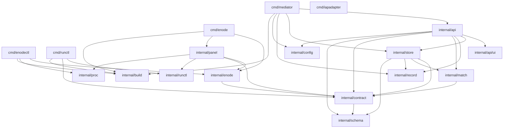

# 의존 — 오늘의 그래프

**2026-09-15 전면 재측정.** `go list -f '{{.Imports}}'` 로 열여덟 패키지를 직접
셌다. 2026-09-08 판은 패키지 열둘의 그래프였다.

---

## 내부 의존



`cmd/iapadapter` 는 내부 패키지를 하나도 안 문다 — HTTP 클라이언트 둘과 설정을
자기 안에 들고 `enode --once` 를 exec 한다. 저장소에서 유일하게 자족적인 바이너리다.

### 잎 — 아무것도 안 무는 것 일곱

```text
   internal/api/ui   내부 의존 0.  구조 불변식이 store 를 금지한다
   internal/build    runtime/debug 하나
   internal/config   yaml.v3 하나
   internal/proc     표준 + x/sys
   internal/record   파일시스템만
   internal/runctl   net/http 만
   internal/schema   표준만
```

### 주요 간선의 이유

| 간선 | 유형 | 이유 |
|---|---|---|
| `api -> store` | 컴파일 | HTTP 층이 SQL 을 직접 안 쓴다. 전부 위임한다 |
| `api -> ui` | 컴파일 | `/ui/` 정적 핸들러를 마운트한다. 방향이 반대면 화면이 DB 를 본다 |
| `api -> match` | 컴파일 | 제출과 dry-run 이 같은 순수 함수를 부른다 |
| `store -> match` | 컴파일 | 실행 시점 acquire 가 다시 짝짓는다 |
| `store -> record` | 컴파일 | 봉인이 상태 전이의 일부다 |
| `contract -> schema` | 컴파일 | 계약 검증이 form-only 스키마 검사를 부른다 |
| `enode -> contract` | 컴파일 | 광고 어휘와 단계 모양. 노드가 무는 유일한 도메인 |
| `panel -> enode` | 컴파일 | 신원 · 정책 · 상태 · 링을 읽는다 |
| `panel -> runctl` | 컴파일 | Mediator 조회. 제어판은 자기 클라이언트를 안 짓는다 |
| `panel -> proc` | 컴파일 | 잠금 파일 pid 와 멈춤 신호 |
| `cmd/enode -> panel` | 컴파일 | `enode panel` 하위명령의 숙주 |

### 금지된 간선 — 구조 불변식

```text
   internal/api/ui   ->  internal/store    화면은 정적 파일이다
   internal/panel    ->  internal/store    노드 쪽이 Mediator 의 DB 를 안 본다
   internal/panel    ->  internal/api      제어판은 Mediator 표면을 HTTP 로만 본다
   internal/enode    ->  internal/panel    데몬이 제어판을 안 문다
```

넷 다 오늘 참이다. `internal/panel/boundary_test.go` 가 그중 셋을 센다.

---

## 외부 의존

### 직접 셋

| 이름 | 버전 | 쓰는 자리 | 목적 | 라이선스 |
|---|---|---|---|---|
| `github.com/jackc/pgx/v5` | v5.10.0 | `internal/store` 만 | pgx pool · 트랜잭션 · `FOR UPDATE SKIP LOCKED` | MIT |
| `golang.org/x/sys` | v0.47.0 | `internal/enode` · `internal/proc` | 플랫폼 쌍 — flock · 콘솔 · 디스크 · 프로세스 | BSD-3-Clause |
| `gopkg.in/yaml.v3` | v3.0.1 | `internal/config` · `internal/enode` | Mediator 설정 · 노드 설정 · 정책 · 상태 파일 | MIT + Apache-2.0 |

### 간접 일곱

```text
   github.com/jackc/pgpassfile          pgx
   github.com/jackc/pgservicefile       pgx
   github.com/jackc/puddle/v2           pgx 의 풀
   github.com/kr/text                   테스트 도구 경유
   github.com/rogpeppe/go-internal      테스트 도구 경유
   golang.org/x/sync                    puddle
   golang.org/x/text                    pgx
```

### 없는 것 — 이것이 설계다

```text
   HTTP 라우터        net/http 의 ServeMux 가 Go 1.22+ 부터 메서드와 패턴을 받는다
   웹 프레임워크      화면은 정적 파일 + ES 모듈이다.  번들러도 없다
   로깅 라이브러리    log/slog
   ORM · 마이그레이션 도구   schema.sql 을 통째로 exec 한다
   테스트 프레임워크  표준 testing.  단언 라이브러리도 없다
   JSON Schema 구현   internal/schema 가 일부러 불구인 것을 직접 짓는다
```

---

## 외부 프로세스 의존

패키지 의존은 아니지만 실행에 필요한 것들이다.

```text
   claude          노드의 기본 하네스.  PATH 에서 찾는다.  없으면 광고에 안 실린다
   git             워크스페이스 준비 · diff · user.email.  노드와 클라이언트 양쪽
   PostgreSQL 17   Mediator 의 유일한 외부 상태 의존
   caffeinate      darwin 에서만.  enodectl 이 잠들기를 막는다
   repo            워크스페이스가 그 모양이면.  workspace.go 의 repo forall
```

CI 는 `claude` 를 스텁으로 갈아 끼운다 (`.github/ci-stubs/claude`) — 없으면 두
테스트가 조용히 스킵되고, 그 스킵을 스킵 감시 스텝이 잡는다.
