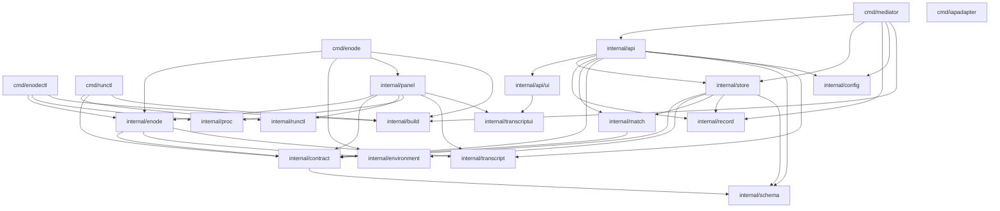

# 의존 — 오늘의 그래프

**2026-09-23 전면 재측정.** `go list -f '{{.Imports}}'` 로 스물한 패키지를 직접
셌다. 2026-09-15 판은 패키지 열여덟의 그래프였다.

---

## 내부 의존



`cmd/iapadapter` 는 내부 패키지를 하나도 안 문다 — HTTP 클라이언트 둘과 설정을
자기 안에 들고 `enode --once` 를 exec 한다. 저장소에서 유일하게 자족적인 바이너리다.

### 잎 — 내부 의존이 0 인 것 아홉

```text
   internal/build          runtime/debug 하나
   internal/config         yaml.v3 하나
   internal/environment    표준 + yaml.v3.  os/exec · os/user 를 쓴다
   internal/proc           표준 + x/sys
   internal/record         파일시스템만
   internal/runctl         net/http 만
   internal/schema         표준만
   internal/transcript     bytes · encoding/json · strings · unicode/utf8 넷뿐이다
   internal/transcriptui   embed 하나.  문장이 0 개다
```

`internal/api/ui` 는 이제 잎이 아니다 — `internal/transcriptui` 를 물어 카드
렌더러를 `/ui/shared/` 아래로 낸다.

### 주요 간선의 이유

| 간선 | 유형 | 이유 |
|---|---|---|
| `api -> store` | 컴파일 | HTTP 층이 SQL 을 직접 안 쓴다. 전부 위임한다 |
| `api -> ui` | 컴파일 | `/ui/` 정적 핸들러를 마운트한다. 방향이 반대면 화면이 DB 를 본다 |
| `api -> match` | 컴파일 | 제출과 dry-run 이 같은 순수 함수를 부른다 |
| `api -> transcript` | 컴파일 | `GET .../log?as=events` 가 같은 조각을 파서에 넣는다 |
| `ui -> transcriptui` | 컴파일 | 카드 렌더러 한 장을 제어판과 같은 바이트로 낸다 |
| `store -> match` | 컴파일 | 실행 시점 acquire 가 다시 짝짓는다 |
| `store -> record` | 컴파일 | 봉인이 상태 전이의 일부다. 봉인이 진행 트리를 먼저 걷는다 |
| `store -> environment` | 컴파일 | **신규.** `StepResult.Environment` 가 `execenv.Record` 타입을 쓴다. 타입 하나 때문이다 |
| `contract -> schema` | 컴파일 | 계약 검증이 form-only 스키마 검사를 부른다 |
| `enode -> contract` | 컴파일 | 광고 어휘와 단계 모양 |
| `enode -> environment` | 컴파일 | **신규.** `StepRuntime` 이 profile · binding · manifest · 결과 기록을 받는다 |
| `enode -> transcript` | 컴파일 | 봉인 로그 선별과 사건 배출이 파서의 어휘를 쓴다 |
| `panel -> enode` | 컴파일 | 신원 · 정책 · 상태 · 링을 읽는다 |
| `panel -> runctl` | 컴파일 | Mediator 조회. 제어판은 자기 클라이언트를 안 짓는다 |
| `panel -> transcript` | 컴파일 | 링 스냅샷을 사건 열로 읽는다 |
| `cmd/enode -> environment` | 컴파일 | **신규.** `enode env check` · `enode env apply` 와 기동 전 준비도 검사 |

### 두 나무가 한 자리에서 만난다 — 신규

2026-09-15 판은 「Mediator 쪽과 노드 쪽이 `contract` 를 공유할 뿐 서로를 안 문다」로
적었다. **오늘은 `internal/environment` 도 공유한다.**

```text
   store -> environment    Mediator 쪽.  execenv.Record 타입 하나를 결과 JSON 에 싣는다
   enode -> environment    노드 쪽.  profile 을 읽고 runtime 을 연다
   결과                     cmd/mediator 가 go list -deps 로 internal/environment 를 링크한다.
                           그 패키지는 os/exec 로 apt-get · debootstrap · chroot 를 부르는
                           코드를 들고 있다 — Mediator 가 부르는 자리는 0 이다
```

막는 검사는 없다 — 금지 표가 이 간선을 모른다(아래). 이 팩의 결과 봉투가 결과
타입을 늘리면 같은 모양이 다시 생길 자리다.

### 금지된 간선 — 구조 불변식

`internal/panel/boundary_test.go` 의 표가 열두 줄이고 봉인이 둘이다.

```text
   internal/panel         ->  internal/store · internal/api
   internal/enode         ->  internal/panel
   internal/api/ui        ->  internal/store
   internal/transcript    ->  internal/enode · internal/api · internal/store · internal/panel
   internal/transcriptui  ->  internal/panel · internal/api · internal/store · internal/enode
   봉인 둘                 internal/transcript · internal/transcriptui 는 표준 라이브러리만 쓴다
                           (transcriptui 는 embed 하나).  go list -deps 로 잰다
```

열두 줄이 오늘 전부 참이다. **`internal/environment` 는 표에 없다** — 무엇을 물면
안 되는지도, 누가 물면 안 되는지도 규칙이 없다.

---

## 외부 의존

### 직접 셋 (2026-09-15 판과 같다)

| 이름 | 버전 | 쓰는 자리 | 목적 | 라이선스 |
|---|---|---|---|---|
| `github.com/jackc/pgx/v5` | v5.10.0 | `internal/store` 만 | pgx pool · 트랜잭션 · `FOR UPDATE SKIP LOCKED` | MIT |
| `golang.org/x/sys` | v0.47.0 | `internal/enode` · `internal/proc` | 플랫폼 쌍 — flock · 콘솔 · 디스크 · 프로세스 · **mount · mount_setattr · statfs** | BSD-3-Clause |
| `gopkg.in/yaml.v3` | v3.0.1 | `internal/config` · `internal/enode` · `internal/environment` | Mediator 설정 · 노드 설정 · 정책 · 상태 파일 · **실행 환경 profile** | MIT + Apache-2.0 |

### 간접 일곱

```text
   github.com/jackc/pgpassfile          pgx
   github.com/jackc/pgservicefile       pgx
   github.com/jackc/puddle/v2           pgx 의 풀
   github.com/kr/text                   테스트 도구 경유
   github.com/rogpeppe/go-internal      테스트 도구 경유
   golang.org/x/sync                    puddle
   golang.org/x/text                    pgx
```

### 없는 것 — 이것이 설계다

```text
   HTTP 라우터        net/http 의 ServeMux 가 Go 1.22+ 부터 메서드와 패턴을 받는다
   웹 프레임워크      화면은 정적 파일 + ES 모듈이다.  번들러도 없다
   로깅 라이브러리    log/slog
   ORM · 마이그레이션 도구   schema.sql 을 통째로 exec 한다
   컨테이너 런타임 라이브러리  runc 를 실행파일로 부른다.  OCI config 는 구조체 몇 개를 직접 짓는다
   테스트 프레임워크  표준 testing.  단언 라이브러리도 없다
   JSON Schema 구현   internal/schema 가 일부러 불구인 것을 직접 짓는다
```

---

## 외부 프로세스 의존

패키지 의존은 아니지만 실행에 필요한 것들이다.

```text
   claude          노드의 기본 하네스.  PATH 에서 찾는다.  없으면 광고에 안 실린다
   git             워크스페이스 준비 · diff · user.email.  노드와 클라이언트 양쪽
   PostgreSQL 17   Mediator 의 유일한 외부 상태 의존
   caffeinate      darwin 에서만.  enodectl 이 잠들기를 막는다
   repo            워크스페이스가 그 모양이면.  workspace.go 의 repo forall
   unshare         runc-overlay 노드만.  바깥 user · mount namespace 를 연다
   runc            runc-overlay 노드만.  단계 프로세스 하나를 띄운다 (run · kill · delete)
   newuidmap       runc-overlay 노드만.  unshare --map-auto 가 부른다
   fuse-overlayfs  overlay 탐침의 셋째 사다리.  있으면 재고 없으면 건너뛴다
   apt-get · debootstrap · chroot · sudo   env apply 만.  노드 데몬은 안 부른다
```

CI 는 `claude` 를 스텁으로 갈아 끼운다 (`.github/ci-stubs/claude`) — 없으면 두
테스트가 조용히 스킵되고, 그 스킵을 스킵 감시 스텝이 잡는다. **CI 는 준비된
rootfs 를 짓지 않고 `integration` 태그도 안 붙인다** — runc-overlay 의 실제
namespace 경로(overlay mount · runc run · 정리)는 그 태그 시험과 사람이 도는
게이트만 잰다. 기본 `go test` 의 runc-overlay 시험은 helper 프로토콜을 가짜
프로세스로 돌린다.
