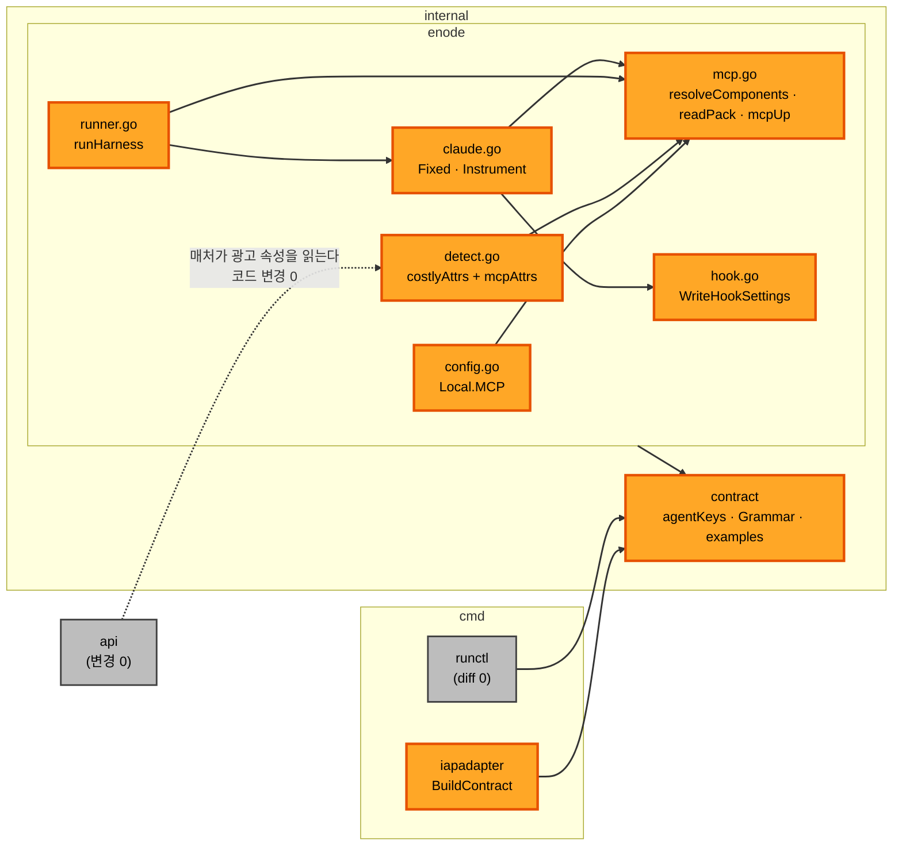

# 의존과 통신 — 무엇이 무엇을 부르나

---

## 1. 경로 셋 (넷이 아니다)

`component-methods.md` 7절이 잰 대로 **`cmd/runctl` 의 diff 는 0 이다.**
`runctl example` 이 `contract.ExampleNames()` 로 임베드 FS 를 읽으므로 예시 파일은
`internal/contract/examples/` 에 살고, `runctl schema steps` 는 구조체에서 뽑는다.

```text
   internal/enode      Major     새 표면 전부.  새 파일 mcp.go 하나
   internal/contract   Minor     알려진 키 둘 · Grammar 줄 · 예시 파일 하나
   cmd/iapadapter      Minor     설정 키 하나 · 템플릿 분기 하나
   cmd/runctl          없음      저절로 는다
```

`requirements.md` 6.3 과 `constraints.md` 의 「새 코드가 사는 자리」가 넷을 적었고,
그중 하나가 실제로는 0 이다. **Units Generation 의 파일 행렬이 이 값을 쓴다.**

---

## 2. 호출 방향



텍스트 대안.

```text
   cmd/iapadapter  ->  internal/contract        계약을 짓는다
   cmd/runctl      ->  internal/contract        예시·스키마를 읽는다 (코드 변경 0)
   internal/enode  ->  internal/contract        오늘 그대로.  새 임포트 0

   enode 안에서
     config.go   ->  mcp.go     Local.MCP 가 MCPServer 를 든다
     detect.go   ->  mcp.go     mcpAttrs 를 부른다
     runner.go   ->  mcp.go     resolveComponents 를 exec 전에 부른다
     runner.go   ->  claude.go  Fixed(dir) · Instrument(dir, self, a, c)
     claude.go   ->  mcp.go     Components 를 파일로 쓴다
     claude.go   ->  hook.go    오늘 그대로

   internal/api    광고 속성을 매처가 읽는다.  코드는 한 줄도 안 는다
```

**새 임포트 간선이 0 이다.** `mcp.go` 는 `internal/enode` 안의 새 파일이고,
`internal/contract` 로의 간선은 이미 있다.

---

## 3. 임포트 금지 넷 — 안 깨진다

| 금지 | 이 회차가 만드나 | 근거 |
|---|---|---|
| `internal/panel` -> `internal/store` | 아니오 | `panel` 을 안 건드린다 |
| `internal/panel` -> `internal/api` | 아니오 | 같다 |
| `internal/api/ui` -> `internal/store` | 아니오 | `api/ui` 를 안 건드린다 |
| `internal/enode` -> `internal/panel` | 아니오 | 새 임포트가 0 이다 |

경계 검사 테스트는 그대로 돈다. **표에 줄이 늘지 않는다** — 새 패키지가 없다.

---

## 4. 자료가 흐르는 길

```text
   노드 소유자 ──▶ enode.yaml mcp:  ──▶ Local.MCP ──┬──▶ mcpAttrs ──▶ 광고 mcp.<이름>
                                                    │                      │
                                                    │                      ▼
                                                    │              Mediator 매처 (변경 0)
                                                    │                      │
                                                    │                      ▼
                                                    └──▶ resolveComponents ◀── 계약 agent.mcp
   워크스페이스 .mcp.json ─────────────────────────────▶       │
   팩 tar ($IN) ──▶ readPack ─────────────────────────────────▶│
                                                                ▼
                                                          Components
                                                                │
                                                    ┌───────────┴───────────┐
                                                    ▼                       ▼
                                          Instrument 가 쓴다        HarnessResult 에 적힌다
                                          <dir>/mcp.json            mcp: [이름]
                                          <dir>/home/skills/…       pack: <sha256>
                                                    │                       │
                                                    ▼                       ▼
                                                 하네스                  Record 봉인
```

**값이 흐르지 않는 자리 둘.**

```text
   광고        mcp.<이름> 만 실린다.  credential 의 환경변수 이름도 안 실린다
   허용목록     이름 · 종류 · 실행 경로나 주소 · 환경변수 이름만.  값은 없다
```

---

## 5. 짝 팩(transcript)과 겹치는 자리

`constraints.md` 의 접점 절이 정본이다. **질문 3 의 답이 A 라 이 팩이 먼저 병합된다.**
Q5 의 답이 A 라 겹침이 팩이 적은 것보다 **줄었다.**

| 파일 | 이 팩 | 짝 팩 | 겹치나 |
|---|---|---|---|
| `claude.go` `Argv` | **안 건드린다** (Q5 = A) | 출력 형식을 바꾼다 | **아니오** — 이 회차에 겹침이 사라졌다 |
| `claude.go` `Fixed` | 시그니처를 바꾼다 | 안 건드린다 | 아니오 |
| `claude.go` `Instrument` | 크게 자란다 | 안 건드린다 | 아니오 |
| `claude.go` `Decode` | 안 건드린다 | 스트림을 훑게 바꾼다 | 아니오 |
| `runner.go` `Job` | `NodeMCP` 한 필드 | tee 와 사건 배출 | **예** — 같은 구조체 |
| `runner.go` `runHarness` | 순서와 실패 규칙 | stdout 처리 | **예** — 같은 함수 |
| `hook.go` | 훅 파일을 가짜 홈 옆으로 | 안 건드린다 | 아니오 |
| `harness.go` `HarnessResult` | 필드 둘 | 안 건드린다 | 아니오 |

**겹치는 것은 `runner.go` 하나다.** 진행자가 직렬로 병합한다. 이 팩이 먼저
들어가므로 짝 팩이 그 위에 올라온다.

---

## 6. 통신 패턴 — 새 것이 없다

```text
   노드 -> Mediator     오늘의 광고 봉투.  속성 키가 늘 뿐이다
   Mediator -> 노드     오늘의 claim 응답.  agent 맵에 키가 둘 늘 뿐이다
   노드 -> 하네스       프로세스 하나.  플래그가 둘 늘고 환경변수가 하나 는다
   blob                 오늘의 $OUT -> Mediator -> $IN 경로.  새 라우트 0
```

새 포트 0 · 새 전송 0 · 새 프로토콜 0. `grep -c 'mux.HandleFunc' internal/api/api.go`
가 17 그대로다.
