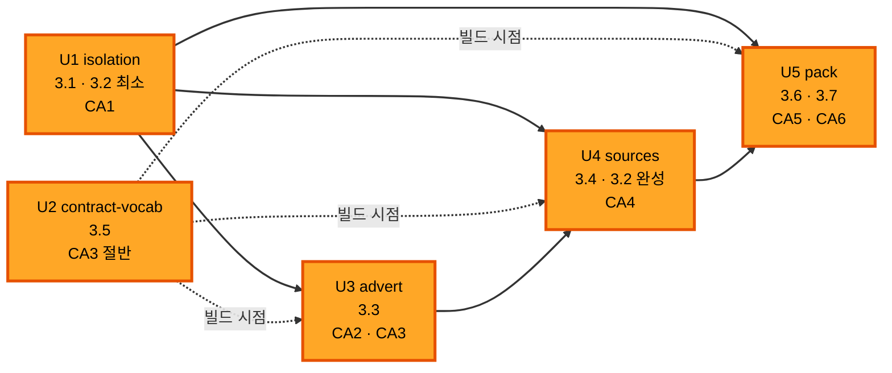

# 유닛 의존 — 무엇이 무엇 위에 서나

`unit-of-work.md` 가 유닛 다섯을 정의했다. 여기는 그 **순서의 근거**다.

---

## 1. 의존 행렬

세로가 「이 유닛이」, 가로가 「저 유닛 위에 선다」.

| | U1 isolation | U2 contract-vocab | U3 advert | U4 sources | U5 pack |
|---|---|---|---|---|---|
| **U1** isolation | — | | | | |
| **U2** contract-vocab | | — | | | |
| **U3** advert | 예 | 예 | — | | |
| **U4** sources | 예 | 예 | 예 | — | |
| **U5** pack | 예 | 예 | | 예 | — |

**의존 없는 유닛이 둘이다** — U1 과 U2. 둘은 파일이 하나도 안 겹친다
(`unit-of-work-file-matrix.md` 1절). 8절이 그 값을 쓴다.

---

## 2. 착수 순서와 그 근거

```text
   ①  U1  isolation        CA1 이 이 팩의 맨 앞이다.  무엇을 열기 전에
                           무엇이 끊기는지를 먼저 잰다 (scene-gates.md 2절)
   ②  U2  contract-vocab   빌드 시점 의존의 뿌리.  U3 · U4 · U5 가 딛는다
   ③  U3  advert           CA2 가 CA4 보다 싸다.  노드 하나로 잰다
   ④  U4  sources          출처 셋을 세워야 CA4 를 잰다
   ⑤  U5  pack             CA6 이 1절 전부를 끝까지 돈다.  사내에서만 돈다
```

**U1 을 U2 앞에 둔 이유** — 둘 다 선행이 없어서 순서를 고를 수 있었다.
`scene-gates.md` 2절이 「CA1 이 가장 앞에 있는 것이 이 팩의 핵심이다」로
적었고, 사내 실측이 찾은 것이 「거꾸로 막힌다」였다. **끊는 것을 먼저 세운다.**

---

## 3. 의존의 종류 — 셋이다

같은 화살표가 아니다. 무엇이 없으면 무엇이 안 되는지가 다르다.

```text
   빌드 시점    U2 -> U3 · U4 · U5
                agentKeys 가 서기 전에는 agent.mcp · agent.pack 을 적은 계약이
                400 이다.  코드가 아니라 계약이 거절된다

   코드 시점    U1 -> U3 · U4 · U5      Instrument 와 mcp.go 의 타입이 먼저 있어야 한다
                U3 -> U4                Local.MCP 가 있어야 resolveComponents 가 읽는다
                U4 -> U5                resolveComponents 가 서 있어야 팩 출처를 더한다

   게이트       U1 -> U3                CA2 의 「먼저 서는 기능」 열이 3.1 이다
                U1 · U2 -> U4 · U5      같은 열이 CA4 · CA5 에 3.1 · 3.2 를 적었다
```

**빌드 시점 의존 하나가 이 팩에서 가장 조용한 함정이다.** 코드는 컴파일되고
테스트도 초록인데 계약만 `400` 으로 돌아온다 — `internal/contract` 를 유닛 하나로
모은 이유다 (계획 Q2 = A).

---

## 4. 그림



텍스트 대안.

```text
   U1 isolation ──┬──▶ U3 advert ──▶ U4 sources ──▶ U5 pack
                  ├──────────────────▲               ▲
                  └──────────────────────────────────┘

   U2 contract-vocab ┄┄▶ U3 · U4 · U5      점선은 빌드 시점 의존

   직렬 경로의 깊이는 다섯이다 — U1 · U2 · U3 · U4 · U5.
   한 손이 도므로 그것이 그대로 실행 순서다
```

---

## 5. 짝 팩(transcript)과의 순서

**팩 단위로 이 팩이 먼저다** (Requirements 확인 질문 Q3 = A). 유닛마다가 아니다.

```text
   이 팩          U1 ~ U5 를 전부 main 에 올린다
   짝 팩          그 위에서 돈다.  runner.go 를 같은 자리에서 만진다
```

겹치는 파일은 `runner.go` 하나다 (`component-dependency.md` 5절 — Q5 = A 가
`claude.go` 의 `Argv` 는 ⑮ 로 되돌아와 겹친다). 이 팩 안에서 `runner.go` 를 만지는
유닛은 셋(U1 · U4 · U5)이지만 **직렬이라 서로 충돌이 아니다.**

**유닛마다 `main` 에 올리는 것이 이 순서를 안 깬다.** 짝 팩은 이 팩의 마지막
유닛(U5)이 들어간 뒤에 착수하므로, 중간 상태의 `runner.go` 위로 올라오지 않는다.

---

## 6. 게이트가 빨간 채로는 다음 유닛을 착수하지 않는다

`CONVENTIONS.md` 3.3 과 `scene-gates.md` 4절이 정본이다.

```text
   빨간 이유가 유닛 안     고친다.  병합 지점이 아니다
   빨간 이유가 유닛 밖     진행자가 이 회차의 audit.md 에 적고 보류로 표시한다.
                         보류는 통과가 아니므로 병합 지점도 아니다
   눈 검증                보류로 안 넘긴다.  CA1 · CA4 · CA5 · CA2 의 S1 은
                         사람이 실제로 한 번 띄우거나 봐야 초록이다
```

**앞 팩의 CP6 이 눈 검증을 보류로 남긴 채 닫혔고, 그 결함이 사내 실측에서야
드러났다.** 이 회차가 그것을 되풀이하지 않는다.

---

## 7. 유닛이 멈추면 무엇이 막히나

```text
   U1 이 막히면   전부 막힌다.  U2 만 독립이다
   U2 가 막히면   U3 의 CA3 · U4 · U5 가 막힌다.  U3 의 CA2 는 선다
   U3 이 막히면   U4 · U5 가 막힌다
   U4 가 막히면   U5 가 막힌다
   U5 가 막히면   CA5 · CA6 이 안 닫힌다.  앞 넷의 게이트는 이미 초록이다
```

**U5 가 사내 함대를 요구하는 유일한 유닛이다** (CA6). 사내가 안 열리면 CA6 만
보류가 되고 CA0 ~ CA5 는 스크래치에서 전부 초록일 수 있다.

---

## 8. 집행자 — 손이 하나면 게이트가 안 선다

`scene-gates.md` 2절 머리가 한 줄로 못 박았다.

```text
   집행자는 그 유닛을 구현하지 않은 사람이다
```

**CA1 ~ CA6 여섯이 전부 사람 집행이다.** 한 손이 U1 ~ U5 를 다 구현하면 그 여섯의
집행 자격자가 0 명이 된다. Requirements 의 Q2 = B(한 손 직렬)는 이 줄을 안 보고
속도만 쟀고, 이 문서도 1절에서 그것을 그대로 받았다.

**두 번째 손의 값은 속도가 아니다.** 병렬로 버는 것은 최대 1/5 다 — 임계 경로가
U1 → U3 → U4 → U5 로 넷이고 직렬이 다섯이다. 값은 **집행 자격**에 있다.

```text
   U2 contract-vocab 을 두 번째 손에 준다
     U1 과 파일이 하나도 안 겹친다 — 병합 충돌이 0 이다
     그 손이 U1 의 CA1 을 집행할 자격을 갖는다.  CA1 은 팩이 「가장 앞」이라고
     못 박은 게이트이고 이 회차의 존재 이유가 앞 팩 CP6 의 눈 검증이
     독립적으로 안 돌아 사내 실측에서야 결함이 드러난 일이다
     조달 비용은 construction-roster.md 1절에 행 하나다 — handle 넷이 살아 있다
```

### 8.1 닫은 값 — 한 손을 유지하고 진행자가 집행한다

**구현은 `taeels` 하나로 간다** (Q2 = B 그대로). 분해도 안 바꾼다. 대신
**집행자를 명시로 배정해 자격 규칙을 지킨다.**

| 조각 | 재는 유닛 | 집행자 | 대상 |
|---|---|---|---|
| CA0 | 다섯 전부 | 기계 | 스크래치 |
| CA1 | U1 | **진행자** | 스크래치 (노드 둘) |
| CA2 (S1 포함) | U3 | **진행자** | 스크래치 |
| CA3 | U2 · U3 | **진행자** | 함대 |
| CA4 | U4 | **진행자** | 스크래치 |
| CA5 | U5 | **진행자** | 스크래치 |
| CA6 | U5 | **진행자** | 사내 함대 |

진행자는 이 회차의 유닛을 구현하지 않으므로 `scene-gates.md` 2절 머리의 자격을
만족한다. **손을 늘리지 않고 자격을 세우는 길이 이것 하나다** — 구현자가 자기
게이트를 집행하면 초록이 아니라 초록이라고 적힌 것이 된다.

**진행자가 못 도는 조각은 보류로 적는다** (`scene-gates.md` 4절). 다만 눈 검증
넷(CA1 · CA2 의 S1 · CA4 · CA5)은 보류로 안 넘긴다 — 앞 팩 CP6 이 그렇게 닫혔고
그 결함이 사내 실측에서야 드러났다.
