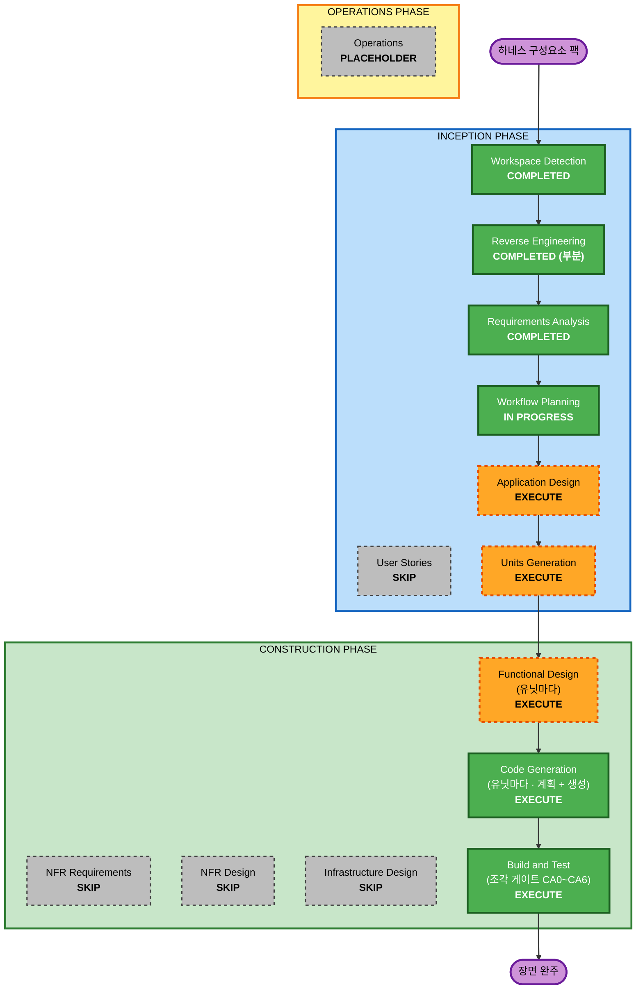

# 실행 계획 — v3 하네스 구성요소 회차

입력은 `requirements.md` (Comprehensive) 와 요구 팩 다섯이다. 여기서 정하는 것은
**어느 단계를 돌리고 어느 단계를 건너뛰는가** 하나다. 유닛 분해는 정하지 않는다 —
팩이 유닛을 주지 않으므로 (`constraints.md` 구조 불변식) Units Generation 이 낸다.

- **회차 브랜치**: `v3-run-harness-components` · HEAD `d1f5154`
- **문서 루트**: `aidlc-docs/v3-run-harness-components/` (Inception) ·
  `aidlc-docs/taeels/` (Construction)
- **작성 시각**: 2026-09-11T13:59:38Z

---

## 1. 상세 분석 요약

### 1.1 전환 범위 (브라운필드)

```text
   전환 유형     단일 아키텍처 안의 기능 추가.  아키텍처 전환이 아니다
   주 변경       하네스 실행 경계를 값으로 닫고(가짜 홈 · 허용목록),
                 노드에 묶인 MCP 를 광고 · 매칭 · 요청의 세 자리에 잇는다
   관련 경로     internal/enode · internal/contract · cmd/iapadapter 셋
                 (`cmd/runctl` 은 소스 diff 가 0 이다 — Application Design 의 측정)
   안 만지는 곳   internal/api · internal/store · internal/panel · internal/api/ui
   배포 모형     무변경.  새 포트 0 · 새 전송 0 · 새 라우트 0
```

### 1.2 변경 영향 평가

| 영역 | 있나 | 무엇이 |
|---|---|---|
| 사용자 대면 | Yes (간접) | 현황판 노드 카드와 제어판 탐지 능력 카드에 `mcp.<이름>` 칩이 는다. 자동이다 — 이 회차가 화면을 안 만든다 (`scene-gates.md` 2.1) |
| 구조 | 후보 하나 | 새 패키지 0 · 임포트 금지 넷 그대로. 다만 `Harness.Fixed()` 가 계장 디렉터리를 알아야 해서 인터페이스 모양이 걸린다 (D1). 이 회차 유일한 구조 변경 후보다 |
| 자료 모형 | Yes | `enode.yaml` 의 `mcp:` 절 · 허용목록 `mcp.json` 형식 · 팩 tar 규약 · `HarnessResult` 의 `mcp` 와 `pack` · Advert attrs 키 둘 (`mcp.<이름>` · `harness.<이름>`) |
| API | 라우트 0 · 문법 증가 | `POST /v1/runs` 가 받는 계약 문법이 는다 — `requires[].mcp.<이름>` · `agent.mcp` · `agent.pack`. 호환 변경이다. 오늘의 계약은 그대로 돈다. `internal/api/api.go` 는 등록 줄조차 안 는다 |
| NFR | Yes | security-baseline 이 차단으로 켜져 있다. 새 비용은 탐지 하나 (5분 주기) |

### 1.3 컴포넌트 관계

```text
   주 컴포넌트     internal/enode      실행 층.  가짜 홈 · 허용목록 · 팩 펴기 ·
                                       탐지기 · 노드 선언이 전부 여기 산다
   공유 컴포넌트   internal/contract   Mediator 와 enode 가 함께 본다.
                                       알려진 키 · Grammar · 예시
   소비 컴포넌트   cmd/iapadapter      설정 키 하나 · 템플릿의 팩 단계
                  cmd/runctl          소스 diff 0.  example 이 임베드 FS 를 돌고
                                      schema 는 Step.Agent 가 map 이라 안 는다
   영향만 받는 곳  internal/api/ui     노드 카드가 새 attrs 키를 자동으로 칩으로 그린다.
                  internal/panel      코드 변경 0
```

변경 종류와 우선순위.

| 경로 | 종류 | 이유 | 우선순위 |
|---|---|---|---|
| `internal/enode` | Major | 새 표면 전부가 여기다 | Critical |
| `internal/contract` | Minor (호환) | 알려진 키 목록에 이름 둘 · Grammar 에 필드 둘 | Critical — 계약 키를 읽는 유닛이 여기 먼저 선다 |
| `cmd/iapadapter` | Minor | 설정 키 하나 · 템플릿 | Important |
| `cmd/runctl` | Configuration-only | example 하나 | Important |

### 1.4 위험 평가

```text
   위험도        High
                 가짜 홈이 틀리면 OAuth 노드의 하네스 인증이 끊긴다.
                 허용목록이 틀리면 사내 MCP 가 다시 막힌다.
                 팩 tar 를 푸는 것은 신뢰할 수 없는 입력을 홈 안에 푸는 것이다 (SEC-A)
   되돌리기      Moderate
                 회차 브랜치 하나라 되돌리기는 한 번이다.  다만 enode.yaml 과
                 계약 문법은 노드 소유자와 계약 작성자에게 이미 나간 뒤일 수 있다
   검사 복잡도    Complex
                 조각 일곱 중 사람이 실제 하네스로 띄워야 초록인 것이 셋(CA1 · CA4 · CA5),
                 사내 함대에서만 도는 것이 하나(CA6)
```

**되돌리기를 쉽게 두는 값 하나** — `detect.go` 의 옛 `harness` 키를 이 회차 동안
같이 싣는다 (`features.md` 3.3). 새 키만 싣고 옛 키를 걷으면 기존 계약의 매칭이
같은 배포에서 끊긴다.

---

## 2. 워크플로 시각화



텍스트 대안.

```text
   INCEPTION      Workspace Detection    완료
                  Reverse Engineering    완료 (네 경로만 부분 재측정 · Q1=B)
                  Requirements Analysis  완료
                  User Stories           스킵
                  Workflow Planning      진행 중
                  Application Design     실행 — D1 ~ D4 를 닫는다
                  Units Generation       실행 — 파일 행렬이 필수다

   CONSTRUCTION   Functional Design      실행 — 유닛마다.  새 파일 형식 넷을 닫는다
                  NFR Requirements       스킵
                  NFR Design             스킵
                  Infrastructure Design  스킵
                  Code Generation        실행 — 유닛마다.  계획 뒤 생성
                  Build and Test         실행 — 조각 게이트 CA0 ~ CA6 이 곧 시험 계획이다

   OPERATIONS     Operations             자리만
```

---

## 3. 실행할 단계

### INCEPTION PHASE

- [x] Workspace Detection (COMPLETED)
- [x] Reverse Engineering (COMPLETED — 부분 재측정)
  - **근거**: 질문 1 의 답이 B 였다. 이 팩이 딛는 네 경로만 다시 쟀고
    공용 `aidlc-docs/inception/reverse-engineering/` 에 실었다
- [x] Requirements Analysis (COMPLETED)
- [x] User Stories — **EXECUTE (minimal)** — 2026-09-12 에 스킵에서 되살렸다
  - **근거**: 수용 기준이 이미 있고 더 강하다. `scene-gates.md` 의 조각 일곱은
    페르소나와 문장이 아니라 **실행 명령**으로 적혀 있고, 집행자 · 대상 ·
    재는 기능 · 먼저 서는 기능까지 표로 붙어 있다. 스토리를 세우면 그 표를
    약한 형태로 다시 쓰는 일이 된다
  - **근거 둘**: 페르소나 셋(노드 소유자 · 계약 작성자 · 진행자)이 이미
    `features.md` 2절의 용어와 3절의 각 기능 안에 이름으로 박혀 있다
  - **위 근거는 규칙의 SKIP 조건에 안 걸렸다** (2026-09-12 검증). `core-workflow.md`
    의 User Stories 절은 ALWAYS Execute IF 에 다섯 줄이 걸리고(새 사용자 대면
    기능 · 페르소나 여럿 · 수용 기준이 필요한 복잡한 요구 · 고객 대면 API 변경 ·
    새 제품 능력) SKIP ONLY IF 여섯 줄에는 **한 줄도 안 걸린다** — 여섯이 전부
    「사용자 영향 0」을 전제하는데 이 회차는 노드 소유자가 `enode.yaml` 을 편집하고
    계약 작성자가 `agent.mcp` 를 적는 표면을 새로 만든다. `inception/user-stories.md`
    의 Default Decision Rule 도 「When in doubt, include」이고, 이 계획은 스스로
    위험을 **High** 로 적었다. **규칙에서 벗어나는 스킵이다**
  - **그래서 최소 형태로 되살렸다** (사용자 결정 2026-09-12). 산출물은
    `inception/user-stories/personas.md` 와 `user-stories.md` 다. 행복 경로는
    안 쓴다 — `scene-gates.md` 가 더 촘촘하다. **저작 경로와 오류 경로만** 짓는다.
    스토리 열 중 셋이 새 완료 조건을 낳았고(`enode.yaml` 검증 · `agent.mcp` 타입 ·
    `runctl capabilities` 노출) 나머지는 기존 게이트를 가리킨다
  - **하류가 이제 안 깨진다**: `units-generation.md` 가 유닛을 「stories 의 묶음」으로
    정의하고 `construction/functional-design.md` 가 story map 에서 배정된 스토리를
    읽는데, 그 자리에 실물이 생겼다
- [x] Workflow Planning (IN PROGRESS)
- [ ] Application Design — EXECUTE
  - **근거**: `requirements.md` 8절이 이 단계에 미결 넷을 명시로 넘겼다.
    **요구가 아니라 모양이라서 여기서 정하지 않으면 유닛이 각자 지어낸다**
  - **닫을 것**:
    - D1 `Fixed()` 가 계장 디렉터리를 어떻게 아나 — 인터페이스를 바꾸나
      `runHarness` 가 홈 변수만 합치나 (`requirements.md` 2.2)
    - D2 Detector 가 MCP 를 어떻게 드나 — 오늘 Detector 는 고루틴 하나다.
      **광고 루프가 탐지를 직접 부르면 안 된다** (4.4). 여기서 막는다
    - D3 허용목록을 누가 쓰나 — `Instrument` 인가 `runHarness` 인가.
      팩 펴기와 같은 자리인가
    - D4 게이트가 `transcript.go` 의 링을 쓸 수 있나 — 쓸 수 있으면
      CA1 · CA4 · CA5 의 눈 검증이 싸진다 (2.3 · 5.1)
  - **산출물**: `aidlc-docs/v3-run-harness-components/inception/application-design/`
- [ ] Units Generation — EXECUTE
  - **근거**: `requirements.md` 9절과 `constraints.md` 끝 절이 **파일 행렬을
    필수로 걸었다**. 한 손이라 사람 충돌은 0 이지만, 짝 팩(transcript)이 같은
    파일 셋(`claude.go` · `runner.go` · `hook.go`)을 만지므로 접점을 표로
    세워야 진행자가 직렬 병합 순서를 정할 수 있다
  - **근거 둘**: 유닛 착수 순서가 `scene-gates.md` 2절의 「먼저 서는 기능」
    열에서 나온다. 그 열을 유닛으로 옮기는 것이 이 단계다
  - **산출물**: `aidlc-docs/v3-run-harness-components/inception/plans/unit-of-work-plan.md`
    와 유닛 정의 · **파일 행렬**

### CONSTRUCTION PHASE

담당은 `taeels` 하나다 (Q2=B). 문서 루트는 `aidlc-docs/taeels/` 이고
유닛마다 `unit/<유닛>` 을 딴다.

- [ ] Functional Design — EXECUTE (유닛마다)
  - **근거**: 이 회차가 만드는 것의 절반이 **파일 형식**이다. 넷을 글로 먼저
    닫지 않으면 코드가 값을 지어낸다
  - **닫을 것**:
    - `enode.yaml` 의 `mcp:` 절 — stdio 와 remote 의 필드 · 「뜨나」의 판정
    - 허용목록 `mcp.json` — 합집합 순서(팩 · 노드 · 워크스페이스)와 겹침 로그
    - 팩 tar 규약 — `skills/` · `agents/` · `mcp.json` · 무시 · **SEC-A 의
      거부 규칙과 크기 · 개수 상한의 실제 값**
    - `HarnessResult` 의 `mcp` 와 `pack` (`ADR-005` 성질 4 를 깨지 않는 자리)
  - **적용 범위**: 형식을 안 만드는 유닛(예 `runctl example` 만 더하는 유닛)은
    그 자리에서 스킵하고 근거를 적는다
- [ ] NFR Requirements — SKIP
  - **근거**: `requirements.md` 4절이 대부분을 닫았다 — 차단 게이트 다섯의 값 ·
    security-baseline 열다섯 규칙의 적용과 처리 표 · 오용 시나리오 넷 · 성능 한 줄.
    **이 회차가 그 값을 바꾸지 않는다.** 유닛마다 그 표를 다시 자르는 것은 결정이
    아니라 복사다
  - **「이미 닫았다」는 두 자리에서 과장이다** (2026-09-12 검증).
    SEC-A 의 크기 · 개수 상한은 닫힘이 아니라 **이송**이고(U5 의 FD),
    확장성은 절 자체가 없다 — MCP 「뜨나」가 노드마다 5분마다 선언 수만큼
    파일시스템을 훑는데 함대 규모에 대한 값이 한 줄도 없다.
    `core-workflow.md` 의 Skip IF 는 둘뿐이고(NFR 이 없다 · 스택이 정해졌다)
    이 회차는 NFR 이 **있다** — 1.2 의 표가 스스로 그렇게 적었다.
    **규칙에서 벗어나는 스킵이다**
  - **가용성 하나가 유닛 밖에 남는다**: `TMPDIR` 이 찬 노드를 떨어뜨리는 경로가
    없다. `hasRoom`(`detect.go:229`)은 `Workspace` 를 재고 떨어뜨리는 것도 `arch`
    하나뿐이라, 그 노드가 `mcp.<이름>` 을 계속 광고하고 계속 뽑히며 에이전트 단계를
    전부 실패시킨다. **이 팩이 만든 결함은 아니다** — `claim.go:459` · `:495` 가
    이미 같은 `os.TempDir()` 에서 죽는다. 다만 이 팩이 그 사고를 처음으로
    보고하게 만든다. 값은 이 회차 밖으로 이월하고 `decisions.md` 4절에 안 적는다 —
    팩의 범위가 아니라 노드 탐지의 범위다
  - **스킵이 무엇을 안 미루나**: 차단 확장의 집행은 스킵과 무관하게 **단계마다**
    돈다 (core-workflow 의 Enforcement). 단계 완료 보고마다 준수 요약을 싣는다
  - **값이 안 정해진 자리는 옮겼다**: SEC-A 의 크기 · 개수 상한은 팩 유닛의
    Functional Design 이 tar 규약과 함께 닫는다. 4.4 의 「광고 루프가 탐지를
    직접 안 부른다」는 Application Design D2 가 닫는다
- [ ] NFR Design — SKIP
  - **근거**: NFR Requirements 를 건너뛴다. 넘길 패턴이 없다
- [ ] Infrastructure Design — SKIP
  - **근거**: 배포 모형이 안 바뀐다. 새 포트 0 · 새 전송 0 · 새 라우트 0 ·
    클라우드 자원 0. 노드는 이미 도는 프로세스다
- [ ] Code Generation — EXECUTE (ALWAYS · 유닛마다)
  - **근거**: 이 회차의 산출물이 Go 코드다. Part 1 에서 유닛별 생성 계획을,
    Part 2 에서 코드와 시험을 낸다
  - **계획에 반드시 들어갈 것**: `internal/enode` 의 커버리지 하한 80% 를
    **하네스 실행파일 없이 도는 시험**으로 채운다 — 가짜 홈 · 허용목록 ·
    팩 펴기 · 뜨나 는 전부 파일과 문자열이다 (`constraints.md`)
- [ ] Build and Test — EXECUTE (ALWAYS)
  - **근거**: 빌드와 시험이 실재한다. **조각 게이트 CA0 ~ CA6 이 곧 시험
    계획이다** — `scene-gates.md` 3절의 명령을 실제 스크립트로 굳힌다
  - **눈 검증을 보류로 안 넘긴다**: CA1 · CA4 · CA5 는 사람이 실제 하네스로 한
    번은 띄워야 초록이다. 앞 팩의 CP6 이 눈 검증을 보류로 남긴 채 닫혔고 그
    결함이 사내 실측에서야 드러났다

### OPERATIONS PHASE

- [ ] Operations — PLACEHOLDER

---

## 4. 패키지 변경 순서

**유닛 순서는 여기서 정하지 않는다.** Units Generation 이 정한다
(`CONVENTIONS.md` 3.1). 여기는 패키지 사이의 제약만 적는다.

```text
   internal/contract   계약 키를 읽는 유닛보다 먼저 선다.  internal/enode 가
                       이것을 임포트하므로 빌드 시점 의존이다.
                       agentKeys 에 mcp · pack 이 없으면 그 키를 적은 계약이 400 이다

   internal/enode      가짜 홈과 허용목록의 뼈대는 계약 키 없이도 먼저 설 수 있다.
                       CA1 이 아무것도 요청하지 않은 단계를 재므로 계약 문법을 안 쓴다

   cmd/iapadapter      둘 다 선 뒤.  설정 키가 팩 단계를 템플릿에 낸다
   cmd/runctl          소스 diff 0.  예시 파일은 internal/contract 에 산다
```

**조율 지점 둘.**

```text
   짝 팩과의 접점    claude.go 의 Argv · runner.go 의 Job · hook.go.
                     transcript 팩이 같은 파일을 만진다 (constraints.md 접점 절).
                     질문 3 의 답이 A 라 이 팩이 먼저다.  진행자가 직렬로 병합한다

   옛 harness 키     detect.go 에서 break 를 걷고 harness.<이름> 을 싣되
                     옛 harness 키를 이 회차 동안 같이 싣는다.  기존 계약의
                     매칭이 같은 배포에서 끊기지 않게 하는 값이다
```

병렬 기회는 없다. 한 손이고 (Q2=B) 접점 셋이 그 한 손 안이라 충돌이 0 이다.

---

## 5. 예상 규모

```text
   실행 단계    Inception 2 (Application Design · Units Generation)
                Construction 3 (Functional Design · Code Generation · Build and Test)
   스킵 단계    3 (NFR Requirements · NFR Design · Infrastructure Design).
                User Stories 는 2026-09-12 에 최소 형태로 되살렸다
   유닛 수      미정.  Units Generation 이 낸다.  기능 일곱과 게이트 일곱이 입력이다
   만지는 경로  3 (internal/enode · internal/contract · cmd/iapadapter)
   게이트       7 (CA0 ~ CA6).  기계 1 · 사람 6 · 그중 사내 함대 1
```

기간은 적지 않는다. 이 회차의 완결성은 유닛 완료 개수가 아니라 **CA6 이 끝까지
도는가**로 판단한다 (`requirements.md` 1.2).

---

## 6. 성공 기준

**주 목표**: 사내 MCP 하나를 요구한 계약이 그 MCP 를 가진 노드에서만 돌고,
하네스는 계약이 요청한 서버와 팩의 스킬만 본다. 계정 커넥터는 0 이다.
무엇을 물렸는지가 Record 에 남는다.

**핵심 산출물**

```text
   Application Design   D1 ~ D4 의 답
   Units Generation     유닛 정의 + 파일 행렬 (접점 표시 포함)
   유닛마다             functional-design · code · unit/<유닛> 브랜치
   Build and Test       CA0 ~ CA6 의 실행 스크립트와 결과
   되돌려 올릴 것        ADR-067 · ADR-034 · ADR-035 · agent-runtime R6 의 갱신안
                        (decisions.md 5절.  진행자가 enode-design 에 올린다)
```

**품질 게이트**

1. 차단 게이트 다섯이 초록이다 — `crypto/tls` T 심볼 10 이하 · `net/http` T
   심볼 50 이하 · 패키지별 커버리지 80% 이상 · 허용목록 밖의 스킵 0 ·
   U+2605 을 담은 파일 0
2. Mediator 라우트 수가 그대로다 (`scene-gates.md` CA0 의 세는 법 · 오늘 26) 그대로다.
   `internal/store` · `internal/panel` · `internal/api/ui` 의 diff 가 0 이다
3. 임포트 금지 넷의 경계 검사 테스트가 그대로 돈다
4. CA1 · CA4 · CA5 가 사람의 눈으로 한 번은 초록이다. 보류로 안 남는다
5. CA6 이 사내 함대에서 1절 ① ~ ⑦ 을 끝까지 돈다
6. 새 로그가 이름만 찍는다 — 값도 자격증명도 안 찍는다 (SECURITY-03)
7. 표기 규약 — 강조는 굵게만. 코드 · 주석 · 로그 · 시험 메시지에 장식 문자 0
   (`CONVENTIONS.md` 1절)
8. 언어 규약 — 에러 · 로그 · CLI 출력 · 시험 이름은 영어. 주석과 커밋은 한국어
   (`CONVENTIONS.md` 2절)

---

## 7. 확장 준수 요약 — Workflow Planning 단계

`security-baseline` 만 켜져 있다 (`decisions.md` §1 · 사용자 결정 2026-09-11).
이 단계의 산출물은 계획 문서 하나이므로 대부분이 N/A 다.

| 규칙 | 판정 | 근거 |
|---|---|---|
| SECURITY-11 보안 설계 | 준수 | 새 보안 표면 넷(가짜 홈 · 허용목록 · 팩 펴기 · 노드 선언)을 **어느 단계가 닫는지** 3절이 명시로 배정했다. SEC-A 의 미정 값은 Functional Design 으로, 탐지와 하트비트의 분리는 Application Design D2 로 옮겼다 |
| SECURITY-05 입력 검증 | 준수 | 팩 tar 경로 검증을 Functional Design 의 필수 산출물로 걸었다. 「어딘가에서 하겠지」로 안 남겼다 |
| 나머지 열셋 | N/A | 계획 문서는 코드 · 네트워크 · 로그 · 자격증명 표면을 만들지 않는다. 그 규칙들은 해당 표면을 만드는 Construction 단계에서 다시 걸린다 |

---

## 8. 브랜치와 커밋

```text
   Inception     v3-run-harness-components 위에서 직렬.  단계 승인마다 커밋한다
   Construction  unit/<유닛> 을 v3-run-harness-components 에서 딴다.
                 그 유닛의 조각 게이트가 초록인 뒤에만 병합한다 (CONVENTIONS.md 3.3)
   안 싣는 것     design/ 은 이 회차가 안 건드린다.
                 상태와 감사는 회차 루트의 것 하나씩이고 진행자가 쓴다
```
