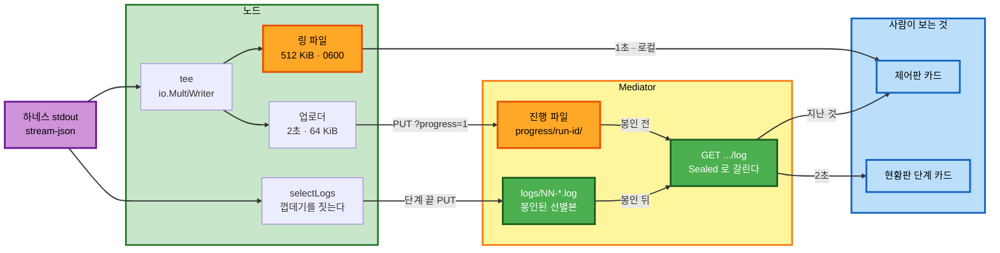

# 의존과 통신

**두 가지를 적는다** — 누가 누구를 임포트하는가(빌드 시점)와 바이트가 어디서
어디로 흐르는가(실행 시점). 둘이 다르다. 제어판은 Mediator 를 임포트하지
않지만 바이트는 거기서 온다.

---

## 1. 임포트 행렬 (빌드 시점)

세로가 임포트하는 쪽, 가로가 임포트되는 쪽이다.

| | transcript | enode | record | api | panel | api/ui | runctl | store |
|---|---|---|---|---|---|---|---|---|
| **transcript** | — | 금지 | 금지 | 금지 | 금지 | 금지 | 금지 | 금지 |
| **enode** | **새로 는다** | — | | | 금지 | | | |
| **record** | | | — | | | | | |
| **api** | **새로 는다** | | 이미 있다 | — | | | | 이미 있다 |
| **panel** | **새로 는다** | 이미 있다 | | 금지 | — | | 이미 있다 | 금지 |
| **api/ui** | | | | | | — | | 금지 |
| **runctl** | | | | | | | — | |
| **store** | | | 이미 있다 | | | | | — |

**는 것은 셋뿐이다** — `enode` · `api` · `panel` 이 각각 `transcript` 를 임포트한다.
**셋 다 금지 방향이 아니다.**

`transcript` 의 행이 전부 금지인 것이 이 설계의 뼈다. **파서는 아래를 모른다** —
표준 라이브러리만 임포트한다.

### 1.1 임포트 금지 여섯의 확인

```text
   panel      -> store     금지.  안 깬다.  panel 은 runctl 로 Mediator 를 부른다
   panel      -> api       금지.  안 깬다.  같은 이유다
   api/ui     -> store     금지.  안 깬다.  Go 변경이 0 이다 (정적 파일만 는다)
   enode      -> panel     금지.  안 깬다.  이 회차가 그 방향을 안 만든다
   transcript -> enode     금지.  안 깬다.  **옮기는 방향이 반대다** (Q4 = A)
   transcript -> api·store·panel   금지.  안 깬다.  표준 라이브러리만이다
```

**경계 검사 테스트의 표에 두 줄이 는다.** 검사기는 표를 읽는다.

### 1.2 Q4 = A 가 방향을 안 뒤집는다

`parseEventLine` · `eventShell` · `elidedMarker` 셋이 오늘 `internal/enode` 에
있다. 그것을 `internal/transcript` 로 **내리면** `enode -> transcript` 가 되고
이것은 허용이다. 반대로 파서가 `enode` 의 것을 **쓰면** 금지를 정면으로 깬다.

**옮기는 것이 유일하게 금지를 안 건드리는 길이다.**

---

## 2. 자료 흐름 (실행 시점)



텍스트 대안.

```text
   하네스 stdout 에서 갈래가 둘이다

   갈래 ①  tee 한 겹     -> 링 파일 (노드 디스크 · 원문)
                        -> 업로더  -> 진행 파일 (Mediator 디스크 · 원문)
   갈래 ②  selectLogs   -> 단계 끝에 logs/NN-*.log (봉인되는 선별본)

   읽는 쪽은 셋이다

   제어판 도는 것   링을 1초로 직접 읽는다.  Mediator 를 안 탄다
   제어판 지난 것   GET .../log 를 단계마다 부른다
   현황판          GET .../log 를 2초로 부른다.  목록 폴링과 별개 타이머다

   GET 이 봉인 전후로 갈린다

   봉인 전   진행 파일.  원문.   X-Enode-Log-Source: progress
   봉인 뒤   logs/.      선별본.  X-Enode-Log-Source: sealed
```

**주황 둘이 원문이 앉는 자리다** — 링(잔여 ③)과 진행 파일(잔여 ① · ②).
초록 둘은 선별본이라 본문이 없다.

---

## 3. 통신 방식

```text
   노드 -> Mediator      HTTP PUT.  청크마다.  실패는 보조다 (다음 청크에 이어 붙는다)
   제어판 -> 링          파일 읽기.  잠금 없음.  머리를 두 번 읽어 찢김을 완화한다
   제어판 -> Mediator    HTTP GET.  runctl.Client 를 통한다.  **직접 안 부른다**
   현황판 -> Mediator    HTTP GET.  브라우저의 fetch.  같은 오리진이다
   Mediator -> 노드      **없다.**  ADR-014 결정 2 — Mediator 는 노드에 접속하지 않는다
```

**밀어 주는 경로가 0 이다.** SSE 도 WebSocket 도 롱폴도 안 만든다
(`constraints.md` §1).

---

## 4. 「파서는 하나다」가 언어 경계를 넘는 법

제어판은 Go 이고 현황판은 브라우저 JS 다. **JS 는 Go 패키지를 임포트할 수 없다.**
그래도 파서가 둘이 되면 안 된다 — `constraints.md` 의 구조 불변식이다.

```text
   제어판    Go 쪽에서 판다.  handleTranscript 가 링을 읽어 **사건 배열로** 낸다.
            원문 토글을 위해 data 도 함께 낸다
   현황판    as=events 로 받는다.  Mediator 가 같은 파서를 거쳐 사건 배열을 낸다.
            원문 토글은 as=raw 다
   그래서    JS 가 JSON 줄을 해석하는 자리가 0 이다.  둘 다 이미 판 것을 그린다
```

**이것이 CB1 · CB2 · CB4 의 「같은 모양」을 세우는 장치다.** 화면 둘이 각자
해석하기 시작하면 그 조각들이 조용히 갈린다.

---

## 5. 변경 종류와 병합 순서

| 경로 | 변경 | 먼저 서야 하는 것 |
|---|---|---|
| `internal/transcript` | 신규 | 없다. **가장 먼저 선다** |
| `internal/enode` | Major | `transcript` (selectLogs 가 임포트한다) |
| `internal/record` | Major | 없다. `api` 보다 먼저 선다 |
| `internal/api` | Major | `transcript` · `record` |
| `internal/runctl` | Minor | `api` (라우트가 있어야 부른다) |
| `internal/panel` | Major | `transcript` · `runctl` |
| `internal/api/ui` | Major | `api` (`as=events` 가 있어야 그린다) |

**직렬 병합 지점 하나** — `internal/api/api.go` 의 등록 줄. 유닛 둘 이상이
만지면 진행자가 한 번에 하나씩 병합한다 (`CONVENTIONS.md` 3.1).

**병렬 기회 하나** — `transcript` 와 `api` 가 선 뒤에는 `panel` 과 `api/ui` 가
서로를 안 기다린다. 같은 사건을 두 화면이 각각 그린다.
