# 실행 계획 — v3 트랜스크립트 회차

입력은 `requirements.md` (Comprehensive · 536줄) 와 `user-stories.md` (스토리 열하나 ·
새 완료 조건 여섯) 와 요구 팩 다섯이다. 여기서 정하는 것은 **어느 단계를 돌리고
어느 단계를 건너뛰는가** 하나다. 유닛 분해는 정하지 않는다 — 팩이 유닛을 주지
않으므로 (`constraints.md` 구조 불변식) Units Generation 이 낸다.

- **회차 브랜치**: `v3-run-transcript` · HEAD `94d28ed`
- **문서 루트**: `aidlc-docs/v3-run-transcript/` (Inception) ·
  `aidlc-docs/taeels/` (Construction · 질문 3 = B)
- **작성 시각**: 2026-09-15T05:52:20Z

**짝 팩과 갈리는 자리 셋을 먼저 적는다.** 같은 회차 번호를 달고 도는 두 팩이라
계획이 닮아 보이지만, 아래 셋이 단계 선택을 실제로 갈랐다.

```text
   라우트      짝 팩 0 · 이 팩 1 (17 -> 18).  새 API 표면이 있다
   패키지      짝 팩 0 · 이 팩 1 (internal/transcript 신규).  임포트 금지가 넷에서 여섯으로
   화면        짝 팩은 칩 하나가 자동으로 늘었다.  이 팩은 사람이 읽는 표면 둘을 짓는다
```

---

## 1. 상세 분석 요약

### 1.1 전환 범위 (브라운필드)

```text
   전환 유형     단일 아키텍처 안의 관측 표면 추가.  아키텍처 전환이 아니다
   주 변경       하네스가 내는 stream-json 사건을 노드에서 화면 둘까지 나르는 경로
                 하나를 잇고, 그 사건을 그리는 파서 하나를 공용으로 둔다
   관련 경로     여섯.  internal/transcript (신규) · internal/enode · internal/record ·
                 internal/api · internal/panel · internal/api/ui
   안 만지는 곳   internal/contract · internal/match · internal/proc ·
                 internal/schema · internal/config · internal/build · cmd/ 다섯 전부
                 **internal/store 가 여기서 빠졌다** — 아래 「영향만 받는 곳」
   배포 모형     새 실행파일 0 · 새 포트 0 · 새 전송 0 · DB 스키마 0.
                 **새 라우트 하나** (GET .../log).  짝 팩과 갈리는 자리다
```

**측정으로 박은 값 둘** (2026-09-15T05:52:20Z · HEAD `94d28ed`).

```text
   grep -c 'mux.HandleFunc' internal/api/api.go   =  17     CB0 의 전제 그대로다
   internal/transcript                            없다      이 회차가 만든다
```

### 1.2 변경 영향 평가

| 영역 | 있나 | 무엇이 |
|---|---|---|
| 사용자 대면 | Yes (직접) | 화면 둘을 사람이 읽게 짓는다 — 제어판 「하네스 트랜스크립트」 카드와 현황판 Run 상세의 단계 카드. **짝 팩은 칩 하나가 자동으로 늘었을 뿐이었고 이 회차는 표면을 짓는다.** 그래서 User Stories 가 스킵이 아니라 실행이었다 (`requirements.md` 9절) |
| 구조 | Yes | **새 패키지 하나** — `internal/transcript`. 표준 라이브러리만 임포트하고 `enode` · `panel` · `api` 셋이 그것을 임포트한다. 임포트 금지가 넷에서 여섯으로 늘고 경계 검사 표에 두 줄이 는다 |
| 자료 모형 | Yes | 진행 파일(새 파일 종류) · 링 내용이 NDJSON 이 된다 · 파서의 사건 모형 여섯(`init` · `text` · `tool_use` · `tool_result` · `result` · `raw`) · `enode.elided` 줄 · 응답 헤더 둘(`X-Enode-Log-Bytes` · 출처). **DB 스키마는 0** |
| API | Yes | 라우트 하나 신규 (`GET /v1/runs/{run}/steps/{seq}/log`) · 기존 `PUT .../log` 에 쿼리 갈림 · `AppendLog` 시그니처 변경(총 길이 반환). 전부 호환 변경이고 오늘의 계약은 그대로 돈다 |
| NFR | Yes — 세 축 | 성능(폴링 셋 · 청크 주기) · 보안(`security-baseline` 차단 · 잔여 셋 · 헤더 다섯) · **확장(함대 규모에서의 청크 PUT 과 폴링 부하)**. 셋째 축이 `requirements.md` 에 값이 0 이다 — 3절의 NFR Requirements 가 그 자리다 |

### 1.3 컴포넌트 관계

```text
   공유 컴포넌트   internal/transcript   신규.  셋이 임포트하고 자기는 아무것도
                                         임포트하지 않는다.  **빌드 시점 의존이라 먼저 선다**
   주 컴포넌트     internal/enode        Decode · 링 tee 되살리기 · 청크 푸시
                  internal/record       진행 파일 쓰기와 총 길이 · 봉인 때 지우기 ·
                                         총 길이로 거는 상한
                  internal/api          GET log 핸들러(새 파일) · putLog 쿼리 갈림 ·
                                         등록 줄 하나
   소비 컴포넌트   internal/panel        카드가 파서를 쓴다 · 지난 것의 출처 전환 ·
                                         보안 헤더 다섯
                  internal/api/ui       Run 상세 단계 카드.  정적 파일
   만지는 곳(추가)  internal/store        **코드 변경이 0 이 아니다.**  앞 판이 0 으로
                                         적었고 U3 의 Functional Design 이 고쳤다 —
                                         수명을 끊는 자리 셋 중 둘이 Run 상태를 알아야
                                         하고 record 는 store 를 임포트하지 않는다.
                                         seal.go 의 sealRecord 와 reap.go 다
```

변경 종류와 우선순위.

| 경로 | 종류 | 이유 | 우선순위 |
|---|---|---|---|
| `internal/transcript` | 신규 | 표시 규칙이 전부 여기 산다. 화면 둘이 이것 없이는 못 선다 | Critical — 먼저 선다 |
| `internal/enode` | Major | 사건을 만드는 쪽. `Decode` · tee · 청크 푸시 셋이 여기다 | Critical |
| `internal/record` | Major | **기존 호출자가 있다** — `api.go:887` 이 `AppendLog` 를 부른다. 시그니처가 바뀌면 같이 움직인다 | Critical |
| `internal/api` | Major | 라우트 하나 신규 · 등록 줄 하나 · putLog 갈림 | Important — `record` 뒤 |
| `internal/panel` | Major | 카드 · 출처 전환 · 헤더 다섯 | Important — 파서와 `api` 뒤 |
| `internal/api/ui` | Major | Run 상세에 카드 하나. 오늘 `static/fleet` 에 Run 상세가 이미 있다 | Important — 파서와 `api` 뒤 |

### 1.4 위험 평가

```text
   위험도        High
                 ① 링에 원문을 되살리는 것은 짝 팩 ⑲ 가 보안 근거로 껐던 것을
                   되살리는 결정이다 (질문 2 = A).  잔여 ③ 이 남는다
                 ② 진행 파일이 봉인 전에 원문을 Mediator 디스크에 앉히고,
                   같은 토큰을 가진 사람이면 누구나 읽는다 (잔여 ① · ②)
                 ③ AppendLog 시그니처가 바뀌고 기존 호출자가 하나 있다
                 ④ 파서의 입력이 신뢰할 수 없는 하네스 출력이다 (SECURITY-13)

   되돌리기      Moderate
                 라우트 하나와 새 패키지는 걷기 쉽다.  FR-2(링)와 FR-5(청크)는
                 서로 독립이라 하나씩 되돌릴 수 있다 — **되돌리기의 단위가 유닛이다**.
                 되돌릴 수 없는 것 하나 — 그 사이 디스크에 앉았던 원문은 이미 앉았다

   검사 복잡도    Complex
                 조각 일곱 중 사람 눈이 넷(CB1 · CB2 · CB4 · CB6),
                 실패 주입이 필요한 것이 하나(CB3), 해당 없음이 하나(CB5)
```

**되돌리기를 쉽게 두는 값 하나** — FR-2 와 FR-5 를 **다른 유닛으로 가른다.**
둘 다 노드의 tee 한 겹에서 갈라지지만 하나는 노드 디스크로 가고 하나는 Mediator
로 간다. 잔여 ③ 과 잔여 ① 이 각각 그 둘에 붙어 있어, 한쪽을 무르는 결정이
다른 쪽을 같이 물어야 하면 되돌리기가 비싸진다. Units Generation 에 거는 제약이다.

---

## 2. 워크플로 시각화

```mermaid
flowchart TD
    Start(["트랜스크립트 팩"])

    subgraph INCEPTION["INCEPTION PHASE"]
        WD["Workspace Detection<br/><b>COMPLETED</b>"]
        RE["Reverse Engineering<br/>(여덟 문서 전면)<br/><b>COMPLETED</b>"]
        RA["Requirements Analysis<br/>(Comprehensive)<br/><b>COMPLETED</b>"]
        US["User Stories<br/>(minimal · 열하나)<br/><b>COMPLETED</b>"]
        WP["Workflow Planning<br/><b>IN PROGRESS</b>"]
        AD["Application Design<br/><b>EXECUTE</b>"]
        UG["Units Generation<br/><b>EXECUTE</b>"]
    end

    subgraph CONSTRUCTION["CONSTRUCTION PHASE"]
        FD["Functional Design<br/>(유닛마다)<br/><b>EXECUTE</b>"]
        NFRA["NFR Requirements<br/>(유닛마다 · 최소)<br/><b>EXECUTE</b>"]
        NFRD["NFR Design<br/>(유닛마다 · 최소)<br/><b>EXECUTE</b>"]
        ID["Infrastructure Design<br/><b>SKIP</b>"]
        CG["Code Generation<br/>(유닛마다 · 계획 + 생성)<br/><b>EXECUTE</b>"]
        BT["Build and Test<br/>(조각 게이트 CB0~CB6)<br/><b>EXECUTE</b>"]
    end

    subgraph OPERATIONS["OPERATIONS PHASE"]
        OPS["Operations<br/><b>PLACEHOLDER</b>"]
    end

    Start --> WD
    WD --> RE
    RE --> RA
    RA --> US
    US --> WP
    WP --> AD
    AD --> UG
    UG --> FD
    FD --> NFRA
    NFRA --> NFRD
    NFRD --> CG
    CG --> BT
    BT --> End(["장면 완주"])

    style WD fill:#4CAF50,stroke:#1B5E20,stroke-width:3px,color:#fff
    style RE fill:#4CAF50,stroke:#1B5E20,stroke-width:3px,color:#fff
    style RA fill:#4CAF50,stroke:#1B5E20,stroke-width:3px,color:#fff
    style US fill:#4CAF50,stroke:#1B5E20,stroke-width:3px,color:#fff
    style WP fill:#4CAF50,stroke:#1B5E20,stroke-width:3px,color:#fff
    style CG fill:#4CAF50,stroke:#1B5E20,stroke-width:3px,color:#fff
    style BT fill:#4CAF50,stroke:#1B5E20,stroke-width:3px,color:#fff
    style AD fill:#FFA726,stroke:#E65100,stroke-width:3px,stroke-dasharray: 5 5,color:#000
    style UG fill:#FFA726,stroke:#E65100,stroke-width:3px,stroke-dasharray: 5 5,color:#000
    style FD fill:#FFA726,stroke:#E65100,stroke-width:3px,stroke-dasharray: 5 5,color:#000
    style NFRA fill:#FFA726,stroke:#E65100,stroke-width:3px,stroke-dasharray: 5 5,color:#000
    style NFRD fill:#FFA726,stroke:#E65100,stroke-width:3px,stroke-dasharray: 5 5,color:#000
    style ID fill:#BDBDBD,stroke:#424242,stroke-width:2px,stroke-dasharray: 5 5,color:#000
    style OPS fill:#BDBDBD,stroke:#424242,stroke-width:2px,stroke-dasharray: 5 5,color:#000
    style Start fill:#CE93D8,stroke:#6A1B9A,stroke-width:3px,color:#000
    style End fill:#CE93D8,stroke:#6A1B9A,stroke-width:3px,color:#000
    style INCEPTION fill:#BBDEFB,stroke:#1565C0,stroke-width:3px,color:#000
    style CONSTRUCTION fill:#C8E6C9,stroke:#2E7D32,stroke-width:3px,color:#000
    style OPERATIONS fill:#FFF59D,stroke:#F57F17,stroke-width:3px,color:#000

    linkStyle default stroke:#333,stroke-width:2px
```



텍스트 대안.

```text
   INCEPTION      Workspace Detection    완료
                  Reverse Engineering    완료 — 여덟 문서 전면 갱신
                  Requirements Analysis  완료 — Comprehensive.  질문 셋의 답이 닫혔다
                  User Stories           완료 — 최소.  스토리 열하나 · NC-1 ~ NC-6
                  Workflow Planning      진행 중
                  Application Design     실행 — 미결 일곱을 닫는다
                  Units Generation       실행 — 파일 행렬이 필수다

   CONSTRUCTION   Functional Design      실행 — 유닛마다.  새 형식 다섯을 닫는다
                  NFR Requirements       실행 — 유닛마다 최소.  안 닫힌 값 둘이 있다
                  NFR Design             실행 — 유닛마다 최소.  패턴 다섯만
                  Infrastructure Design  스킵 — 배포 모형이 안 바뀐다
                  Code Generation        실행 — 유닛마다.  계획 뒤 생성
                  Build and Test         실행 — 조각 게이트 CB0 ~ CB6 이 곧 시험 계획이다

   OPERATIONS     Operations             자리만
```

---

## 3. 실행할 단계

### INCEPTION PHASE

- [x] Workspace Detection (COMPLETED)
- [x] Reverse Engineering (COMPLETED — 여덟 문서 전면 갱신)
  - **근거**: `workspace-detection.md` Step 3 의 분기를 측정값으로 탔다. 이 팩이
    읽는 경로 여섯 중 둘(`internal/panel` · `internal/api/ui`)이 공용 산출물에
    사실상 없었다. 없는 것을 딛고 쓰면 그 문서가 코드를 안 보고 쓴 것이 된다
  - **자리**: 공용 `aidlc-docs/inception/reverse-engineering/`. 회차 루트에 사본을
    안 만들었다 (`CLAUDE.md` 의 문서 루트 규약)
- [x] Requirements Analysis (COMPLETED — Comprehensive)
  - **근거**: 팩의 전제 다섯이 짝 팩의 유닛 다섯 때문에 뒤집혀 있었다. 그 다섯을
    코드에 대고 다시 재는 절(2절)이 문서의 앞에 통째로 필요했다
- [x] User Stories (COMPLETED — minimal)
  - **근거**: `core-workflow.md` 의 ALWAYS Execute IF 에 걸린다 — 새 사용자 대면
    기능 · 사용자 워크플로 변경 · 페르소나 여럿 · 고객 대면 API 변경. SKIP ONLY IF
    여섯 줄에는 한 줄도 안 걸린다. **짝 팩이 이 자리를 스킵했고 그 회차의 검증이
    스스로 규칙 위반으로 셌다** — 이 회차는 그것을 되풀이하지 않았다
  - **낸 것**: 페르소나 셋 · 스토리 열하나 · **새 완료 조건 여섯 (NC-1 ~ NC-6)**.
    행복 경로는 안 썼다 — CB0 ~ CB6 이 더 촘촘하다. 오독 경로와 침묵 경로만이다
- [x] Workflow Planning (IN PROGRESS)
- [ ] Application Design — **EXECUTE**
  - **근거**: `requirements.md` 8절이 이 단계에 미결 여섯을 **명시로** 넘겼다.
    요구가 아니라 모양이라서 여기서 정하지 않으면 유닛이 각자 지어낸다
  - **근거 둘**: 새 패키지 하나가 생긴다. `core-workflow.md` 의 Execute IF 첫 줄
    (「새 컴포넌트나 서비스가 필요한가」)이 그대로 걸린다
  - **닫을 것 — 여섯은 `requirements.md` 8절이 준 것이고 ⑦ 은 이 단계가 더했다**:
    - D1 진행 파일의 이름과 자리. `run-<id>/` 안이면 Seal 이 tar 하기 전에
      지워야 한다 — `blobs/` 의 `.tmp-` 를 걷는 선례가 `record.go:112` 에 있다
    - D2 청크 PUT 을 기존 라우트에서 어떻게 가르는가. 쿼리 하나가 권장이고
      CB0 의 셈(17 -> 18)이 그 전제다
    - D3 봉인 전후의 출처를 말하는 응답 헤더의 이름
    - D4 `AppendLog` 의 시그니처. 총 길이를 돌려주고 총 길이로 상한을 건다.
      **기존 호출자 하나(`api.go:887`)가 안 깨져야 한다**
    - D5 `selectLogs` 가 FR-3 의 파서를 쓰는가 그대로 두는가. 「파서는 하나다」가
      요구하는 자리이나 `selectLogs` 는 짓는 쪽이고 파서는 읽는 쪽이다
    - D6 유닛 분해와 파일 행렬 — Units Generation 의 몫이다 (아래)
    - **D7 재시도가 진행 파일에서 어떻게 갈리는가 (이 단계가 더했다)**.
      `AppendLog` 는 `O_APPEND` 이고 경로에 `attempt` 가 없다
      (`record.go:58`). blob 은 `%02d.%d-%s` 로 시도를 가르는데
      (`claim.go:469`) 로그는 안 가른다. 단계가 재시도되면 시도 둘의 사건
      열이 한 파일에 이어 붙고, **노드는 총 길이를 받아 그 뒤부터 이어 쓴다**.
      화면이 그 경계를 안 그리면 읽는 사람이 한 시도로 읽는다 — NC-1 이
      막으려는 오독과 같은 모양이다
  - **산출물**: `aidlc-docs/v3-run-transcript/inception/application-design/`
- [ ] Units Generation — **EXECUTE**
  - **근거**: `constraints.md` 의 접점 절이 **파일 행렬을 명시로 필수**로 걸었다
  - **근거 둘**: `core-workflow.md` 의 Execute IF 에 넷이 걸린다 — 새 자료 모형 ·
    API 변경 · 상태 관리 변경 · **여섯 패키지가 움직인다**
  - **근거 셋**: 스토리 열하나와 NC-1 ~ NC-6 을 받을 자리가 유닛밖에 없다.
    `user-stories.md` 4절이 그렇게 넘겼다
  - **낼 것**: 유닛 정의 · 의존 그래프(웨이브) · **파일 행렬** · 스토리 사상표.
    배정 안 된 스토리 0 · 배정 안 된 NC 0 을 그 자리에서 센다
  - **거는 제약 하나**: FR-2(링)와 FR-5(청크)를 다른 유닛으로 가른다 (1.4)

### CONSTRUCTION PHASE

담당은 `taeels` 하나다 (질문 3 = B). 문서 루트는 `aidlc-docs/taeels/` 이고
유닛마다 `unit/<유닛>` 을 딴다.

- [ ] Functional Design — **EXECUTE** (유닛마다)
  - **근거**: 이 회차가 만드는 것의 절반이 **형식**이다. 다섯을 글로 먼저 닫지
    않으면 코드가 값을 지어낸다
  - **닫을 것**:
    - 파서의 사건 모형 — 여섯 종류의 필드와 못 읽은 줄의 `raw` 모양
    - 진행 파일의 형식과 이름 (D1 의 답을 받아 구체로)
    - `enode.elided` 줄 — `{"type":"enode.elided","events":N,"bytes":B}` 를
      화면이 「본문 N 개가 걷혔다」로 그리는 규칙
    - `GET log` 의 응답 헤더 둘과 `as=events` 의 배열 모양
    - **NC-1 ~ NC-6 의 표시 모양** — 스토리는 「보인다」까지만 적었다.
      경과 시각 · 링 잘림 · 링 잔여 한 줄 · 상한 도달 · 마지막 갱신 시각
  - **적용 범위**: 형식을 안 만드는 유닛은 그 자리에서 스킵하고 근거를 적는다
- [ ] NFR Requirements — **EXECUTE** (유닛마다 · 최소)
  - **근거**: `core-workflow.md` 의 Execute IF 넷 중 **셋이 걸린다** — 성능 요구가
    있고(`requirements.md` 5.7), 보안 고려가 있고(5.3 ~ 5.6), 확장 우려가 있다.
    Skip IF 는 둘뿐이고(NFR 이 없다 · 스택이 정해졌다) 첫째가 거짓이다
  - **근거 둘**: **짝 팩이 이 자리를 스킵했고 그 회차의 계획이 스스로 규칙 위반으로
    적었다.** 그 회차에서 값이 안 정해진 둘이 갈 곳이 없었던 것이 이유였다.
    같은 실수를 되풀이하지 않는다
  - **닫을 것 — `requirements.md` 가 안 닫은 값 둘**:
    - N1 **함대 규모의 값.** 노드 N 대가 2초마다 청크 PUT 을 던지고 Mediator 가
      그때마다 디스크에 append 한다. 화면 둘이 동시에 폴링한다 (제어판 1초 ·
      현황판 2초 · 목록 5초). `requirements.md` 5.7 은 **간격만 적고 규모를
      한 줄도 안 적는다.** 동시에 도는 단계 몇 개까지가 이 값의 전제인가
    - N2 **진행 파일이 디스크에 앉아 있는 기간의 상한.** 봉인 때 지워지는 것은
      맞다 — 종료 상태에 이르면 `reap.go` 의 `sealExpired` 가 잡는다
      (`seal.go:175` · `reap.go:113`). 그러나 **종료 안 된 채 오래 도는 Run** 의
      진행 파일에는 상한이 없다. 잔여 ① 의 노출 기간이 곧 그 값이다
  - **적용 범위**: 새 표면을 만드는 유닛만 돈다 — 파서 · 청크 푸시 · GET log ·
    카드 둘. 표면이 없는 유닛은 그 자리에서 스킵하고 근거를 적는다.
    **N1 · N2 는 유닛 밖의 값이므로 그 값을 지는 유닛이 하나로 정해져야 한다** —
    Units Generation 이 그것을 배정한다
  - **이 단계가 안 하는 것**: `requirements.md` 5.1 의 차단 게이트 다섯과 5.3 의
    규칙별 처리 표를 유닛마다 다시 자르는 것. 그것은 결정이 아니라 복사다
- [ ] NFR Design — **EXECUTE** (유닛마다 · 최소)
  - **근거**: 규칙이 「NFR Requirements 가 돌았으면 돈다」이다. 그리고 넘길 패턴이
    실재한다
  - **닫을 것 — 패턴 다섯만**:
    - 총 길이 상한에 닿았을 때의 거동과 그것이 보이는 자리 (NC-4)
    - 청크 PUT 실패가 실행과 링을 막지 않는 분리 (`requirements.md` FR-5)
    - 폴링 타이머의 분리 — 현황판 목록 5초(`client.mjs:67`)와 단계 카드 2초
    - 파서가 아는 키만 읽는 규율 (SECURITY-13 · `runner.go` 의 `parseEventLine`)
    - **봉인 때의 순서** — 진행 파일을 지우는 것이 tar 보다 앞이다 (D1)
  - **이 단계가 안 하는 것**: Functional Design 이 닫은 형식을 다시 적는 것
- [ ] Infrastructure Design — **SKIP**
  - **근거**: 배포 모형이 안 바뀐다. 새 실행파일 0 · 새 포트 0 · 새 전송 0 ·
    DB 스키마 0 · 클라우드 자원 0. 진행 파일은 Mediator 가 이미 쓰고 있는
    기록 디스크(`record.Store.Root`)에 산다
  - **스킵이 무엇을 안 미루나**: 디스크가 더 쓰인다는 사실은 남는다. 그 값은
    **위의 N2 로 옮겼다** — 여기서 안 다룬다고 아무 데도 안 남는 것이 아니다
- [ ] Code Generation — **EXECUTE** (ALWAYS · 유닛마다)
  - **근거**: 이 회차의 산출물이 Go 코드다. Part 1 에서 유닛별 생성 계획을,
    Part 2 에서 코드와 시험을 낸다
  - **계획에 반드시 들어갈 것**: 커버리지 하한 80% 가 `transcript` · `enode` ·
    `api` · `panel` 넷에 걸린다. 파서는 **하네스 없이 도는 시험**으로 채운다 —
    실측한 stream-json 줄을 `testdata` 에 두고 **그것은 실제로 받았던 것의
    기록이므로 고치지 않는다** (`CONVENTIONS.md` 2.2)
- [ ] Build and Test — **EXECUTE** (ALWAYS)
  - **근거**: 빌드와 시험이 실재한다. **조각 게이트 CB0 ~ CB6 이 곧 시험 계획이다** —
    `requirements.md` 6절의 고쳐 쓴 표가 정본이고 그것을 실제 스크립트로 굳힌다
  - **눈 검증을 보류로 안 넘긴다**: CB1 · CB2 · CB4 · CB6 은 사람이 실제 하네스로
    한 번은 봐야 초록이다. 짝 팩의 앞 팩 CP6 이 눈 검증을 보류로 남긴 채 닫혔고
    그 결함이 사내 실측(2026-09-11)에서야 드러났다. **이 회차가 그 대가다**
  - **CB5 는 해당 없음으로 닫는다** — `runctl mcp` 가 `main` 에 없다. 보류가 아니다

### OPERATIONS PHASE

- [ ] Operations — PLACEHOLDER

---

## 4. 패키지 변경 순서

**유닛 순서는 여기서 정하지 않는다.** Units Generation 이 정한다
(`CONVENTIONS.md` 3.1). 여기는 패키지 사이의 제약만 적는다.

```text
   internal/transcript   가장 먼저 선다.  panel 과 api/ui 와 enode 가 이것을
                         임포트하므로 빌드 시점 의존이다.  파서가 없으면
                         카드 둘이 못 서고 CB1 · CB2 · CB4 를 잴 수가 없다

   internal/enode        Decode 와 링 tee 는 파서 없이도 선다 — 사건을 만드는
                         쪽이다.  청크 푸시는 record 가 총 길이를 돌려준 뒤다

   internal/record       api 보다 먼저 선다.  AppendLog 의 기존 호출자가
                         api.go:887 하나이고 시그니처가 바뀐다

   internal/api          record 뒤.  GET log 는 새 파일이고 api.go 는 등록 줄 하나다

   internal/panel        파서 뒤 · api 뒤.  지난 것의 출처 전환이 GET log 를 쓴다
   internal/api/ui       파서 뒤 · api 뒤.  같은 이유다
```

**직렬 병합 지점 하나** — `internal/api/api.go` 의 등록 줄. 유닛 둘 이상이
만지면 진행자가 한 번에 하나씩 병합한다 (`CONVENTIONS.md` 3.1).

**짝 팩과의 동시 접점은 0 이다.** `constraints.md` 의 접점 절이 `claude.go` 의
`Argv` 를 접점으로 적었으나 짝 팩이 그것을 이미 가져가 `main` 에 넣었다
(`claude.go:343`). 이 회차는 `Decode` 만 만진다. `runner.go` 와 `claim.go` 도
이 팩만 만진다.

병렬 기회는 있다. 한 손이지만 (질문 3 = B) 파서가 선 뒤에는 `panel` 과 `api/ui`
가 서로를 안 기다린다 — 같은 파서의 같은 사건을 두 화면이 각각 그린다.

---

## 5. 예상 규모

```text
   실행 단계    Inception 2 (Application Design · Units Generation)
                Construction 5 (Functional Design · NFR Requirements ·
                NFR Design · Code Generation · Build and Test)
   스킵 단계    1 (Infrastructure Design)
   유닛 수      미정.  Units Generation 이 낸다.  기능 일곱 · 스토리 열하나 ·
                새 완료 조건 여섯 · 게이트 일곱이 입력이다
   만지는 경로  6.  그중 하나가 신규 패키지다
   게이트       7 (CB0 ~ CB6).  기계 1 (CB0) · 실패 주입 1 (CB3) ·
                사람 눈 4 (CB1 · CB2 · CB4 · CB6) · 해당 없음 1 (CB5)
```

기간은 적지 않는다. 이 회차의 완결성은 유닛 완료 개수가 아니라 **CB6 이 끝까지
도는가**로 판단한다 (`requirements.md` 1.2 의 고정점).

---

## 6. 성공 기준

**주 목표** (`requirements.md` 1.2 의 고정점 그대로).

계약을 던지고 제어판과 현황판을 열면, **단계가 끝나기 전에 읽을 수 있는 문장이
흐르고**, 도구 호출이 이름으로 보이며, 끝난 뒤에도 같은 모양으로 읽힌다.

**핵심 산출물**

```text
   Application Design   D1 ~ D7 의 답
   Units Generation     유닛 정의 + 의존 그래프 + **파일 행렬** + 스토리 사상표
   유닛마다             functional-design · nfr-requirements · nfr-design ·
                        code 요약 · unit/<유닛> 브랜치
   Build and Test       CB0 ~ CB6 의 실행 스크립트와 결과
   되돌려 올릴 것        ADR-025 §7 ③ · mediator-api 의 GET log 절 ·
                        agent-runtime R3 · R4 · ADR-005
                        (requirements.md 11절.  진행자가 enode-design 에 올린다)
```

**품질 게이트**

1. 차단 게이트 다섯이 초록이다 — `crypto/tls` T 심볼 10 이하 · `net/http` T 심볼
   50 이하 · 패키지별 커버리지 80% 이상 · 허용목록 밖의 스킵 0 · U+2605 을 담은
   파일 0
2. Mediator 라우트 수가 하나만 는다 — `grep -c 'mux.HandleFunc' internal/api/api.go`
   가 17 에서 18 이다 (CB0). **`internal/contract` 의 diff 가 0 이다** —
   `internal/store` 는 이 목록에서 빠졌다. **게이트가 빨개진 것이 아니라 기준선이
   바뀐 것**이고, 사용자가 대가를 보고 골랐다 (U3 의 물음 5 = A · 2026-09-15).
   근거와 자리는 `unit-of-work-file-matrix.md` 5.1
3. 임포트 금지의 경계 검사 테스트가 돈다 — **두 줄이 아니라 넷이 늘고, 앞 팩의
   넷 중 하나(`api/ui -> store`)는 규칙으로만 있고 검사기에 없다.**
   `unit-of-work-file-matrix.md` 6절이 실측했다. 그리고 **`go list -deps` 는 시험
   임포트를 안 보므로** 그 명령으로만 세우면 `_test.go` 의 위반이 안 걸린다 (6.4)
4. CB1 · CB2 · CB4 · CB6 이 사람의 눈으로 한 번은 초록이다. 보류로 안 남는다
5. CB3 이 실패를 한 번 주입하고도 두 벌을 안 만든다
6. 새 로그가 본문을 안 싣는다 — `Emit` 이 종류만 적는 오늘의 규율 그대로
   (SECURITY-03 · `requirements.md` FR-1)
7. 표기 규약 — 강조는 굵게만. 코드 · 주석 · 로그 · 시험 메시지에 장식 문자 0
   (`CONVENTIONS.md` 1절)
8. 언어 규약 — 에러 · 로그 · CLI 출력 · 시험 이름은 영어. 주석과 커밋은 한국어
   (`CONVENTIONS.md` 2절)
9. **NC-1 ~ NC-6 이 유닛에 배정되고 배정 안 된 것이 0 이다** — Units Generation
   이 그 자리에서 센다

---

## 7. 이 단계가 새로 찾은 것 — 셋

계획을 문서가 아니라 코드에 대고 세우면서 나온 것이다. **셋 다 요구를 늘리지
않고 갈 자리만 정했다.**

```text
   ①  재시도의 경계          D7.  AppendLog 가 O_APPEND 이고 경로에 attempt 가 없다.
                             blob 은 %02d.%d-%s 로 가르는데 로그는 안 가른다.
                             -> Application Design

   ②  안 닫힌 NFR 값 둘       N1 함대 규모 · N2 진행 파일의 디스크 수명.
                             requirements.md 5.7 이 간격만 적고 규모를 안 적는다.
                             -> NFR Requirements (그래서 그 단계를 돌린다)

   ③  거짓이 되는 주석 넷      requirements.md 11절이 record.go:86 하나만 적었다.
                             셋이 더 있다 — record.go:54 「원문 그대로」 ·
                             record.go:56 「아무도 읽지 않고」(FR-6 이 읽게 만든다) ·
                             claim.go:143 「원문 그대로 올린다」.
                             -> Code Generation 이 그 유닛에서 함께 고친다
```

---

## 8. 확장 준수 요약 — Workflow Planning 단계

`security-baseline` 만 켜져 있다 (`decisions.md` §1 · 사용자 결정 2026-09-11).
이 단계의 산출물은 계획 문서 하나이므로 대부분이 N/A 다.

| 규칙 | 판정 | 근거 |
|---|---|---|
| SECURITY-11 보안 설계 | 준수 | 새 보안 표면 넷(진행 파일 · 링 원문 · GET log · 파서)을 **어느 단계가 닫는지** 3절이 명시로 배정했다. 잔여 ① 의 노출 기간은 N2 로, 재시도 경계는 D7 로 갔다 |
| SECURITY-03 민감정보 | 준수 | 잔여 셋을 없앤 척하지 않았다. 1.4 가 위험도 High 의 근거로 그 셋을 이름으로 적고, N2 가 그중 하나의 **값**을 닫을 자리를 만들었다 |
| SECURITY-05 입력 검증 | 준수 | 파서가 신뢰할 수 없는 입력을 받는다는 것을 1.4 ④ 에 적고, 아는 키만 읽는 규율을 NFR Design 의 패턴으로 걸었다 |
| 나머지 열둘 | N/A | 계획 문서는 코드 · 네트워크 · 로그 · 자격증명 표면을 만들지 않는다. 그 규칙들은 해당 표면을 만드는 Construction 단계에서 다시 걸린다 |

**차단 findings 0.**

---

## 9. 브랜치와 커밋

```text
   Inception     v3-run-transcript 위에서 직렬.  단계 승인마다 커밋한다
   Construction  unit/<유닛> 을 v3-run-transcript 에서 딴다.
                 그 유닛의 조각 게이트가 초록인 뒤에만 main 에 병합한다
                 (CONVENTIONS.md 3.3)
   안 싣는 것     design/ 은 진행자가 고친다.  FR-7 의 화면은 이 회차의 새 .pen 이다.
                 남의 문서 루트 — 짝 팩의 상태와 감사는 안 건드린다
```
