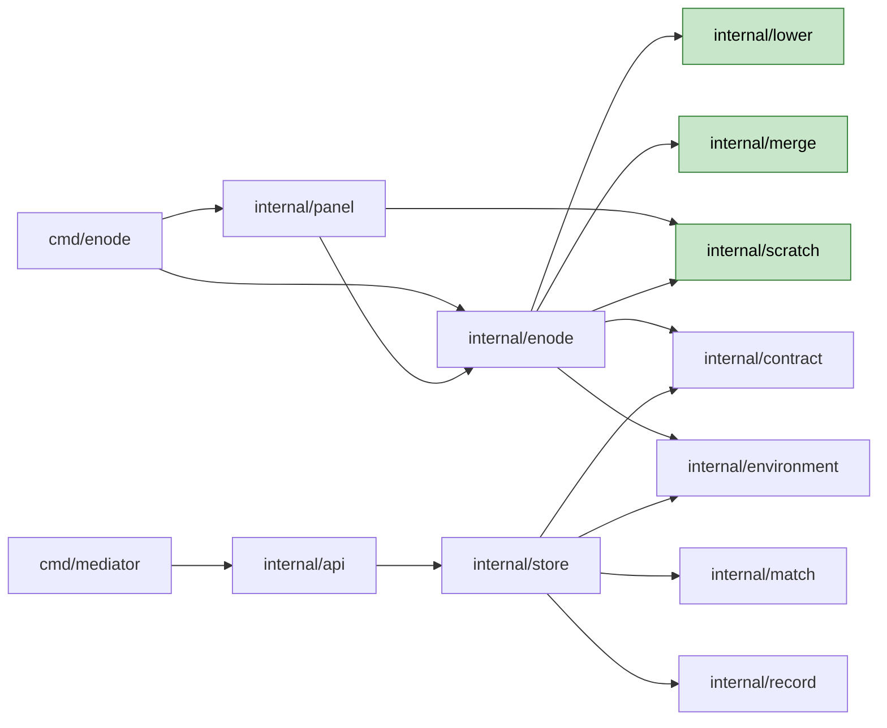

# 의존과 통신

- **작성 시각**: 2026-09-24T06:33:21Z · 답 일곱(전부 A)을 딛는다

세 겹으로 적는다 — 임포트(빌드 때) · 프로세스와 파일(실행 때 한 기계 안) · HTTP(노드와
Mediator 사이).

---

## 1. 임포트

### 1.1 그림



텍스트 대안.

```text
   노드 쪽        cmd/enode -> internal/enode -> internal/lower · internal/merge · internal/scratch (새)
                                            -> internal/contract · internal/environment (오늘)
                 cmd/enode -> internal/panel -> internal/enode (오늘) · internal/scratch (새, Usage 타입)
   Mediator 쪽    cmd/mediator -> internal/api -> internal/store -> environment · contract · match · record
   새 셋의 바깥    표준 라이브러리 · golang.org/x/sys/unix.  그 밖은 0.  셋끼리도 0
```

### 1.2 Mediator 가 링크하지 않는다 (5.2 · 품질 게이트 4)

오늘 `go list -deps ./cmd/mediator` 의 내부 패키지는 열둘이다 — `api` · `api/ui` · `build` ·
`config` · `contract` · `environment` · `match` · `record` · `schema` · `store` · `transcript` ·
`transcriptui`. `internal/enode` 는 없다 (2026-09-24 측정).

| 패키지 | Mediator 가 링크하나 | 막는 것 |
|---|---|---|
| `internal/lower` | 아니오 | 임포트하는 쪽이 `internal/enode` 뿐이다. 경계 시험 줄 (2절) |
| `internal/merge` | 아니오 | 같다 |
| `internal/scratch` | 아니오 | 같다. `internal/panel` 도 임포트하지만 panel 은 Mediator 밖이다 |
| `internal/environment` | 예 (오늘 그대로) | 새로 받는 것은 인터페이스 하나다. 새 내부 임포트 0 (1.4) |
| `internal/contract` | 예 (오늘 그대로) | effect · budget · build · merge 의 타입과 검증. 노드와 Mediator 가 함께 딛는다 |

**`store -> environment` 한 줄은 이 회차가 안 끊는다** (5.2 「안 하는 것」). 그 줄 때문에 env
check 의 lower 확인을 `internal/environment` 에 둘 수 없었고, 그래서 이음매로 노드 쪽이
낸다 (계획 1.4).

---

## 2. 경계 시험에 더할 것 (`internal/panel/boundary_test.go`)

오늘 금지 표는 열두 줄이고 Mediator 쪽 금지는 0 줄이다. 봉인 둘(`transcript` ·
`transcriptui` 는 표준 라이브러리만)이 있다.

```text
   금지 줄 넷     cmd/mediator -> internal/enode
                 cmd/mediator -> internal/lower
                 cmd/mediator -> internal/merge
                 cmd/mediator -> internal/scratch
   봉인 셋        internal/lower · internal/merge · internal/scratch 는
                 표준 라이브러리와 golang.org/x/sys 만 딛는다
```

**봉인이 서로의 임포트도 막는다.** 셋이 서로를 임포트하면 모듈 경로가 생겨 봉인이
빨개진다. 금지 줄로 셋끼리의 여섯 방향을 적는 대신 봉인 하나로 잰다 — 오늘 봉인의
주석이 적은 「금지는 이름을 아는 것만 막고 봉인은 전부 막는다」와 같은 이유다.

오늘 봉인은 첫 경로 조각에 점이 있으면 실패한다. 새 봉인은 `golang.org/x/sys` 만 허용
목록으로 받는다. 허용 목록은 그 한 줄이다.

---

## 3. 프로세스와 파일 — 한 기계 안

### 3.1 프로세스

```text
   enode 데몬 (노드마다 하나)
     Advertiser 고루틴       광고 주기.  LowerGuard 로 후보 잠금
     Worker 고루틴           claim 과 단계.  LowerGuard.OnClaim
     Deleter 고루틴          trash-helper 를 연다
     Store 고루틴            Settle.  크기 측정은 helper 로
   helper (unshare --user --map-root-user --map-auto 뒤, 데몬의 자식)
     runtime-helper          단계 세션마다.  오늘 있다.  --mount 로 마운트 namespace 도 연다
     trash-helper            trash 항목마다
     merge-helper            합치기마다 (굽기 노드 · 재개하는 노드)
   형제 데몬                 같은 lower 의 다른 노드.  같은 사용자 · 같은 home (결정 3-14)
   enode panel               제어판.  상태 파일과 정책 파일만 읽고 쓴다
```

**데몬과 helper 는 표준 입출력으로만 말한다.** runtime-helper 의 JSON 선(runc_overlay_linux.go)이
선례다. trash-helper 는 인자로, merge-helper 는 표준 입력으로 경로 셋을 받는다. 마운트
namespace 가 필요 없는 둘은 `--mount` 를 안 연다 — 삭제와 합치기는 마운트하지 않는다.

### 3.2 공유 파일 — 누가 쓰고 누가 읽나

| 파일 | 쓰는 쪽 | 읽는 쪽 | 만나는 법 |
|---|---|---|---|
| `lowers/<key>/lower.lock` | 형제 전부(공유) · merge(배타) | 커널 | flock. 쥔 프로세스가 죽으면 커널이 푼다 |
| `lowers/<key>/bake.lock` | 굽기 Run 의 Worker · 재개하는 노드 | 커널 | flock. 주인이 살아 있다는 증거 |
| `lowers/<key>/` 의 쥔 사람 기록 | 공유 잠금을 쥔 노드 | merge (Q4) | 살아 있는 기록만 읽는다. 형식은 Functional Design |
| `lowers/<key>/state.json` | 굽기 노드 · 재개하는 노드 | 형제 전부(광고 주기) | 임시 파일에 쓰고 rename |
| `lowers/<key>/lower.json` | 처음 본 노드 · 별칭을 더하는 노드 | env check | 같다 |
| `<lower>/.enode-metadata.json` | merge (합치기의 마지막 동작) | 형제 전부(광고 키) | 마운트 0 인 창에서만 쓴다 (결정 3-15) |
| `<scratch>/trash/` | 그 노드의 세션 닫기 · merge | 그 노드의 삭제자 | rename 으로 들어오고 helper 가 지운다 |
| `<scratch>/pending/<run>` | build 단계 닫기 | merge · 재개하는 노드 | state.json 이 자리를 가리킨다 |
| `<scratch>/spool/` | 세션 닫기(capture) | Store · enode checkpoint | 소유자만 읽는다 (5.3) |
| `<stem>.status.yaml` | Advertiser | 제어판 | 오늘 그대로 · 칸이 는다 (Q3) |
| `<stem>.policy.yaml` | 소유자 · 제어판 | Advertiser | 오늘 그대로 |

**대기 upper 는 굽기 노드의 scratch 아래다.** 재개하는 노드가 다른 노드일 수 있으므로
state.json 이 그 경로를 싣는다. 같은 사용자 · 같은 filesystem 이라 다른 노드도 닿는다
(결정 3-6 · 3-14).

---

## 4. HTTP — 노드와 Mediator

| 표면 | 방향 | 이 회차 | 실리는 것 |
|---|---|---|---|
| `POST /v1/runs/{run}/steps/{seq}/exited` | 노드 -> Mediator | 새로 | outcome · exited_at · attempt · 노드 · 인스턴스 |
| `POST /v1/runs/{run}/steps/{seq}/result` | 노드 -> Mediator | 칸이 는다 | exited_at · finalized_at · finalize · upload · reason · diagnostics · checkpoint_capture · changeset · build · merge |
| `PUT /v1/runs/{run}/steps/{seq}/log` | 노드 -> Mediator | 오늘 그대로 | merge 의 기다림 줄이 여기로 간다 (Q4) |
| `PUT .../blob/{name}` | 노드 -> Mediator | client 만 바뀐다 | 업로드 전용 client · 예산 마감 · 스트림 (1.9) |
| `POST /v1/nodes` | 노드 -> Mediator | 키가 는다 | workspace.writes · ir · repo.built.* · bake.run · bake.resumed · producer.* · 합성한 drain |
| `GET /v1/runs/{id}` | 사람 -> Mediator | 칸이 는다 | 단계의 phase · phase_since · exit.  QUEUED 의 후보 셋 |
| `GET /v1/nodes` | 사람 -> Mediator | 오늘 그대로 | 새 광고 키가 capabilities 에 보인다 (완료 조건 6) |

**노드끼리는 HTTP 로 말하지 않는다.** 형제는 파일과 flock 으로만 만난다 (3.2). Mediator 는
lower 를 모른다 (4-7 기각).

---

## 5. 자료 흐름

### 5.1 명령 종료에서 Record 까지

```text
   명령 종료 ----------- exited ----------> steps.phase = finalizing · phase_since · exit
     |                                       (GET /v1/runs/{id} 에 곧바로 보인다)
     v
   Finalize (노드) --- named output ------> blob (업로드 예산)
     |              --- 진단 --------------> result.diagnostics (Q5)
     v
   닫기 (노드) ------- upper -------------> trash 또는 spool (rename)
     |
     v
   result ------------------------------> steps.result -> 봉인 -> Record 의 StepFile
                                          (exited_at · finalized_at 이 노드 시계로)
```

### 5.2 upper 에서 lower 까지

```text
   build 세션의 upper --rename--> <scratch>/pending/<run>      state = pending
                                            |                     형제 drain 시작
                                            v
                       배타 잠금 (형제가 전부 후보에서 빠지고 도는 Run 0)
                                            |                     state = merging
                                            v
                       merge.Apply --rename--> lower (항목마다)
                                  --rename--> <scratch>/trash (lower 에서 없앨 것)
                                            |
                                            v
                       .enode-metadata.json    state = committed    형제 drain 풀림 · 새 ir 광고
```

**byte 를 옮기지 않는다.** 두 흐름 모두 rename 이다. 크기에 비례하는 일(삭제 · 크기
측정)은 보고 뒤 배경에서 한다 (5.4).
