# 실행 계획 — 굽기 회차 (v4-run-finalize-bake)

입력은 `requirements.md`(Comprehensive · FR-1 ~ FR-13) 와 `stories.md`(스토리 열아홉 ·
새 완료 조건 열) 와 요구 팩 다섯이다. 여기서 정하는 것은 **어느 단계를 돌리고 어느
단계를 건너뛰는가** 하나다. 유닛 분해는 정하지 않는다 — 팩이 유닛을 주지 않으므로
(`constraints.md` 구조 불변식) Units Generation 이 낸다. 범위를 자르는 자리도 그
단계의 승인이다 (`requirements.md` 9절).

- **회차 브랜치**: `v4-run-finalize-bake` · HEAD `7a7ec85`
- **문서 루트**: `aidlc-docs/v4-run-finalize-bake/` (Inception 과 Construction). 처음 판은
  Construction 을 `aidlc-docs/taeels/` 에 두었다 (2026-09-24 에 바꿨다 — CLAUDE.md 의 문서 루트 규약)
- **작성 시각**: 2026-09-23T23:57:36Z

**앞 회차와 갈리는 자리 셋을 먼저 적는다.** 계획의 뼈대는 같아 보이지만 아래 셋이
단계 선택과 순서를 실제로 갈랐다.

```text
   되돌리기       앞 회차는 화면과 파일이라 유닛 단위로 물렸다.  이 회차의 합치기는 공유
                 lower 를 바꾸고, trash 를 지운 뒤에는 물릴 길이 없다
   노드 쪽 기제    앞 회차는 표면을 더했다.  이 회차는 노드에 새 기제 넷(trash 삭제자 ·
                 lower 상태와 잠금 · 합치기 · checkpoint store)을 들인다.  Mediator 가
                 링크하지 않는 자리에 둬야 한다 (requirements.md 5.2)
   사람 조각      앞 회차는 넷.  이 회차는 여덟이고 그중 여섯이 SunnyVM 이다
```

---

## 1. 상세 분석 요약

### 1.1 전환 범위 (브라운필드)

```text
   전환 유형     단일 아키텍처 안의 확장.  새 실행 기계가 0 개다 — 굽기는 일반 Run 이고
                 (ADR-077 §2) lower 조율은 기계 안의 flock 과 광고 drain 이다 (5.5)
   주 변경       세 갈래 (features.md 1.1)
                   단계 결과를 좁힌다     수확 좁히기 · effect · 종료 보고 · phase · 예산
                   실행 상태를 따로 둔다   trash · 배경 삭제자 · 여유 drain · checkpoint
                   굽기를 일반 Run 으로    굽기 계약 · build · 합치기 · lower 상태 · metadata
   관련 경로     internal/contract · internal/enode · internal/store · internal/api ·
                 internal/record · internal/environment · cmd/enode ·
                 노드 쪽 새 패키지 (자리는 Application Design ⑤) ·
                 packaging/macos/examples (완료 조건 3 ①)
   고르면         internal/panel — Application Design 이 완료 조건 1 · 2 의 노드 쪽 자리로 제어판을 고를 때
   안 만지는 곳   internal/match (매칭 규칙 안 바뀜 · 5.5) · internal/schema · internal/proc ·
                 internal/transcript · internal/transcriptui · internal/runctl · cmd/ 의
                 mediator · enodectl · runctl · iapadapter
   배포 모형     새 실행파일 0 · 새 포트 0 · 라우트 +1 · steps 표에 칸이 는다 ·
                 노드 디스크에 새 자리 셋 (<scratch>/trash · spool · ~/.local/state/enode/lowers)
```

**측정으로 박은 값** (2026-09-23T23:57:36Z · HEAD `7a7ec85`).

```text
   grep -c 'mux.HandleFunc' internal/api/api.go         18     조각 0 의 전제 (18 -> 19)
   go list -deps ./cmd/mediator 의 내부 패키지            12     internal/environment 가 있다
                                                              internal/enode 는 없다
   go list -f Imports ./internal/environment 의 내부      0      store 가 execenv.Record 하나로 문다
   internal/panel/boundary_test.go 의 금지 표             12 줄  Mediator 쪽 금지는 0 줄
```

### 1.2 변경 영향 평가

| 영역 | 있나 | 무엇이 |
|---|---|---|
| 사용자 대면 | Yes (직접) | 진행 조회에 `phase` · `phase_since` · `exit` 가 는다. 굽기 계약이 새로 생긴다. **계약도 설정도 안 고친 사람의 동작이 바뀐다** — 명령 단계의 `workspace.diff` 가 안 나오고, 여유가 모자란 노드는 통째로 빠지고, 실패한 단계의 upper 가 48시간 남는다 (`stories.md` 완료 조건 3) |
| 구조 | Yes | 노드 쪽 새 기제 넷과 결과 adapter 둘. **Mediator 가 링크하지 않는 자리**여야 한다 — 오늘 Mediator 는 store 를 거쳐 `internal/environment` 를 링크하므로 그 패키지에는 못 둔다 (7절 ③) |
| 자료 모형 | Yes | `steps` 표의 칸(`phase` 등 · Application Design ⑦) · Record `StepFile` 의 두 시각 · 계약 필드(effect · 예산 둘 · `sync` · `builds[]` · merge kind · 대기 상한) · receipt 의 `checkpoint_capture` · `.enode-metadata.json` · lower 상태 파일 넷 · 광고 키 셋. **스키마는 `ALTER TABLE ... ADD COLUMN IF NOT EXISTS` 선례를 딛는다** (`schema.sql` 에 열두 줄) |
| API | Yes | 라우트 하나(`POST .../exited`) · 진행 조회 필드 · result 가 다시 싣는 필드 셋 · 평평한 광고 키 셋 · 완료 조건 4 의 QUEUED 사유. 전부 더하는 변경이고 옛 노드는 `running` 에 머문다 (5.5) |
| NFR | Yes — 네 축 | 성능(임대 창이 upper 크기와 무관 · 5.4) · 보안(팩의 보안 표 · 5.3) · 커버리지 여유(`internal/enode` 81.5% · 5.1) · **크로스 빌드 셋**(7절 ④) |

### 1.3 컴포넌트 관계

```text
   공유 컴포넌트    internal/contract    effect · 예산 · 굽기 계약과 400 검증.  노드와 Mediator
                                        둘 다 딛는다.  빌드 시점 의존이라 먼저 선다
   주 컴포넌트      internal/enode       가장 크다.  claim.go (1,030 줄) 에 수확 좁히기 · 종료
                                        보고 · 예산 · capture 결과가, runc_overlay_linux.go
                                        (1,285 줄) 에 trash 다섯 자리 · build upper · spool 이,
                                        detect.go 에 arch 조건문 제거와 여유 drain 이 모인다
                   노드 쪽 새 패키지      합치기 · lower 상태와 잠금 · 삭제자 · spool.
                                        자리는 Application Design ⑤.  namespace 없이 도는 규칙은
                                        기본 go test 에서 돈다 (5.1)
                   internal/store       phase 칸 · exited 수락과 인스턴스 대조 · 진행 조회 ·
                                        완료 조건 4 의 대기 사유
   소비 컴포넌트    internal/api         등록 줄 하나 · exited 핸들러
                   internal/record      StepFile 의 종료 시각과 Finalize 끝 시각
                   internal/environment env check 셋 (st_dev · 소유 uid · lower.json).  7절 ③
                   cmd/enode            배경 삭제자 기동 · 시작 때 합치기 재개
   설정과 정본      packaging/macos/examples   예시 넷의 min_free_gb 주석 (완료 조건 3 ①)
                   enode-design          requirements.md 11절의 되돌림 열둘.  진행자가 올린다
```

| 경로 | 종류 | 이유 | 우선순위 |
|---|---|---|---|
| `internal/contract` | Major | 계약 문법이 는다. 셋(FR-1 · FR-3 · FR-5)이 `contract.go` 한 파일을 만진다 | Critical — 먼저 선다 |
| 노드 쪽 새 패키지 | 신규 | 합치기가 공유 lower 를 바꾼다. **이 회차에서 되돌리기가 가장 어려운 코드다** | Critical |
| `internal/enode` | Major | 기능 열셋 중 아홉이 닿는다(합치기를 여기 두면 열). 커버리지 여유 1.5점 | Critical |
| `internal/store` | Major | 새 칸과 대조 · 진행 조회. 완료 조건 4 가 Mediator 변경을 하나 더한다 | Important — contract 뒤 |
| `internal/api` | Minor | 등록 줄 하나와 핸들러 하나 | Important — store 뒤 |
| `internal/record` | Minor | 시각 두 칸 | Important — store 와 함께 |
| `internal/environment` | Minor | env check 셋. 자리가 임포트 경계에 걸린다 | Important — 새 패키지의 자리 뒤 |
| `cmd/enode` | Minor | 기동 두 줄 | Optional — 기제가 선 뒤 |
| `packaging/macos/examples` | Config-only | 주석 넷이 거짓이 된다 | Important — FR-4 와 같은 유닛 |

### 1.4 위험 평가

```text
   위험도        High
                 ①  합치기가 공유 lower 를 바꾼다.  틀리면 그 기계의 모든 형제가 잘못된
                    바닥 위에서 돈다 (requirements.md 머리의 깊이 근거)
                 ②  배경 삭제자는 user namespace 안에서 지우는 코드다.  trash 밖을 지우면
                    되돌릴 수 없다 (5.3 의 trash 삭제 줄)
                 ③  수확 좁히기가 기존 계약의 결과를 조용히 바꾼다 (완료 조건 3 ④)
                 ④  internal/enode 의 여유가 1.5점이고 가장 많은 문장이 여기 들어간다
                 ⑤  사람 조각 여덟 중 여섯이 SunnyVM 이다.  노트북이 꺼져 있으면 보류다

   되돌리기      합치기는 Difficult.  lower 에 적용한 변경은 trash 를 지운 뒤 물릴 길이 없다.
                 그래서 합치기 시험은 버려도 되는 lower 에서만 돈다 (5.5 · 완료 조건 8).
                 나머지는 Moderate — 유닛 단위로 물린다.  옛 노드와 새 노드가 같은
                 Mediator 에 붙을 수 있으므로 (5.5) 노드를 물려도 Mediator 는 안 깨진다

   검사 복잡도    Complex.  조각 열셋 — 기계 넷 (0 · 1 · 3 · 5) · 기계와 사람 하나 (7) ·
                 사람 여덟 (2 · 4 · 6 · 8 · 9 · 10 · 11 · 12)
```

**Units Generation 에 거는 제약 둘.**

- **합치기의 규칙을 자기 유닛으로 둔다.** 합치기 순회와 재개는 namespace 없이 가짜
  트리에서 잴 수 있다(5.6). 그 부분을 lower 상태 · drain 과 한 유닛에 섞으면 물릴 때
  같이 물린다
- **조각 7 의 기계 부분(가짜 트리에서 1 ~ 30번째 연산 뒤 강제 종료하는 Go 시험)을 조각
  6 의 사람 부분보다 먼저 초록으로 만든다.** `scene-gates.md` 는 조각 7 을 6 뒤에 두지만
  그것은 사람 부분의 순서다. 실제 lower 에 합치기를 처음 돌리기 전에 재개가 한 번에
  끝낸 것과 같다는 것을 기계로 먼저 본다

---

## 2. 워크플로 시각화

```mermaid
flowchart TD
    Start(["finalize-bake 팩"])

    subgraph INCEPTION["INCEPTION PHASE"]
        WD["Workspace Detection<br/><b>COMPLETED</b>"]
        RE["Reverse Engineering<br/>(여덟 문서 전면)<br/><b>COMPLETED</b>"]
        RA["Requirements Analysis<br/>(Comprehensive)<br/><b>COMPLETED</b>"]
        US["User Stories<br/>(minimal · 열아홉)<br/><b>COMPLETED</b>"]
        WP["Workflow Planning<br/><b>IN PROGRESS</b>"]
        AD["Application Design<br/><b>EXECUTE</b>"]
        UG["Units Generation<br/><b>EXECUTE</b>"]
    end

    subgraph CONSTRUCTION["CONSTRUCTION PHASE"]
        FD["Functional Design<br/>(유닛마다)<br/><b>EXECUTE</b>"]
        NFRA["NFR Requirements<br/>(유닛마다 · 최소)<br/><b>EXECUTE</b>"]
        NFRD["NFR Design<br/>(유닛마다 · 최소)<br/><b>EXECUTE</b>"]
        ID["Infrastructure Design<br/><b>SKIP</b>"]
        CG["Code Generation<br/>(유닛마다 · 계획 + 생성)<br/><b>EXECUTE</b>"]
        BT["Build and Test<br/>(조각 0 ~ 12)<br/><b>EXECUTE</b>"]
    end

    subgraph OPERATIONS["OPERATIONS PHASE"]
        OPS["Operations<br/><b>PLACEHOLDER</b>"]
    end

    Start --> WD
    WD --> RE
    RE --> RA
    RA --> US
    US --> WP
    WP --> AD
    AD --> UG
    UG --> FD
    FD --> NFRA
    NFRA --> NFRD
    NFRD --> CG
    CG --> BT
    BT --> End(["장면 셋 완주"])

    style WD fill:#4CAF50,stroke:#1B5E20,stroke-width:3px,color:#fff
    style RE fill:#4CAF50,stroke:#1B5E20,stroke-width:3px,color:#fff
    style RA fill:#4CAF50,stroke:#1B5E20,stroke-width:3px,color:#fff
    style US fill:#4CAF50,stroke:#1B5E20,stroke-width:3px,color:#fff
    style WP fill:#4CAF50,stroke:#1B5E20,stroke-width:3px,color:#fff
    style CG fill:#4CAF50,stroke:#1B5E20,stroke-width:3px,color:#fff
    style BT fill:#4CAF50,stroke:#1B5E20,stroke-width:3px,color:#fff
    style AD fill:#FFA726,stroke:#E65100,stroke-width:3px,stroke-dasharray: 5 5,color:#000
    style UG fill:#FFA726,stroke:#E65100,stroke-width:3px,stroke-dasharray: 5 5,color:#000
    style FD fill:#FFA726,stroke:#E65100,stroke-width:3px,stroke-dasharray: 5 5,color:#000
    style NFRA fill:#FFA726,stroke:#E65100,stroke-width:3px,stroke-dasharray: 5 5,color:#000
    style NFRD fill:#FFA726,stroke:#E65100,stroke-width:3px,stroke-dasharray: 5 5,color:#000
    style ID fill:#BDBDBD,stroke:#424242,stroke-width:2px,stroke-dasharray: 5 5,color:#000
    style OPS fill:#BDBDBD,stroke:#424242,stroke-width:2px,stroke-dasharray: 5 5,color:#000
    style Start fill:#CE93D8,stroke:#6A1B9A,stroke-width:3px,color:#000
    style End fill:#CE93D8,stroke:#6A1B9A,stroke-width:3px,color:#000
    style INCEPTION fill:#BBDEFB,stroke:#1565C0,stroke-width:3px,color:#000
    style CONSTRUCTION fill:#C8E6C9,stroke:#2E7D32,stroke-width:3px,color:#000
    style OPERATIONS fill:#FFF59D,stroke:#F57F17,stroke-width:3px,color:#000

    linkStyle default stroke:#333,stroke-width:2px
```



텍스트 대안.

```text
   INCEPTION      Workspace Detection    완료
                  Reverse Engineering    완료 — 여덟 문서 전면 갱신 (기준 195a5d0)
                  Requirements Analysis  완료 — Comprehensive.  질문 여섯과 재질문 하나가 닫혔다
                  User Stories           완료 — 최소.  페르소나 넷 · 스토리 열아홉 · 완료 조건 열
                  Workflow Planning      진행 중
                  Application Design     실행 — 8절의 열둘과 이 단계가 찾은 넷을 닫는다
                  Units Generation       실행 — 파일 행렬과 직렬 병합 지점이 필수다

   CONSTRUCTION   Functional Design      실행 — 유닛마다.  합치기 표 · lower 상태 기계 · phase
                  NFR Requirements       실행 — 유닛마다 최소.  안 닫힌 값 셋
                  NFR Design             실행 — 유닛마다 최소
                  Infrastructure Design  스킵 — 배포 모형이 안 바뀐다
                  Code Generation        실행 — 유닛마다.  계획 뒤 생성
                  Build and Test         실행 — 조각 0 ~ 12 가 곧 시험 계획이다

   OPERATIONS     Operations             자리만
```

---

## 3. 실행할 단계

### INCEPTION PHASE

- [x] Workspace Detection (COMPLETED)
- [x] Reverse Engineering (COMPLETED — 여덟 문서 전면 갱신)
  - **근거**: 팩의 접점 파일 `runc_overlay_linux.go` 와 `internal/environment/*` 가 공용
    산출물에 한 번도 안 나왔다. `workspace-detection.md` Step 3 의 분기를 측정값으로 탔다
- [x] Requirements Analysis (COMPLETED — Comprehensive)
  - **근거**: 공유 lower 를 바꾸는 코드가 들어온다. 팩을 코드에 대니 어긋난 자리가
    열이었고 그중 하나(`min_free_gb`)가 사용자 결정이었다
- [x] User Stories (COMPLETED — minimal)
  - **근거**: `core-workflow.md` 의 ALWAYS Execute IF 넷에 걸린다 — 새 사용자 기능 ·
    사용자 경험 변경 · 페르소나 여럿 · 복잡한 업무 규칙
  - **낸 것**: 페르소나 넷(P4 굽기 담당을 더했다) · 스토리 열아홉 · 새 완료 조건 열 ·
    순연 행 4-15. 행복 경로는 안 썼다 — 조각 0 ~ 12 가 더 촘촘하다
- [x] Workflow Planning (IN PROGRESS)
- [ ] Application Design — **EXECUTE**
  - **근거**: `requirements.md` 8절이 이 단계에 열셋(①~⑬, 그중 ⑬ 은 Units Generation)을
    **명시로** 넘겼다. 요구가 아니라 모양이라서 여기서 안 정하면 유닛이 각자 지어낸다
  - **근거 둘**: 새 컴포넌트가 생긴다 — 노드 쪽 기제 넷과 adapter 둘. `core-workflow.md`
    의 Execute IF 첫 줄이 그대로 걸린다
  - **닫을 것**: 8절 ① ~ ⑫ · `stories.md` 완료 조건 1 · 5 · 6 의 노드 밖 경로 ·
    **이 단계가 찾은 넷 (7절)** — 업로드 예산과 요청마다의 30초 · 두 시계 · env check 의
    자리 · 크로스 빌드
  - **산출물**: `aidlc-docs/v4-run-finalize-bake/inception/application-design/`
- [ ] Units Generation — **EXECUTE**
  - **근거**: `core-workflow.md` 의 Execute IF 여섯 중 다섯이 걸린다 — 새 자료 모형 ·
    API 변경 · 복잡한 알고리즘(합치기) · 상태 관리(lower 상태 넷) · 여러 패키지.
    IaC 만 없다
  - **근거 둘**: 스토리 열아홉과 완료 조건 열을 받을 자리가 유닛밖에 없다
  - **낼 것**: 유닛 정의 · 의존 그래프 · **파일 행렬과 직렬 병합 지점**(4절) · 스토리와
    완료 조건 사상표. 배정 안 된 스토리 0 · 배정 안 된 완료 조건 0 을 그 자리에서 센다
  - **거는 제약**: 1.4 의 둘. 그리고 **범위를 자를 자리가 이 단계의 승인이다** —
    `requirements.md` 9절이 질문 2 = B 로 그 자리를 남겼다

### CONSTRUCTION PHASE

담당은 `taeels` 하나다 (질문 2 = B). 문서 루트는 이 회차 폴더의 `construction/` 이고
유닛마다 `unit/<유닛>` 을 회차 브랜치에서 딴다. 처음 판은 `aidlc-docs/taeels/` 였다
(2026-09-24 에 바꿨다 — CLAUDE.md 의 문서 루트 규약).

- [ ] Functional Design — **EXECUTE** (유닛마다)
  - **근거**: 이 회차가 만드는 것의 절반이 **규칙**이다. 글로 먼저 닫지 않으면 코드가
    값을 지어낸다
  - **닫을 것**:
    - 합치기 표 — ADR-077 §4 에 종류가 바뀐 항목 한 줄을 더한다. SunnyVM 의 `merge.py` 가
      그것을 어떻게 다뤘는지 확인한다 (FR-7)
    - lower 상태 기계 — committed · building · pending · merging 과 전이마다의 잠금,
      공유 잠금을 언제 잡고 놓는지 (8절 ③), 낡은 상태 정리와 재개
    - phase 의 모형 — `running` · `finalizing` · `waiting` 과 **어느 시계로 재는지** (7절 ②)
    - 예산 둘과 merge 대기 상한의 경계와 reason 코드
    - `.enode-metadata.json` 과 build 결과 manifest 의 필드
    - checkpoint capture 의 상태 다섯과 reason 여섯의 전이
    - trash 삭제자의 경계 — symlink 를 안 따라가고 trash 밖을 안 지운다
    - **가짜 표시(whiteout · opaque)를 특권 없이 만들 수 있는지 실측한다** (8절 ⑫ · 5.6)
  - **적용 범위**: 규칙을 안 만드는 유닛은 그 자리에서 스킵하고 근거를 적는다
- [ ] NFR Requirements — **EXECUTE** (유닛마다 · 최소)
  - **근거**: Execute IF 넷 중 셋이 걸린다 — 성능 요구(5.4), 보안 고려(팩의 보안 표 5.3),
    확장 우려(형제 노드 수와 trash 누적). 확장은 셋 다 꺼졌지만 **팩의 보안 표는 팩의
    요구로 남는다** (`requirements.md` 3절)
  - **닫을 것 — `requirements.md` 가 값을 안 준 셋**:
    - N1 **배경 삭제자가 한 번에 지우는 양과 속도.** idle IO 라고만 적혀 있다 (5.4 · 8절 ⑨)
    - N2 **checkpoint 하나의 상한과 inode 한도** (8절 ⑨)
    - N3 **업로드 예산과 요청마다의 30초가 어떻게 겹치는가** (7절 ①)
  - **적용 범위**: 성능 · 보안 표면을 만드는 유닛만 돈다 — Finalize · trash · 합치기 ·
    capture · 종료 보고. **N1 ~ N3 은 한 유닛이 진다** — Units Generation 이 배정한다
  - **안 하는 것**: 5.1 의 차단 게이트와 5.3 의 표를 유닛마다 다시 자르는 것. 복사다
- [ ] NFR Design — **EXECUTE** (유닛마다 · 최소)
  - **근거**: 규칙이 「NFR Requirements 가 돌았으면 돈다」이다. 넘길 패턴이 실재한다 —
    보고 전 창에는 `rename` 한 번만(5.4), 합치기 시작 전 확인 넷(FR-7), 삭제자의 경계
  - **안 하는 것**: Functional Design 이 닫은 규칙을 다시 적는 것
- [ ] Infrastructure Design — **SKIP**
  - **근거**: 배포 모형이 안 바뀐다. 새 실행파일 0 · 새 포트 0 · 새 전송 0 · 클라우드
    자원 0. 새 디스크 자리 셋은 노드 사용자의 scratch 와 home 아래이고, `steps` 의 새
    칸은 자료 모형이라 Functional Design 이 진다
  - **스킵이 무엇을 안 미루나**: 운영 대상 host 의 subordinate-ID 배치는 FR-12 이고 조각
    11 이 사람이 잰다. 여기서 안 다룬다고 아무 데도 안 남는 것이 아니다
- [ ] Code Generation — **EXECUTE** (ALWAYS · 유닛마다)
  - **근거**: 이 회차의 산출물이 Go 코드다. Part 1 에서 유닛별 계획을, Part 2 에서 코드와
    시험을 낸다
  - **계획에 반드시 들어갈 것**:
    - namespace 없이 도는 규칙은 기본 `go test` 에서 돈다. integration 태그 뒤에 두면
      커버리지 하한에 안 든다 (5.1)
    - `merge.py` 의 시험을 Go 로 옮긴다. 가짜 트리가 종류가 바뀐 항목을 담는다 (5.6)
    - **Linux 전용 코드는 `_other.go` 짝을 둔다.** CI 가 windows/amd64 · linux/arm ·
      darwin/arm64 로 짓는다 (7절 ④)
    - 에러 · 로그 · CLI 출력 · 테스트 문자열은 영어, 주석은 한국어, 장식 문자 0 (5.7)
- [ ] Build and Test — **EXECUTE** (ALWAYS)
  - **근거**: **조각 0 ~ 12 가 곧 시험 계획이다.** `requirements.md` 6절의 바뀐 표가
    정본이고 그것을 실제 스크립트로 굳힌다
  - **사람 조각을 보류로 안 넘긴다**: 사람 조각 여덟은 사람이 한 번은 봐야 초록이다.
    SunnyVM 이 꺼져 못 돈 조각은 보류이고 **보류는 통과가 아니다** (`scene-gates.md` 4절)
  - **합치기 조각은 버려도 되는 lower 에서만** — 조각 6 · 7 · 8 의 스크립트가 굽기를 내기
    전에 대상 lower 를 출력하고 운영 lower 면 멈춘다 (완료 조건 8)

### OPERATIONS PHASE

- [ ] Operations — PLACEHOLDER

---

## 4. 패키지 변경 순서

**유닛 순서는 여기서 정하지 않는다.** Units Generation 이 정한다 (`CONVENTIONS.md` 3.1).
여기는 패키지 사이의 제약만 적는다.

```text
   internal/contract       가장 먼저.  effect · 예산 · 굽기 계약을 노드와 Mediator 가 둘 다 읽는다
   internal/store ·        contract 뒤.  종료 보고와 phase 는 노드 쪽 없이도 선다 —
   internal/api ·          종료 보고를 안 보내는 옛 노드는 running 에 머물므로 (5.5)
   internal/record         Mediator 를 먼저 올려도 아무것도 안 깨진다
   internal/enode 수확     contract 의 effect 뒤.  FR-11 의 adapter 는 이것 뒤
   internal/enode trash    다른 무엇도 안 기다린다.  runc_overlay_linux.go 다섯 자리와 삭제자
   노드 쪽 새 패키지        합치기 규칙은 아무것도 안 기다린다 — 가짜 트리에서 선다.
                           lower 상태와 잠금은 합치기 규칙과 따로 선다
   build 단계              trash 뒤 (upper 를 대기 자리로 rename) · 굽기 계약 뒤
   merge 단계 · 재개        lower 상태 뒤 · build 뒤 · 합치기 규칙 뒤
   metadata · 광고 키       merge 뒤
   checkpoint              trash 뒤.  같은 rename 과 같은 삭제자를 쓴다
   internal/environment    새 패키지의 자리가 정해진 뒤 (7절 ③)
```

**직렬 병합 지점 다섯.** 유닛 둘 이상이 만질 가능성이 높은 파일이다. 파일 행렬에
표시하고 진행자가 한 번에 하나씩 병합한다 (`CONVENTIONS.md` 3.1).

```text
   internal/contract/contract.go          FR-1 effect · FR-3 예산 · FR-5 굽기 계약
   internal/enode/claim.go                FR-1 수확 · FR-2 종료 보고 · FR-3 예산 · FR-10 결과 · FR-11
   internal/enode/runc_overlay_linux.go   FR-4 trash 다섯 · FR-6 upper 대기 · FR-10 spool
   internal/store/schema.sql              FR-2 phase 칸 · 완료 조건 4 가 칸을 쓰면
   internal/api/api.go                    등록 줄 하나.  앞 회차와 같은 자리
```

**병렬 기회가 있다.** 한 손이지만 contract 가 선 뒤에는 Mediator 쪽(종료 보고 · phase)과
노드 쪽 trash 와 합치기 규칙이 서로를 안 기다린다.

---

## 5. 예상 규모

```text
   실행 단계    Inception 2 (Application Design · Units Generation)
                Construction 5 (Functional Design · NFR Requirements · NFR Design ·
                Code Generation · Build and Test)
   스킵 단계    1 (Infrastructure Design)
   유닛 수      미정.  Units Generation 이 낸다.  입력은 FR 열셋 · 스토리 열아홉 ·
                완료 조건 열 · 조각 열셋
   만지는 경로  여덟 (새 패키지 포함).  제어판을 고르면 아홉
   라우트       18 -> 19
   게이트       13 (조각 0 ~ 12).  기계 4 · 기계와 사람 1 · 사람 8
```

기간은 적지 않는다. 이 회차의 완결성은 유닛 완료 개수가 아니라 **장면 셋이 끝까지
도는가**로 판단한다 (`requirements.md` 1.2 의 고정점).

---

## 6. 성공 기준

**주 목표** (`requirements.md` 1.2 그대로).

명령이 끝나면 밖에서 곧바로 보이고, 결과 확정이 workspace 크기를 걷지 않고, 하루치
굽기가 형제를 멈추지 않은 채 lower 에 합쳐지며, 실패한 단계를 보고 뒤에 들여다볼 수
있다. **그중 임대 창이 upper 크기와 무관하다가 이 회차의 값이다.**

**핵심 산출물**

```text
   Application Design   8절 ① ~ ⑫ 와 이 단계가 찾은 넷의 답
   Units Generation     유닛 정의 + 의존 그래프 + 파일 행렬 + 스토리 · 완료 조건 사상표
   유닛마다             functional-design · nfr-requirements · nfr-design · code 요약 ·
                        unit/<유닛> 브랜치
   Build and Test       조각 0 ~ 12 의 실행 스크립트와 결과
   되돌려 올릴 것        requirements.md 11절의 열둘.  진행자가 enode-design 에 올린다
   순연 행              stories.md 3절의 4-15.  decisions.md 에 옮기는 것은 팩을 고치는 쪽
```

**품질 게이트**

1. 차단 게이트가 초록이다 — 패키지별 커버리지 80% 이상 · 허용목록 밖의 스킵 0 · U+2605
   을 담은 파일 0 · 출력 문자열의 장식 문자 0 · `enodectl.exe` 의 `crypto/tls` T 심볼 10
   이하 · `net/http` T 심볼 50 이하 (5.1)
2. 라우트가 하나만 는다 — `grep -c 'mux.HandleFunc' internal/api/api.go` 가 18 에서 19
   다 (조각 0)
3. **`internal/match` 의 diff 가 0 이다** — 매칭 규칙을 안 바꾼다 (5.5)
4. **`go list -deps ./cmd/mediator` 에 노드 쪽 새 패키지가 없다** — 경계 검사 표에 그
   줄을 더한다 (5.2). 오늘 그 표에 Mediator 쪽 금지는 0 줄이다
5. 크로스 빌드 셋이 초록이다 — windows/amd64 · linux/arm · darwin/arm64
6. 사람 조각 여덟이 사람의 눈으로 한 번은 초록이다. 보류로 안 남는다
7. 합치기 조각이 버려도 되는 lower 에서만 돌았다. `/srv/yocto` 는 읽기만 했다
8. 표기 규약 — 강조는 굵게만. 코드 · 주석 · 로그 · 시험 메시지에 장식 문자 0
9. 언어 규약 — 에러 · 로그 · CLI 출력 · 시험 이름은 영어. 주석과 커밋은 한국어
10. **스토리 열아홉과 완료 조건 열이 유닛에 배정되고 배정 안 된 것이 0 이다**

---

## 7. 이 단계가 새로 찾은 것 — 넷

계획을 문서가 아니라 코드에 대고 세우면서 나온 것이다. **넷 다 요구를 늘리지 않고
갈 자리만 정했다.**

```text
   ①  업로드 예산과 요청마다의 30초
       노드의 HTTP client 는 요청마다 30초에 끊긴다 (cmd/enode/main.go:206).  PutBlob 이
       그 client 를 쓴다 (internal/enode/claim.go:172).  업로드 예산 기본 3분(FR-3)이 서도
       blob 하나가 30초를 넘으면 그 요청이 먼저 끊긴다.  ADR-075 §1 의 대조가 바로 그
       30초에서 버려졌다.  예산이 요청마다의 제한을 대신하는지 겹치는지가 안 정해졌다
       -> Application Design (자리) · NFR Requirements N3 (값)

   ②  두 시계
       진행 조회의 started_at 과 ended_at 은 Mediator 의 now() 다
       (internal/store/claim.go:321 · :783).  정본은 phase_since 를 노드가 보낸 exited_at
       으로 둔다 (mediator-api.md:462).  한 단계의 줄에 두 시계가 섞인다.
       US-8 의 상한(phase_since + 예산 둘)은 노드가 예산을 스스로 지키므로 노드 시계로 맞다
       -> Functional Design (phase 를 지는 유닛)

   ③  env check 의 자리가 임포트 경계에 걸린다
       env check 는 internal/environment/check.go 에 있다.  Mediator 는 store 를 거쳐 그
       패키지를 링크한다 (internal/store/claim.go:17).  FR-8 이 env check 에 lower.json 신원
       확인을 더하면서 environment 가 lower 상태 코드를 임포트하면 5.2 가 깨진다 —
       Mediator 가 lower 상태 코드를 링크하게 된다.  5.2 는 store -> environment 한 줄을
       끊는 것을 이 팩 밖으로 뒀다.
       길은 있다 — enodectl env check 는 enode 바이너리를 자식으로 부른다
       (cmd/enodectl/environment.go).  노드 쪽(cmd/enode · internal/enode)에 두면 두 CLI 가
       다 받고 Mediator 는 안 링크한다
       -> Application Design ⑤ 에 한 줄을 더한다.  새 패키지의 자리와 env check 의 자리를 함께 정한다

   ④  크로스 빌드 셋
       CI 의 cross 가 windows/amd64 · linux/arm · darwin/arm64 로 짓는다 (ci.yml:456 ~ :458).
       lower 상태 자리의 키(statfs f_fsid 와 inode)와 합치기의 syscall 은 linux/arm 32비트
       에서도 컴파일돼야 하고, Linux 전용 코드는 windows 와 darwin 에서 설 _other.go 짝이
       있어야 한다 (runc_overlay_other.go 가 선례다)
       -> Code Generation 계획
```

---

## 8. 확장 준수 요약 — Workflow Planning 단계

**확장 셋이 모두 꺼져 있다** (`aidlc-state.md` 의 Extension Configuration ·
Requirements Analysis 질문 4 ~ 6). 전체 규칙 파일을 싣지 않았고 집행할 규칙이 없다.

| 확장 | 판정 | 근거 |
|---|---|---|
| security-baseline | N/A (꺼짐) | 질문 4 = B. **팩의 보안 표는 팩의 요구로 남는다** — NFR Requirements 가 유닛마다 그 줄을 진다 (3절) |
| resiliency-baseline | N/A (꺼짐) | 질문 5 = B |
| property-based-testing | N/A (꺼짐) | 질문 6 = X 「기존 테스트 컨벤션을 따른다」. 합치기 재개 시험은 그 컨벤션 안에서 가짜 트리로 돈다 (5.6) |

---

## 9. 브랜치와 커밋

```text
   Inception     v4-run-finalize-bake 위에서 직렬.  단계 승인마다 커밋한다.
                 Inception 이 닫히면 회차 브랜치를 PR 로 main 에 올린다 (CONVENTIONS.md 3.1)
   Construction  unit/<유닛> 을 v4-run-finalize-bake 에서 딴다.
                 그 유닛의 조각 게이트가 초록인 뒤에만 main 에 병합한다 (CONVENTIONS.md 3.3)
   안 싣는 것     design/ 은 진행자가 고친다.  남의 문서 루트 — 다른 회차의 상태와 감사
   정본          enode-design 되돌림은 진행자가 올린다.  이 저장소는 서브모듈 핀만 옮긴다
```
