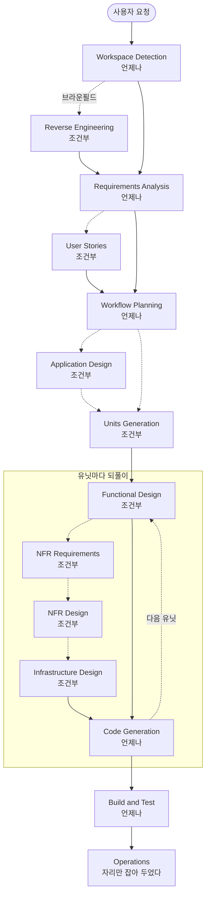
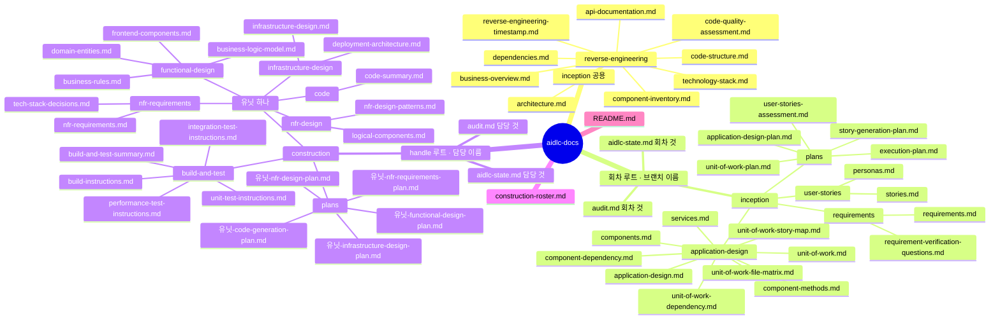

# AI-DLC 작업흐름 — 한 장 요약

세미나 재료다. 판본은 **AI-DLC v1.0.1** 이고 규칙 전문은 `.aidlc/aidlc-rules/`
에 있다. 이 문서는 그 규칙이 실제로 이 저장소에서 돈 모양까지 함께 적는다.

---

## 1. 한 줄로

AI-DLC 는 **에이전트가 단계를 돌고 사람이 단계마다 승인하는** 개발 수명주기다.
단계마다 문서 산출물이 남고, 그 산출물이 다음 단계의 입력이 된다. 남는 것은
코드만이 아니라 **왜 그렇게 지었는지의 기록**이다.

```text
   에이전트가 한다    분석 · 설계 · 계획 · 코드 생성
   사람이 한다        물음에 답하기 · 단계 승인 · 게이트 판정
   둘 사이의 계약     계획을 먼저 보여 주고, 승인 뒤에만 산출물을 만든다
```

---

## 2. 판 셋과 단계 열넷

| 판 | 무엇을 정하나 | 단계 |
| --- | --- | --- |
| INCEPTION | 무엇을 · 왜 짓는가 | 일곱 |
| CONSTRUCTION | 어떻게 짓는가 | 여섯 (앞 넷은 유닛마다 되풀이) |
| OPERATIONS | 배포와 운영 | 자리만 잡아 두었다 |

**언제나 도는 단계는 다섯**이고 나머지는 조건부다. 조건부 단계를 돌지 말지는
Workflow Planning 이 정하고, 사람이 뒤집을 수 있다.

| 판 | 단계 | 언제 | 내는 것 |
| --- | --- | --- | --- |
| INCEPTION | Workspace Detection | 언제나 | 상태 파일 · 브라운필드 판정 |
| INCEPTION | Reverse Engineering | 브라운필드만 | 기존 코드 분석 문서 아홉 |
| INCEPTION | Requirements Analysis | 언제나 | 요구 문서 · 검증 물음 |
| INCEPTION | User Stories | 조건부 | stories · personas |
| INCEPTION | Workflow Planning | 언제나 | 실행 계획 — 어느 단계를 돌지 |
| INCEPTION | Application Design | 조건부 | 컴포넌트 · 메서드 · 서비스 · 의존 |
| INCEPTION | Units Generation | 조건부 | 유닛 정의 · 유닛 의존 · 스토리 맵 |
| CONSTRUCTION | Functional Design | 유닛마다 · 조건부 | 도메인 엔티티 · 업무 규칙 |
| CONSTRUCTION | NFR Requirements | 유닛마다 · 조건부 | 비기능 요구 · 기술 스택 결정 |
| CONSTRUCTION | NFR Design | 유닛마다 · 조건부 | NFR 패턴 · 논리 컴포넌트 |
| CONSTRUCTION | Infrastructure Design | 유닛마다 · 조건부 | 인프라 · 배포 구조 |
| CONSTRUCTION | Code Generation | 유닛마다 · 언제나 | 코드 + code-summary.md |
| CONSTRUCTION | Build and Test | 언제나 | 빌드와 시험 지침 다섯 |
| OPERATIONS | Operations | 자리만 | 없다 |

**깊이는 적응한다.** 단계를 돌기로 했으면 그 단계의 산출물은 **전부** 만든다.
바뀌는 것은 만들지 말지가 아니라 얼마나 자세히 쓰는지다 (`common/depth-levels.md`).




### 2.1 v2 와 나란히 — 판 다섯 · 단계 서른셋

정본은 `awslabs/aidlc-workflows` 다. 이 저장소가 쓰는 **v1.0.1 은 마크다운 규칙
묶음**이고, 지금 나가 있는 **v2 (2.8.2) 는 같은 방법론 위에서 판과 단계를 다시
갈랐다.** 아래는 이 절의 범위 — 판과 단계 — 만 나란히 댄 것이다.

**판이 셋에서 다섯으로 늘었다.**

| v1.0.1 | v2 | v2 의 단계 수 | 무엇이 달라졌나 |
| --- | --- | --- | --- |
| 없다 | 0 INITIALIZATION | 셋 · 0.1 ~ 0.3 | v1 의 Workspace Detection 이 여기로 왔다. 승인 게이트 없이 도구 호출 하나로 끝난다 |
| 없다 | 1 IDEATION | 일곱 · 1.1 ~ 1.7 | 통째로 새 판이다. 의도 · 시장 조사 · 타당성 · 범위 · 팀 · 러프 목업 · 승인 |
| INCEPTION · 일곱 | 2 INCEPTION | 아홉 · 2.1 ~ 2.9 | 관행 발굴 · 정제 목업 · 계약 설계가 늘었다 |
| CONSTRUCTION · 여섯 | 3 CONSTRUCTION | 일곱 · 3.1 ~ 3.7 | CI Pipeline 이 늘었다 |
| OPERATIONS · 자리만 | 4 OPERATION | 일곱 · 4.1 ~ 4.7 | 자리만 잡아 두었던 판이 단계로 찼다 |

**v1 의 단계 열넷은 사라지지 않았다** — 번호를 받고 자리를 옮겼다.

| v1.0.1 단계 | v2 | 달라진 점 |
| --- | --- | --- |
| Workspace Detection | 0.2 Workspace Detection | 판이 바뀌었다. 규칙 기반 스캐너로 자동으로 돌고 승인이 없다 |
| Reverse Engineering | 2.1 Reverse Engineering | 두 토막 파이프라인이 됐다 — 개발자 에이전트가 훑고 아키텍트 에이전트가 종합해 쓴다 |
| Requirements Analysis | 2.3 Requirements Analysis | 언제나. 그대로다 |
| User Stories | 2.4 User Stories | mob 으로 돈다 — 리드가 초안을 쓰고 디자인 · 개발 · 품질이 병렬로 기여한다 |
| Workflow Planning | 프로파일 선택 + 2.9 Delivery Planning | **둘로 갈렸다.** 어느 단계를 돌지는 프로파일과 컴포저가 정하고, 2.9 는 배달 계획을 낸다 |
| Application Design | 2.6 Domain Design | 이름이 바뀌었다. ADR 을 `decisions.md` 로 낸다 |
| Units Generation | 2.7 Units Generation | 조건부에서 **언제나**로 올라갔다 |
| Functional Design | 3.1 Functional Design | 유닛마다 · 조건부. 그대로다 |
| NFR Requirements | 3.2 NFR Requirements | 그대로다 |
| NFR Design | 3.3 NFR Design | 그대로다 |
| Infrastructure Design | 3.4 Infrastructure Design | 그대로다 |
| Code Generation | 3.5 Code Generation | 유닛마다 · 언제나. 그대로다 |
| Build and Test | 3.6 Build and Test | 끝에 한 번. 그대로다 |
| Operations | 4.1 ~ 4.7 | 자리만 있던 것이 단계 일곱으로 찼다 |

**늘어난 열아홉은 앞뒤로 붙었다** — 코드를 쓰기 전의 판단과, 코드를 낸 뒤의 운영이다.

| v2 단계 | 판 | 무엇을 |
| --- | --- | --- |
| 0.1 Workspace Scaffold · 0.3 State Initialization | 0 | 레코드 디렉터리와 상태를 만든다 |
| 1.1 Intent Capture and Framing | 1 | 의도와 이해관계자 지도 |
| 1.2 Market Research | 1 | 경쟁 분석 · 사는가 짓는가 |
| 1.3 Feasibility and Constraints | 1 | 타당성 · 제약 등록부 · RAID |
| 1.4 Scope Definition | 1 | 범위와 백로그 |
| 1.5 Team Formation | 1 | 팀 평가 · mob 편성 |
| 1.6 Rough Mockups | 1 | 와이어프레임 · 사용자 흐름 |
| 1.7 Approval and Handoff | 1 | 착수 브리프 · 결정 로그 |
| 2.2 Practices Discovery | 2 | 팀 관행을 캐서 memory 로 승격한다 |
| 2.5 Refined Mockups | 2 | 하이파이 목업 · 상호작용 명세 |
| 2.8 Contract Design | 2 | 계약 요약 |
| 3.7 CI Pipeline | 3 | CI 설정 · 품질 게이트 |
| 4.1 ~ 4.7 | 4 | 배포 파이프라인 · 환경 · 배포 실행 · 관측 · 장애 대응 · 성능 검증 · 되먹임 |

**단계를 고르는 방식과 승인 자리가 바뀌었다.** 이것이 2절에서 가장 큰 차이다.

| 축 | v1.0.1 | v2 |
| --- | --- | --- |
| 어느 단계를 돌까 | Workflow Planning 이 매번 판단해 `execution-plan.md` 에 적는다 | 프로파일이 EXECUTE 와 SKIP 격자를 미리 정한다. 어긋나면 컴포저 에이전트를 부른다 |
| 언제나 도는 단계 | 다섯 | 프로파일마다 다르다 |
| 승인 자리 | 단계마다 하나씩 | 판 경계마다 검증 게이트 셋 + 단계 게이트 |
| 자율 | 없다. 언제나 사람이 승인한다 | Construction 첫 게이트 뒤 「사다리 물음」으로 남은 게이트를 끌지 고른다 |
| 유닛 도는 순서 | 유닛 하나를 설계부터 코드까지 끝내고 다음 유닛 | 기본이 stage-major — 한 단계를 모든 유닛에 돌리고 다음 단계로 간다 |
| 누가 도나 | 에이전트 하나가 전 단계를 돈다 | 에이전트 열넷 — 도메인 열하나 · 리뷰어 둘 · 컴포저 하나 |

프로파일이 곧 「단계를 몇 개 도나」다.

| 프로파일 | 도는 단계 | 쓰는 자리 |
| --- | --- | --- |
| Feature · Enterprise | 33 / 33 | 전 수명주기 |
| Classic · Workshop | 26 / 33 | Ideation 없이 돌던 방식 · 교육 진행 |
| MVP | 23 / 33 | Operation 판을 빼고 |
| Infrastructure | 13 / 33 | 환경 · IaC · 비용 |
| Express · Refactor · Security patch | 10 / 33 | 최단 경로 |
| Bugfix | 9 / 33 | 결함 하나 |
| Proof of concept | 8 / 33 | 타당성만 확인 |

**한 줄로.** v1 의 「언제나 다섯 · 나머지는 그때 판단」이 v2 에서 **「프로파일이
미리 고른 격자」**가 됐다. 이 저장소가 회차마다 Workflow Planning 을 돌려
`execution-plan.md` 를 낸 자리가, v2 에서는 `/aidlc feature` 같은 한 줄 선택으로
바뀐다. **판단을 매번 하지 않고 굳혀 둔 것**이고, 그 대신 굳힌 격자가 안 맞는
회차를 위해 컴포저를 따로 두었다.

유닛 순회가 stage-major 로 바뀐 까닭도 적어 둘 값이 있다 — 유닛마다 단계마다
게이트를 두면 유닛 셋에 게이트 열다섯이라 「애 보기」가 되고, 반대로 전부 모아
한 번에 보면 만오천 줄이 한 게이트에 쏟아진다. v2 는 그 가운데를 골랐다.

---

## 3. 단계 하나가 도는 모양

단계는 거의 모두 **계획과 생성 두 토막**으로 갈린다. 물음은 계획 안에 박고,
답을 받은 뒤에 승인을 구하고, 승인된 계획만 실행한다.

```text
   1  계획       그 단계가 무엇을 낼지 체크박스로 적는다.  물음을 그 안에 박는다
   2  물음       [Answer]: 태그에 A ~ E 로 답한다.  E 는 「그 밖」 이고 직접 쓴다
   3  승인       계획을 사람이 승인한다.  승인 전에 산출물을 만들지 않는다
   4  생성       승인된 계획을 그대로 실행해 산출물을 낸다
   5  체크박스   한 걸음을 끝낸 그 자리에서 [x] 로 바꾼다.  나중에 몰아 하지 않는다
   6  기록       aidlc-state.md 에 단계 상태 · audit.md 에 원문 그대로의 입력
   7  승인       「고칠 것을 말한다」 또는 「다음 단계로 간다」 둘 중 하나
```

**7 의 선택지는 둘이다.** 규칙이 셋 이상의 메뉴를 금지한다 — 갈림길을 늘리면
에이전트가 스스로 흐름을 만들어 내고 그 흐름은 기록에 안 남는다.

---

## 4. 산출물 계층도

정본 AI-DLC 는 `aidlc-docs/` 한 벌을 쓴다. **이 저장소는 소유자별로 갈랐다** —
Inception 은 회차(브랜치) 이름으로, Construction 은 담당 handle 로. 아래는 그
갈린 모양이다.



읽는 법 셋.

```text
   한 갈래가 한 소유자    회차 루트는 그 회차 진행자 · handle 루트는 그 담당
   잎이 곧 파일 이름      단계를 돌면 그 잎이 전부 생긴다.  깊이만 적응한다
   공용은 하나            reverse-engineering 만 회차와 무관하게 참이라 한 벌이다
```

`unit-of-work-file-matrix.md` 는 정본 규칙에 없고 이 저장소가 더했다 — 유닛
둘 이상이 만지는 파일을 표시해 진행자가 직렬로 병합하기 위한 것이다.

**애플리케이션 코드는 이 나무에 안 들어온다.** 저장소 뿌리(`cmd/` · `internal/`)
에 들어가고, `aidlc-docs/` 에는 그 요약인 `code-summary.md` 만 남는다.

---

## 5. 두 장부

```text
   aidlc-state.md   단계 진행 · 워크스페이스 판정 · 확장 설정.  통째로 다시 쓸 수 없다
                    소유자가 하나라서 병합에서 안 부딪친다
   audit.md         사용자 입력을 원문 그대로 · 시각과 함께.  이어 붙이기만 한다
                    요약하지 않는다.  요약하면 결정의 근거가 사라진다
```

`audit.md` 는 `.gitattributes` 의 `merge=union` 으로 git 이 합친다. 시각은 ISO
8601 (`date -u +%Y-%m-%dT%H:%M:%SZ`).

---

## 6. 확장

확장은 Requirements Analysis 에서 켜고 끈다. **켠 것은 권고가 아니라 제약**이고,
어기면 그 단계를 닫지 못한다. 끈 것은 규칙 파일을 아예 안 읽어서 문맥을 아낀다.

```text
   security/baseline          보안 기준선
   resiliency/baseline        복원력 기준선
   testing/property-based     속성 기반 시험
```

---

## 7. 이 저장소가 얹은 것

```text
   문서 루트     Inception 은 aidlc-docs/<회차 브랜치>/ · Construction 은 aidlc-docs/<handle>/
   브랜치        v<N>-run-<이름> 에서 Inception · unit/<유닛> 에서 Construction
   모이는 곳     둘 다 PR 로 main
   커밋 지점     단계 승인마다.  산출물이 나왔으면 그 자리에서 역사에 넣는다
   병합 지점     그 유닛의 장면 게이트가 초록인 뒤.  보류는 통과가 아니라 병합 지점도 아니다
   병렬          유닛 의존 그래프가 순서를 정한다.  의존 없는 유닛부터 동시에 돈다
   입력          요구 팩(requirements/<팩>/) 과 설계 정본(enode-design 서브모듈)
                 Requirements Analysis 가 그것을 읽는다
```

정본과 갈라진 자리는 하나다 — **문서 루트를 소유자로 갈랐다.** 그 까닭은 8절이
시간으로, 9절이 말로 적는다.

---

## 8. 회차 하나를 시간으로 편다 — v1-run-dhseo

대회 회차다. **Inception 한 바퀴가 커밋 넷에 산출물 스물넷으로 남았다.** 시각은
UTC 이고 `audit.md` 의 표기와 같다. 자리는 layering 뒤의 주소다 — 그 layering 이
이 표 끝에서 일어난다.

| 시각 · UTC | 산출물 | 낸 단계 | 자리 | 커밋 |
| --- | --- | --- | --- | --- |
| 07:17:19 | aidlc-state.md | 회차 장부 | 회차 루트 | 1fe2145 |
| 07:17:19 | audit.md | 회차 장부 | 회차 루트 | 1fe2145 |
| 07:17:19 | business-overview.md | Reverse Engineering | 공용 | 1fe2145 |
| 07:17:19 | architecture.md | Reverse Engineering | 공용 | 1fe2145 |
| 07:17:19 | code-structure.md | Reverse Engineering | 공용 | 1fe2145 |
| 07:17:19 | api-documentation.md | Reverse Engineering | 공용 | 1fe2145 |
| 07:17:19 | component-inventory.md | Reverse Engineering | 공용 | 1fe2145 |
| 07:17:19 | technology-stack.md | Reverse Engineering | 공용 | 1fe2145 |
| 07:17:19 | dependencies.md | Reverse Engineering | 공용 | 1fe2145 |
| 07:17:19 | code-quality-assessment.md | Reverse Engineering | 공용 | 1fe2145 |
| 07:51:58 | reverse-engineering-timestamp.md | Reverse Engineering | 공용 | da73c53 |
| 07:51:58 | requirement-verification-questions.md | Requirements Analysis | 회차 루트 | da73c53 |
| 07:51:58 | requirements.md | Requirements Analysis | 회차 루트 | da73c53 |
| 08:56:43 | execution-plan.md | Workflow Planning | 회차 루트 | 5a401a4 |
| 08:56:43 | application-design-plan.md | Application Design | 회차 루트 | 5a401a4 |
| 08:56:43 | components.md | Application Design | 회차 루트 | 5a401a4 |
| 08:56:43 | component-methods.md | Application Design | 회차 루트 | 5a401a4 |
| 08:56:43 | services.md | Application Design | 회차 루트 | 5a401a4 |
| 08:56:43 | component-dependency.md | Application Design | 회차 루트 | 5a401a4 |
| 08:56:43 | application-design.md | Application Design | 회차 루트 | 5a401a4 |
| 10:25:52 | unit-of-work-plan.md | Units Generation | 회차 루트 | e6e59c6 |
| 10:25:52 | unit-of-work.md | Units Generation | 회차 루트 | e6e59c6 |
| 10:25:52 | unit-of-work-dependency.md | Units Generation | 회차 루트 | e6e59c6 |
| 10:25:52 | unit-of-work-story-map.md | Units Generation | 회차 루트 | e6e59c6 |

게이트는 따로 돈다. `audit.md` 가 적은 승인 시각이다.

```text
   05:36:09   초기 요청 · Workspace Detection
   07:17:58   Reverse Engineering 완료 · 검증
   07:50:41   Requirements Analysis 승인
   08:15:29   Workflow Planning 승인
   08:51:01   Application Design 승인
   10:22:05   Units Generation 승인
   10:28:27   aidlc-docs layering — 회차별 문서 루트 · RE 공용 · audit merge=union
   10:56:58   CONSTRUCTION 착수 · 담당 배정
```

읽을 것 넷.

**커밋은 단계 승인을 따라간다.** 승인 뒤 몇 분 안에 그 단계 산출물이 커밋으로
들어갔다 — 승인 08:51:01 에 커밋 08:56:43, 승인 10:22:05 에 커밋 10:25:52.
`CONVENTIONS.md` 3.3 의 「커밋 지점은 단계 승인마다」가 실제로 그렇게 돌았다.

**하나가 어긋났다.** `execution-plan.md` 는 Workflow Planning 산출물인데 그 단계
커밋이 없다 — 08:15:29 에 승인받고 08:56:43 의 **Application Design 커밋에 실려**
들어갔다. 한 단계 늦은 것이고, 이 회차에서 규약과 역사가 갈린 유일한 자리다.

**첫 커밋 전 1시간 41분은 역사에 없다.** 요청이 05:36:09 인데 첫 커밋이
07:17:19 이다. Workspace Detection 과 Reverse Engineering 이 도는 동안 git 에는
아무것도 안 남았고, 그 사이의 기록은 `audit.md` 한 장에만 있다.

**이 날 회차 셋이 같은 경로에서 동시에 돌았다.** `v1-run-dhseo`(대회 데모 전환) ·
`v2-run-shin_pen_drawing`(시안) · `v1-run-dhseo-cardnews`(카드뉴스)가 전부
`aidlc-docs/inception/plans/execution-plan.md` 에 자기 실행 계획을 썼다 — 07:47:10 ·
08:15:52 · 08:56:43 에 세 번. 브랜치가 달라서 그 자리에서는 안 터졌지만 합치면
한 파일이다. **10:28:27 의 layering 커밋이 셋을 회차 루트로 갈랐고, 7절의 문서 루트
규약이 거기서 나왔다.**

Construction 은 10:56:58 에 착수했다. 그 산출물은 담당 handle 루트로 갈라져
이 표 밖이다 — `aidlc-docs/{taeels,shin-son,nacl1119,runixs}/construction/`.

### 8.1 대회장에서 만든 유닛 여덟 — 병렬 실행 검토

Units Generation 이 낸 분해다. **유닛 여덟 · 손 넷 · 웨이브 다섯.** 같은 줄에
있는 유닛이 동시에 도는 것이고, 아래가 그 손이다.

```text
   W0     obs
          taeels
          |
          +--------------------+--------------------+
          v                    v                    v
   W1     queue                mcp                  ui (fleet)
          shin-son             taeels               runixs
          |
          +--------------------+
          v                    v
   W2     drain                demo-back
          shin-son             runixs
          |                    |
          v                    v
   W3     panel                ui (demo)
          nacl1119             runixs
          |
          v
   W4     transcript
          nacl1119
```

**막는 것만 그렸다.** obs 는 여덟 중 여섯이 딛지만 화살표를 셋만 그었다 — 나머지는
이 줄기를 타고 따라오므로 착수 시점을 안 바꾼다. 전부 적은 의존은
`unit-of-work-dependency.md` 1절에 있다.

| 웨이브 | 폭 | 동시에 도는 유닛 | 그 손 | 기다리는 것 |
| --- | --- | --- | --- | --- |
| W0 | 1 | obs | taeels | 없다 |
| W1 | 3 | queue · mcp · ui (fleet) | shin-son · taeels · runixs | obs |
| W2 | 2 | drain · demo-back | shin-son · runixs | queue |
| W3 | 2 | panel · ui (demo) | nacl1119 · runixs | drain · demo-back |
| W4 | 1 | transcript | nacl1119 | panel |

검토할 것 넷.

**폭은 셋에서 멈춘다.** 손은 넷인데 그래프가 셋보다 넓게 안 벌어진다. W1 에서
가장 넓고 그 다음부터 좁아진다 — 여덟 유닛을 넷이 나눠도 **줄기가 다섯 깊이**
(`obs -> queue -> drain -> panel -> transcript`)라 거기가 바닥이다.

**한 웨이브 안에서 손이 겹치지 않는다.** W1 셋도 W2 둘도 W3 둘도 서로 다른
사람이다. 배정이 그래프를 따라갔다는 뜻이고, 겹쳤으면 폭이 적힌 수보다 좁아진다.

**꼬리가 한 손에 몰린다.** W3 panel 과 W4 transcript 가 둘 다 nacl1119 다. 그
사람은 W1 · W2 에서 의존 그래프에 없고, 그 자리를 `card-news` 가 메웠다 — 그래서
로스터가 그것만 「별개」로 적어 두었다.

**폭을 실제로 줄이는 것은 접점 파일이다.** `internal/store/store.go` 와
`internal/api/api.go` 는 유닛 여럿이 쓴다. 그래프가 셋으로 벌어져도 **병합은 한
번에 하나**이고 진행자가 직렬로 받았다 (`unit-of-work-dependency.md` 3절의 파일
행렬 · `CONVENTIONS.md` 3.1). 동시에 짤 수 있느냐와 동시에 합칠 수 있느냐는
다른 물음이다.

폭을 넓히려고 쓴 수법이 하나 있다. **착수와 완료를 가르는 것**이다 — `ui` 는 obs
만으로 W1 에 착수해 실 함대 모드를 닫고, 데모 모드의 게이트만 demo-back 뒤인 W3
에서 닫는다. 그래서 표에 `ui` 가 두 번 나오지만 **한 유닛이다.** `panel` 도 같다 —
obs 로 착수해 drain 으로 닫는다. 이것이 없으면 둘 다 뒤 웨이브로 통째로 밀린다.

---

## 9. 세미나에서 짚을 것

**계획을 먼저 승인받는 값이 여기 있다.** 산출물을 만든 뒤에 되돌리면 그 사이의
결정이 이미 다음 단계의 입력으로 새어 나간 뒤다. 승인이 흐름을 끊는 자리가 곧
되돌릴 수 있는 자리다.

**상태 한 장을 여럿이 만지면 부딪친다.** 대회 때 담당 넷이 한 `aidlc-state.md`
를 두고 돌았고, 진행자가 병합 뒤 손으로 옮겨야 했다. 소유자별 문서 루트가 그
옮기는 경로를 없앴다. **가르는 기준은 사람 수가 아니라 소유자다** — 한 손이 도는
회차도 handle 루트를 쓴다.

**낡은 산출물을 물려받지 않는다.** 이전 회차의 문서를 미리 실어 두면 그 단계를
실행한 것이 아니라 물려받은 것이 되고, 물려받은 것은 코드가 움직인 만큼 조용히
거짓이 된다. 되쓸 것은 되쓰되 **그 시점의 코드에 다시 대 본 값**만 싣는다.

**적어 둔 경로와 실제로 간 경로가 갈린다.** 대회 때 「유닛이 회차 브랜치로
모인다」고 적었지만 유닛 PR 스물여섯이 전부 `main` 으로 갔다. 규약은 그 뒤에
실제 경로로 고쳤다 — 규약이 기록을 이기지 못한다.

---

## 10. 더 읽을 자리

```text
   .aidlc/aidlc-rules/aws-aidlc-rules/core-workflow.md     워크플로 정본
   .aidlc/aidlc-rules/aws-aidlc-rule-details/              단계마다의 절차
   aidlc-docs/README.md                                    산출물이 쌓이는 자리
   CONVENTIONS.md 3절                                      브랜치 · 커밋 · 병합 지점
   aidlc-docs/construction-roster.md                       담당과 배정
```

2.1 절의 v2 값은 정본 저장소에서 받아 왔다. 판본은 **2.8.2**.

- [awslabs/aidlc-workflows](https://github.com/awslabs/aidlc-workflows) — v2 정본
- [Phases and Stages](https://github.com/awslabs/aidlc-workflows/blob/main/docs/guide/04-phases-and-stages.md) — 판 다섯과 단계 서른셋의 표
- [Workflow Profiles](https://github.com/awslabs/aidlc-workflows/blob/main/docs/guide/workflow-profiles.md) — 프로파일 열하나
- [Agents](https://github.com/awslabs/aidlc-workflows/blob/main/docs/guide/06-agents.md) — 에이전트 열넷
- [awslabs/aidlc-workflows at v1](https://github.com/awslabs/aidlc-workflows/tree/v1) — 이 저장소가 쓰는 계열
