<!--
아웃라인이다. 슬라이드마다 올릴 것만 적었고 문장은 아직 안 다듬었다.
진행 노트와 재료 출처는 HTML 주석에 넣었다 — Marp 의 발표자 노트로 그대로 뜬다.

재료는 둘이다.
  seminar-plan.md          진행의 뼈대.  이 덱의 순서가 그 순서다
  docs/aidlc-workflow.md   표와 그림.  아래 「재료」 줄이 그 절을 가리킨다

**mermaid 는 Marp 가 안 그린다.** 2절 흐름도와 4절 마인드맵은 mermaid-cli 로
미리 구워 assets/ 에 SVG 로 둔다.  빌드는 스크립트 하나다.
  scripts/build-slides.sh      SVG 는 <svg> 로 박고 나머지는 data URI.  파일 하나로 나온다
-->

# AI-DLC 로 이틀 만에

디디톤 회고와 enode

<!-- 표지. 팀 이름과 날짜를 넣는다 -->

---

## 오늘 할 이야기

1. 디디톤이 뭐였나
2. AI-DLC 가 뭔가
3. 우리가 실제로 돈 방식
4. 개발 후기 — 좋았던 것과 막힌 것
5. 해커톤 회고 — 왜 7위였나
6. enode 와 데모

<!-- 목차. 4번과 5번이 이 발표의 값이다. 1~3 은 빠르게 넘긴다 -->

---

# 1. 디디톤이 뭐였나

---

## 디디톤 개요

- 주제 — AI-DLC 를 위한 앱 또는 서비스
- 사외에서 이틀
- AWS 코리아 협업
- 팀당 AWS Bedrock 1,000 달러

<!-- 재료: seminar-plan.md 「디디톤 개요」 + 「aidlc 개발 후기」의 크레딧 줄
     크레딧을 여기서 미리 말해 두면 뒤의 토큰 이야기가 자연스럽다 -->

---

## 팀 넷

- 사진 넷 · 이름 · 역할
- shin-son · nacl1119 · taeels · runixs

<!-- 재료: aidlc-docs/construction-roster.md 1절이 handle 과 이름의 정본
     사진 슬라이드. 역할은 뒤의 유닛 그래프와 색을 맞추면 좋다 -->

---

## 뭘 만들었나

enode 에 셋을 겨눠 **둘을 닫았다.**

- **mediator · host 대시보드** — 함대가 보인다
- **drain** — 소유자가 자기 노드를 거둔다
- **mediator MCP** — 유닛으로 세웠고 **이틀 안에 못 닫았다**

**설계는 닫혔고 코드만 없다.** 도구 여덟을 어느 라우트와 어느 메서드에 붙일지
표까지 적혀 있다 — 감쌀 REST 도 그것을 부르는 클라이언트도 이미 서 있다.

<!-- 재료: seminar-plan.md 「뭘 만들었나」 + 코드 확인
     확인한 사실 — cmd/runctl 에 mcp 서브명령이 없고 internal/ 에 mcp 패키지가 없다
     taeels 의 construction 폴더에도 mcp 유닛 산출물이 없다 (로스터는 W1 · CP5 로 배정했다)
     여기서 이름만 흘린다. 자세한 것은 6부 enode 소개에서
     못 닫은 유닛을 세는 것이 이 발표의 정직함이다 — 5부의 「7위」와 톤이 맞는다
     근거 — requirements/decisions.md 5.2 가 값 넷을 닫고 5.3 이 도구 여덟을
     라우트와 Client 메서드에 붙여 표로 적었다 (2026-09-05 승인)
     남은 것은 도구 표면과 변환기 하나.  obs 가 그 변환기 함정을 주석으로 경고해 뒀다 -->

---

# 2. AI-DLC 가 뭔가

---

## 한 줄로

**에이전트가 단계를 돌고 사람이 단계마다 승인한다.**

- 단계마다 문서 산출물이 남는다
- 그 산출물이 다음 단계의 입력이 된다
- 남는 것은 코드만이 아니라 왜 그렇게 지었는지의 기록

<!-- 재료: docs/aidlc-workflow.md 1절 -->

---

## 판 셋과 단계 열넷

| 판 | 무엇을 정하나 | 단계 |
| --- | --- | --- |
| INCEPTION | 무엇을 · 왜 짓는가 | 일곱 |
| CONSTRUCTION | 어떻게 짓는가 | 여섯 |
| OPERATIONS | 배포와 운영 | 자리만 |

**언제나 도는 단계는 다섯**이고 나머지는 조건부다.

<!-- 재료: docs/aidlc-workflow.md 2절 첫 표
     단계 열넷 표는 슬라이드에 안 올린다 — 너무 길다. 흐름도 이미지로 대신한다 -->

---

## 단계 흐름



<!-- 재료: docs/aidlc-workflow.md 2절의 mermaid flowchart
     단계 열넷을 그대로 그리면 가로 13:1 이라 슬라이드 폭에서 글자가 안 읽힌다
     판 셋 단위로 굵게 다시 그렸다.  단계 이름은 상자 안에 -->

---

## 단계 하나가 도는 모양

```text
   계획 -> 물음 -> 승인 -> 생성 -> 기록 -> 승인
```

- 물음은 **계획 안에** 박는다
- **승인 전에 산출물을 만들지 않는다**
- 끝의 선택지는 둘뿐 — 고칠 것을 말하거나, 다음 단계로

<!-- 재료: docs/aidlc-workflow.md 3절
     이 슬라이드가 4부 「되돌릴 수 없다」의 복선이다 -->

---

## 산출물이 쌓이는 모양



<!-- 재료: docs/aidlc-workflow.md 4절 마인드맵
     잎이 전부 실제 파일 이름이다. 청중이 놀라는 지점 — 문서가 이만큼 나온다
     읽으라고 하지 않는다.  「이만큼 나온다」는 인상용 -->

---

## v1 과 v2

| | v1.0.1 (우리가 쓴 것) | v2 (2.8.2) |
| --- | --- | --- |
| 실체 | 마크다운 규칙 묶음 | 네이티브 명령 + 결정론 엔진 |
| 판 | 셋 | 다섯 |
| 단계 | 열넷 | 서른셋 |
| 단계 선택 | 매번 LLM 이 판단 | 프로파일이 미리 고른 격자 |

<!-- 재료: docs/aidlc-workflow.md 2.1 절
     v2 의 표 다섯 중 「축」 표만 네 줄로 줄였다
     한 줄로: 판단을 매번 하지 않고 굳혔다 -->

---

# 3. 우리가 실제로 돈 방식

---

## 준비 — 이슈를 왼쪽으로 민다

- 사전에 AI-DLC 로 추가 기능 개발을 **2회차** 돌렸다
- 각 회차에서 나온 이슈를 모아 **대회장 requirement pack** 으로 만들었다
- 대회장에서는 그 팩을 입력으로 Requirements Analysis 부터 시작

<!-- 재료: seminar-plan.md 「aidlc 를 위한 준비」
     shift-left 가 이 발표의 첫 교훈이다. 이틀은 설계할 시간이 없다 -->

---

## 회차 하나를 시간으로 편다

| 시각 UTC | 무슨 일 |
| --- | --- |
| 05:36 | 첫 요청 |
| 07:17 | Reverse Engineering 완료 |
| 07:50 | Requirements 승인 |
| 08:51 | Application Design 승인 |
| 10:22 | Units Generation 승인 |
| 10:56 | Construction 착수 |

**Inception 한 바퀴 = 5시간 20분 · 산출물 스물넷 · 커밋 넷**

<!-- 재료: docs/aidlc-workflow.md 8절
     전체 표(24행)는 안 올린다. 게이트 시각만 여섯 줄로 줄였다
     이 슬라이드가 「상류에 쏟아라」의 증거다 -->

---

## 유닛 여덟과 병렬

```text
   W0     obs
          |
          +--------+--------+
          v        v        v
   W1     queue    mcp      ui (fleet)
          |
          +--------+
          v        v
   W2     drain    demo-back
          |        |
          v        v
   W3     panel    ui (demo)
          |
          v
   W4     transcript
```

<!-- 재료: docs/aidlc-workflow.md 8.1 절 ASCII 그래프 (손 이름은 지웠다)
     ASCII 라 Marp 가 그대로 그린다 — 이미지로 구울 필요가 없다
     다음 슬라이드에서 이 그림의 뜻을 푼다 -->

---

## 병렬은 손 수가 아니라 그래프가 정한다

- **폭은 셋에서 멈춘다** — 손은 넷인데 그래프가 셋보다 안 벌어진다
- **꼬리가 한 손에 몰린다** — W3 · W4 가 둘 다 같은 사람
- **폭을 실제로 줄이는 것은 접점 파일** — `store.go` · `api.go` 는 직렬 병합

동시에 **짤** 수 있느냐와 동시에 **합칠** 수 있느냐는 다른 물음이다.

<!-- 재료: docs/aidlc-workflow.md 8.1 절의 검토 넷 중 셋
     마지막 줄이 이 슬라이드의 핵심. 유닛 디자인 이야기의 결론 -->

---

## 문서 루트를 소유자로 갈랐다

- 처음엔 상태 파일 한 장을 넷이 만졌다 — 병합에서 부딪쳤다
- Inception 은 회차 이름으로, Construction 은 담당 handle 로
- **가르는 기준은 사람 수가 아니라 소유자다**

<!-- 재료: docs/aidlc-workflow.md 7절 + 8절의 layering 커밋
     실제로 그 날 회차 셋이 같은 경로에 썼다는 일화를 여기서 -->

---

# 4. 개발 후기

---

## 상류에 쏟아라

- **일단 Construction 에 들어가면 되돌릴 수 없다**
- 그러니 상류일수록 토큰과 시간을 많이 넣는다
- 공통으로 쓰이는 기능을 유닛으로 뽑았으면 **교차검증이 필수**

<!-- 재료: seminar-plan.md 「aidlc 개발 후기」
     3부의 승인 게이트 슬라이드와 이어 붙인다 -->

---

## 첫날 저녁을 검증에 다 썼다

- 설계 교차검증만으로 **x5 구독의 5시간 윈도우**를 태웠다
- 그래도 그게 쌌다
- 설계에 공을 들이는 진짜 이유 — **이걸 다시 하고 싶지 않다**

<!-- 재료: seminar-plan.md 같은 절
     숫자 하나로 청중을 때리는 슬라이드. 아까워 보이지만 아깝지 않았다는 순서로 -->

---

## 여기서 SE 지식이 필요해진다

- 유닛 경계 · 의존 그래프 · 접점 파일은 전부 **설계 판단**이다
- 에이전트는 그 판단을 대신해 주지 않는다
- AI-DLC 가 묻는 물음에 답하려면 답할 사람이 있어야 한다

<!-- 재료: seminar-plan.md 「여기서 SE 지식의 필요성을 절감」
     4부에서 가장 중요한 한 장일 수 있다 -->

---

## 인간 병목 생성기 클로드 (1) — 글자를 지어낸다

- `I2` · `U4` · `CP1` 같은 alias 심볼을 아주 좋아한다
- **나중에 그 뜻을 못 찾는 경우까지 나온다**

실물 — 이 저장소의 `GLOSSARY.md`

| 글자 | 푼 말 |
| --- | --- |
| `CP0` ~ `CP11` | **없다** |
| `CA0` ~ `CA6` | **없다** |

<!-- 재료: GLOSSARY.md
     지은 쪽도 모른다고 확인해서 「없다」로 적은 칸이다. 가장 센 실물 증거 -->

---

## 인간 병목 생성기 클로드 (2) — 안 읽히는 한국어

- 한글로 쓰였는데 읽히지 않는다
- 읽는 데 드는 시간이 곧 사람의 병목

<!-- 슬라이드에는 실제 산출 문서 한 조각을 통째로 띄운다
     재료: seminar-plan.md 의 Q4 `store.WakeQueued` 인용 블록
     길어서 글자가 작아질 것이다 — 그게 이 슬라이드의 의도다. 읽으라고 안 한다 -->

---

## 인간 병목 생성기 클로드 (3) — 발산과 포기

- 기본 하네스의 답변 스타일 — 「미결로 남긴 것 셋」
  - 닫으려고 물었는데 열고 끝난다
- 결국 사람이 **산출 문서의 이해를 포기**한다
  - 권장안으로 전부 답해 버리는 경우가 다발

<!-- 재료: seminar-plan.md 같은 절
     (2)에서 (3)으로 자연스럽게 넘어간다 — 안 읽히니까 포기하고, 포기하면 권장안 일괄 수락
     여기서 「그럼 게이트가 무슨 의미인가」를 청중에게 던지고 넘어가도 좋다 -->

---

# 5. 해커톤 회고

---

## 결과

- **입선** — 대상 1 · 최우수 2 · 장려 3 · 입선 5
- 공동 7위

<!-- 재료: seminar-plan.md 「해커톤 회고」
     담담하게. 다음 두 장이 원인 분석이다 -->

---

## 평가 구조가 게임을 정했다

- AI 평가 **40 %**
- 현장 인기투표 **60 %**

만든 것보다 **보이게 한 것**이 이겼다.

<!-- 재료: 같은 절. 배점을 먼저 보여 주고 다음 장에서 그 결과를 설명한다 -->

---

## 인간의 주의력을 두고 경쟁했다

- 투표는 **대회 종료 30분 전**에 시작
- 모두가 자기 제품을 마무리하는 시점
- 20팀의 소개글과 데모를 다 볼 물리적 시간이 없다

<!-- 재료: 같은 절
     이 슬라이드가 회고의 핵심. 제품 경쟁이 아니라 주의력 경쟁이었다 -->

---

## 데모와 마케팅에서 졌다

- 고정된 작업 둘로 노드 간 협업을 보였다
  - mac 에서 음성 합성 → rpi 붙은 윈도우 PC 에서 재생
  - 윈도우 PC 에서 rpi LED 패턴 토글
- 소개 카드뉴스를 공들여 만들었으나 어필 실패
- **현장 영업이 없었으면 입선도 못 했다**

<!-- 재료: 같은 절
     문태호님 공을 여기서 분명히 말한다 -->

---

## 입선작을 보니

- **메모리 솔루션이 압도적**
- 「옵시디언 자료를 지식베이스로 만든다」 정도도 입선

결론 — **출품 아이템의 매력도 문제**였다.

<!-- 재료: 같은 절
     여기서 6부로 넘어간다: 그럼 enode 는 무엇이었나 -->

---

# 6. enode

---

## 한 줄 소개에 실패했다

> capability 기반 분산 실행 노드

**아무도 못 알아들었다.**

<!-- 재료: seminar-plan.md 「enode - 출품작 소개」 첫 줄
     일부러 한 장을 통째로 쓴다. 다음 장이 고쳐 쓴 소개다 -->

---

## 다시 쓴 소개

**아무 머신에서나 Claude 를 돌려 일을 시키고 결과를 받아 오는
cross-machine multi-agent system.**

- 각 머신 사용자가 자기 자원을 **간단히 등록**한다
- 중앙 서버가 중개한다
- 소비자는 `runctl` 로 원하는 cap 과 계약을 낸다

<!-- 재료: 같은 절
     MCP 와의 차이를 여기서 한 문장으로 -->

---

## 구조

- `runctl` 을 부르는 소비자도 보통 에이전트라 **MCP 로도 제공**
- **탄력 노드** — 동적으로 오케스트레이터를 부른다
- **3단계 샌드박스 정책**


<!-- 재료: 같은 절 + design/enode-demo.pen 캡쳐
     pen 아트보드에서 뽑아 assets/ 에 넣는다 -->

---

## 데모

사내 구성. **It's a Plan** 을 호출자로 두고 짧게 보여 준다.

<!-- 재료: seminar-plan.md 「enode 데모」
     라이브. 실패 대비로 녹화본을 준비한다 -->

---

## 가져갈 것 셋

1. **상류에 쏟아라** — Construction 은 되돌릴 수 없다
2. **병렬은 손이 아니라 그래프가 정한다** — 접점 파일까지 봐야 진짜 폭이다
3. **만든 것과 보이게 한 것은 다른 일이다** — 40 대 60 이 그것을 가르쳤다

<!-- 마무리. 4부·3부·5부에서 하나씩 뽑았다 -->

---

# 질문

<!-- 예상 질문
     - v2 로 갈아타나 -> 2.1 절의 비교표를 다시 띄운다
     - 토큰 얼마나 썼나 -> Bedrock 1,000 달러와 x5 윈도우 이야기
     - AI-DLC 없이도 되지 않나 -> 3부의 유닛 그래프로 답한다 -->
